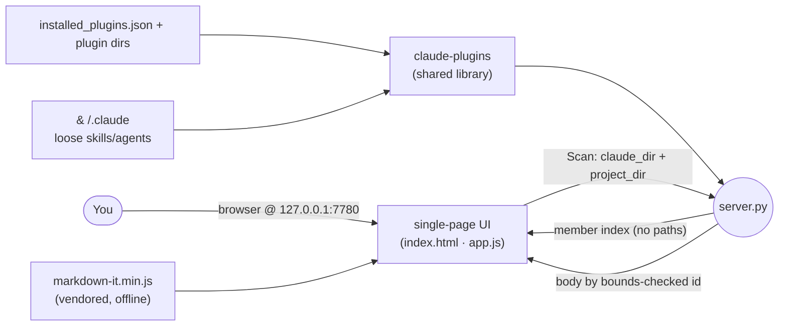
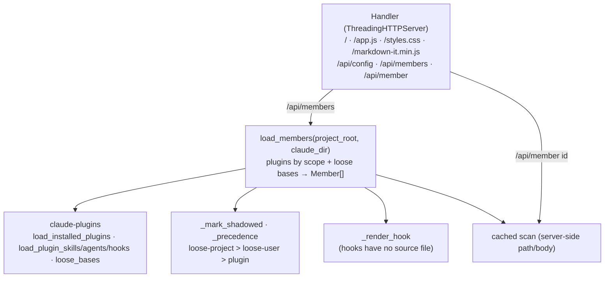
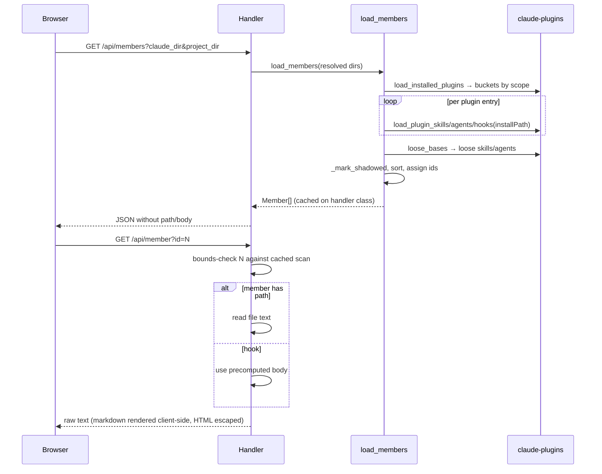
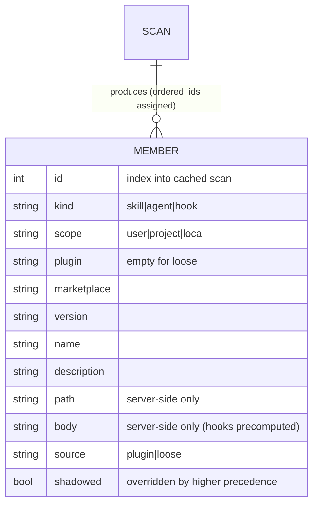

# claude-component-browser — Architecture

A local web app that lists and searches every Claude Code component — skill, agent, hook — on this
machine, from installed plugins and from loose (non-plugin) skills/agents under a `.claude` dir.
A thin stdlib server + single-page UI over the shared `claude-plugins` library; all parsing lives in
the library, never here.

## System context

You point it at a Claude dir and a project dir in the UI; it scans local config and serves a
searchable page. Binds `127.0.0.1` only — that is the whole auth story.

## Components

Request-time scan into an in-memory `Member` list; three data endpoints plus static assets. Parsing
is delegated; the server adds ordering, shadowing, and the path-hiding boundary.

## Key flow — scan and read a member

The member list strips `path`/`body`; the body endpoint indexes the server's own scan by id, so no
user-supplied path ever reaches the filesystem (the traversal guard).

## Data model

`Member` is the only entity — an in-memory scan result; `path`/`body` never cross the wire.

## Key Decisions

### 2026-07-02 — Thin server over `claude-plugins`; parsing never forked into the app

**Status:** Accepted
**Context:** Both this browser and `per-project-plugin-toggler` read the same on-disk plugin layout.
Reimplementing the reader in each would create two sources of truth for a fiddly parse.
**Decision:** Keep all plugin/skill/agent/hook reading in the `claude-plugins` library; `server.py`
is a stdlib `ThreadingHTTPServer` that calls the library, adds display ordering and shadow
resolution, and serves a vanilla single-page UI. The parsing is a registered shared surface
(`docs/shared-plugin-logic.md`).
**Consequences:** One parser, two apps. This app owns only presentation concerns (ordering,
shadowing, rendering). A layout/parse change lands in the library and both apps inherit it.

### 2026-07-02 — Dirs chosen in the UI at request time, not at startup

**Status:** Accepted
**Context:** A user may want to browse components for an arbitrary project and Claude dir without
restarting the server, and `local`/`project`-scope plugins only resolve against a specific project
root.
**Decision:** Only `--host`/`--port` are startup args. The Claude dir and project dir are entered in
the UI top bar (prefilled to `~/.claude` and cwd, persisted per browser via localStorage) and passed
to `/api/members`, which re-scans on each call. This app deliberately does not read `$C4_CLAUDE_DIR`
— the UI is the source of truth. Non-existent dirs scan to empty (the library degrades gracefully),
so no validation error path is needed.
**Consequences:** Re-target scope resolution live without a restart. Each scan is request-time work
(fine at this scale). The scan is cached on the handler so `/api/member` can index it by id.

### 2026-07-02 — No file paths cross the wire; body is fetched by bounds-checked id

**Status:** Accepted
**Context:** Serving component bodies naively (client passes a path) is a path-traversal hole, and
leaking filesystem paths to the client is unnecessary exposure.
**Decision:** The member list omits `path`/`body`. The body endpoint takes an integer `id` that
indexes the server's own cached scan, bounds-checked before any read — the client never supplies a
path. The server binds `127.0.0.1` only. Markdown is rendered client-side with a vendored offline
`markdown-it` and raw HTML escaped.
**Consequences:** No traversal surface and no path disclosure. The offline markdown vendor keeps the
app CDN-free (works airplane-mode) at the cost of carrying the bundled file. Loopback binding is the
entire auth model — no new network exposure without revisiting this.

### 2026-07-02 — Loose components shadow plugin ones; loose-project beats loose-user

**Status:** Accepted
**Context:** A skill/agent can exist both as a loose `.claude` file and inside a plugin, or at both
user and project scope. Showing duplicates without indicating which one Claude Code actually uses
would mislead.
**Decision:** Resolve precedence by `(kind, name)`: loose project > loose user > plugin. The winner
displays normally; lower-precedence duplicates are marked `shadowed` (struck through) rather than
hidden, so the full picture stays visible.
**Consequences:** The UI reflects effective resolution while still disclosing every source. The
precedence order is a fixed contract mirrored in the README; changing it changes what users read as
"active".
