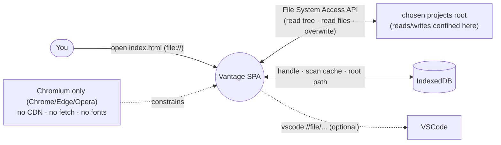
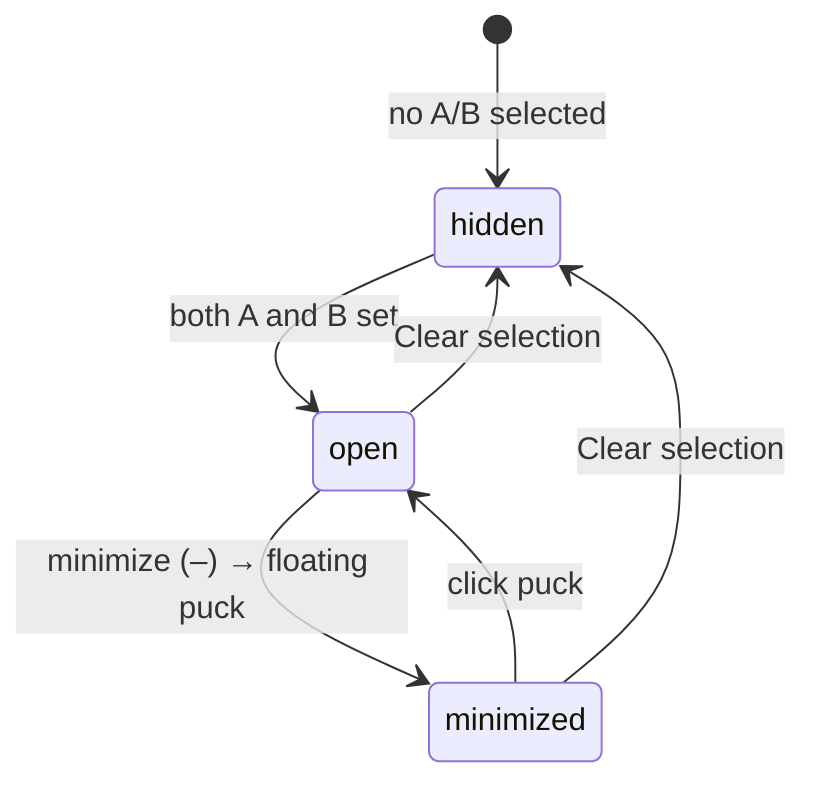
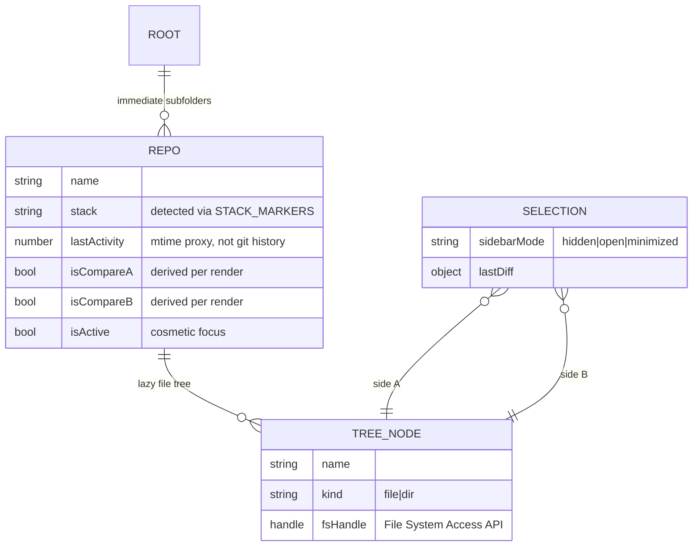

# cross-repo-file-diff (Vantage) — Architecture

A local, serverless repo explorer. Point it at a folder of Git repos; each immediate subfolder
becomes a card you can expand into its file tree, pick one file from two different repos, diff them
in a slide-in sidebar, and copy/overwrite one onto the other. No build, no server, no dependencies —
a set of static files loaded over `file://` in a Chromium browser.

## System context

Runs entirely in the browser against the File System Access API; the only persistence is IndexedDB
(directory handle + scan cache + optional root path). No network of any kind.



## Components

One concern per file, each a plain object on the `window.Vantage` namespace; load order in
`index.html` is the dependency contract (no ES modules — CORS-blocked over `file://`).

```mermaid
flowchart TD
    ns["namespace.js (FIRST)<br/>window.Vantage + constants<br/>IGNORE_LIST · STACK_MARKERS · walk depth"]
    persist["persist.js → Persist<br/>IndexedDB: handle · cache · rootPath"]
    scanner["scanner.js → Scanner<br/>chooseRoot · scanRoot · detectStack<br/>lastActivity (mtime chain) · readTree"]
    compare["compare.js → Compare<br/>diff (line LCS) · wordDiff · looksBinary"]
    copy["copy.js → Copy<br/>copyFile · resolveDestDir · destExists"]
    editor["editor.js → Editor<br/>vscodeUri · setRootPath"]
    ui["ui.js → UI (controller)<br/>state · DOM refs · render board/tree/diff<br/>selection bar · sidebar + puck · modals"]
    app["app.js (LAST)<br/>UI.init() on DOMContentLoaded"]

    ns --> persist --> scanner --> compare --> copy --> editor --> ui --> app
    ui -->|reads/writes| persist
    ui -->|scan| scanner
    ui -->|diff| compare
    ui -->|overwrite (confirmed)| copy
    ui -->|vscode link| editor
```

## Key flow — open → select A/B → diff → copy

Data flows one way: Scanner/Persist produce plain objects; `UI` holds them as state and re-renders.
Copy is the only destructive action and is always confirmed against the named target.

```mermaid
sequenceDiagram
    participant U as You
    participant UI as Vantage.UI
    participant Sc as Scanner
    participant P as Persist
    participant C as Compare
    participant Cp as Copy

    U->>UI: Change folder
    UI->>Sc: chooseRoot() → dirHandle
    UI->>P: saveHandle(dirHandle)
    UI->>Sc: scanRoot(dirHandle) → Repo[] (stack, lastActivity)
    UI->>P: saveCache(scan)
    UI-->>U: render board (sort/filter)
    U->>UI: expand card (chevron) → readTree
    U->>UI: assign file to A, file to B
    UI->>C: diff(textA, textB) + wordDiff replaced lines
    C-->>UI: DiffLine[] (+N −M summary)
    UI-->>U: slide-in unified diff sidebar; highlight A/B cards
    U->>UI: Copy A → B
    UI->>UI: confirm modal (names exact target)
    UI->>Cp: copyFile(srcHandle, dstDir, name) — overwrite
    Cp-->>U: toast; destination updated
```

## Sidebar state machine

The diff sidebar has only two modes; there is no close. Minimizing never clears the selection — only
**Clear** removes the comparison.



## Data model

All plain in-memory shapes held by `UI`; only the directory handle, scan cache, and root path are
persisted (IndexedDB).



## Key Decisions

### (archived) — Multiple classic-script files over `file://`, never ES modules

**Status:** Accepted
**Context:** The app must run by double-clicking `index.html` (no server), but ES-module
`import`/`export` is CORS-blocked over `file://`. A single giant file would be unmaintainable; a
bundler/server would defeat the zero-install goal.
**Decision:** Split into one-concern files under `styles/` and `scripts/`, loaded by classic
`<link>`/`<script src>` tags. Cross-file sharing goes through a single `window.Vantage` namespace
object; **load order in `index.html` is the dependency contract** (`namespace.js` first, `app.js`
last). No bundler, no server, no ES modules, and no re-inlining into one file.
**Consequences:** Editable-and-refresh development with clean module boundaries, at the cost of a
hand-maintained load order and a global namespace instead of imports. See the archived decision log
for the full rationale.

### (archived) — Zero network, zero dependencies; hand-written LCS diff

**Status:** Accepted
**Context:** A local file tool should not phone home, and pulling a diff library or web fonts would
add remote fetches that break offline `file://` use and leak activity.
**Decision:** No network calls of any kind — no CDN, fetch, analytics, or remote fonts (the
Google-Fonts `@import` was intentionally dropped; type tokens fall back to Georgia/system-ui/mono).
The line diff is a hand-written LCS (`Compare.diff`), with a token-level `wordDiff` for intra-line
highlights and a `looksBinary` guard. No third-party dependencies.
**Consequences:** Fully offline and self-contained. The diff is "good enough" LCS, not a
battle-tested library — acceptable for reviewing config/source files side by side. Any future
feature must respect the no-network rule.

### (archived) — Writes confined to the chosen root; copy/overwrite is the only mutation, always confirmed

**Status:** Accepted
**Context:** The tool overwrites files across repos — a genuinely destructive capability — while the
File System Access API scopes all access to the folder the user grants.
**Decision:** Reads and writes stay inside the chosen root. Copy/overwrite is the only destructive
action; it always names the exact target and waits for an explicit confirm (`#confirm-overlay`).
There is no delete. The picked directory handle persists in IndexedDB so reopening reconnects
(subject to a browser permission re-grant click).
**Consequences:** Blast radius is bounded to one granted folder and every overwrite is deliberate.
No accidental deletes are possible. Reconnection is one click rather than automatic, by browser
design.

### (archived) — Last-activity is an mtime proxy; VSCode path is opt-in

**Status:** Accepted
**Context:** Sorting repos by "recent activity" ideally reads git history, but parsing commit
objects/packs in-browser is heavy, and the File System Access API never exposes a folder's real
absolute path (needed for `vscode://` links).
**Decision:** Derive last-activity from file mtimes via a fallback chain
(`.git/logs/HEAD` → `.git/HEAD` → shallow working-tree walk) — never parse git objects. The
"Open in VSCode" button is disabled until the user pastes the projects root's absolute path
(**Set root path**, persisted), used only to compose `vscode://file/<root>/<repo>` assuming repos
are direct children.
**Consequences:** Cheap, dependency-free activity sorting that is a proxy, not precise git truth.
VSCode integration is fully optional; the app works without ever setting a path.
