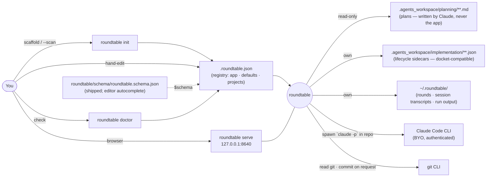
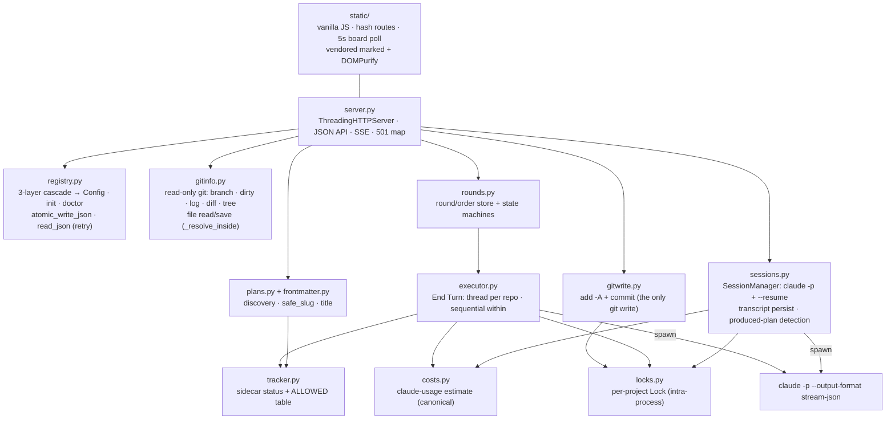
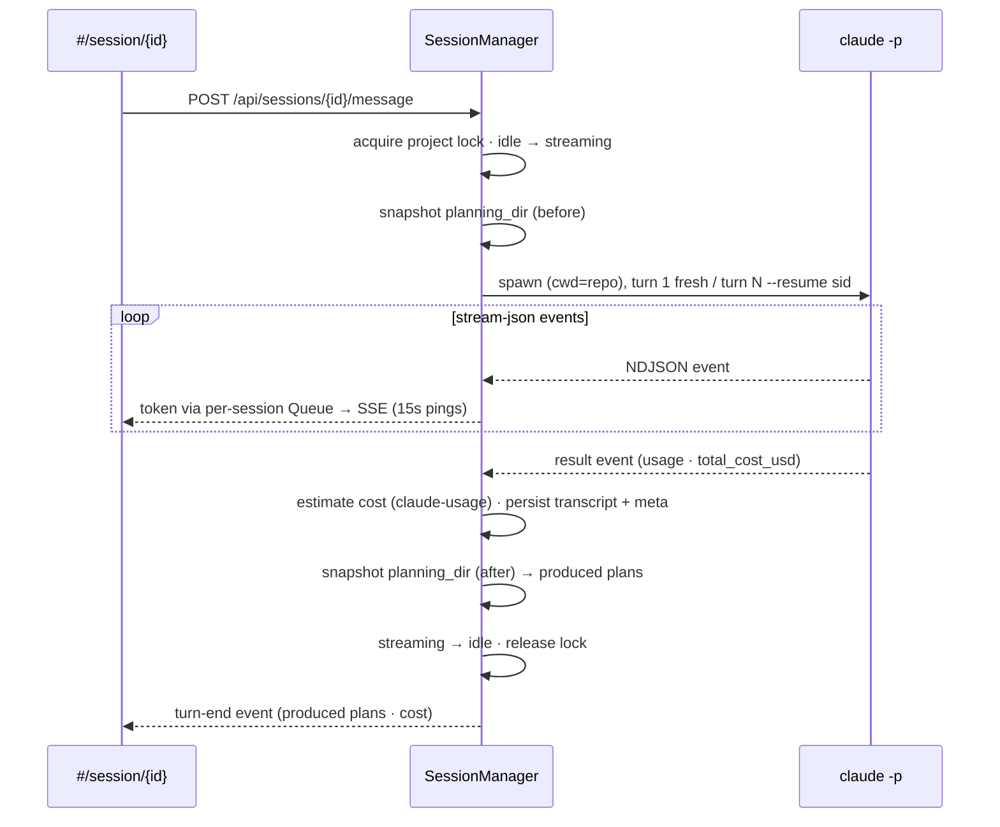
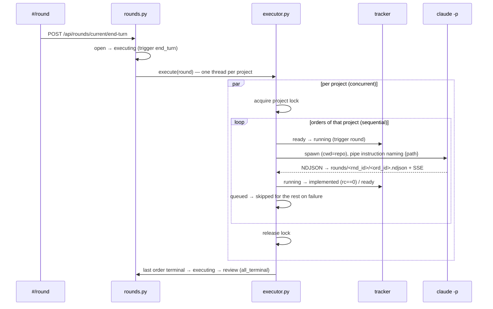
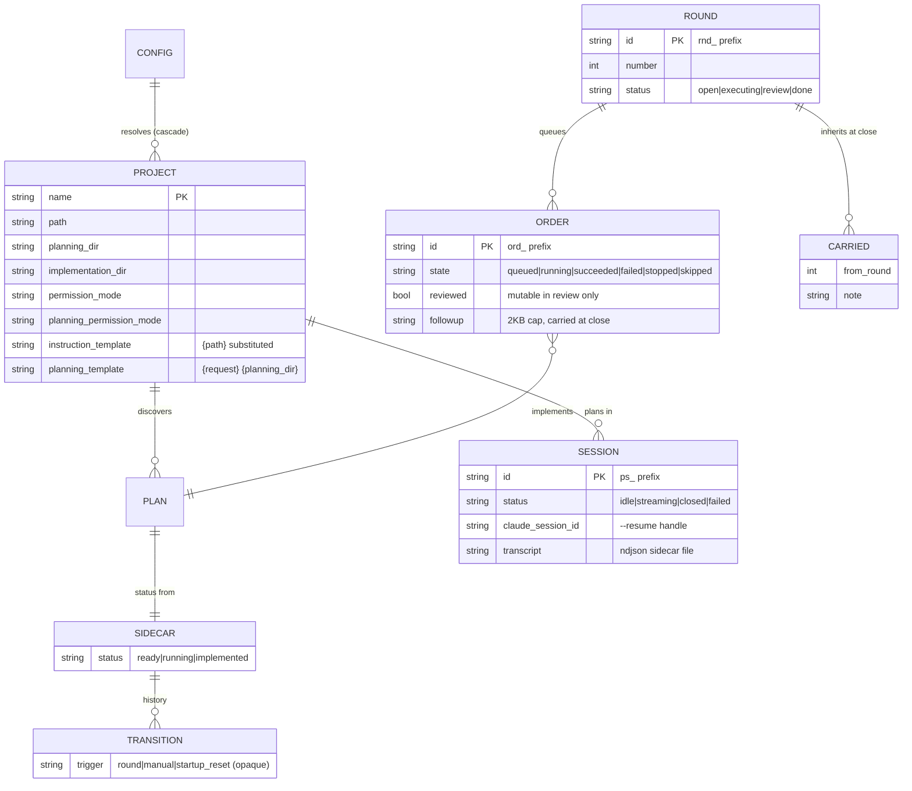
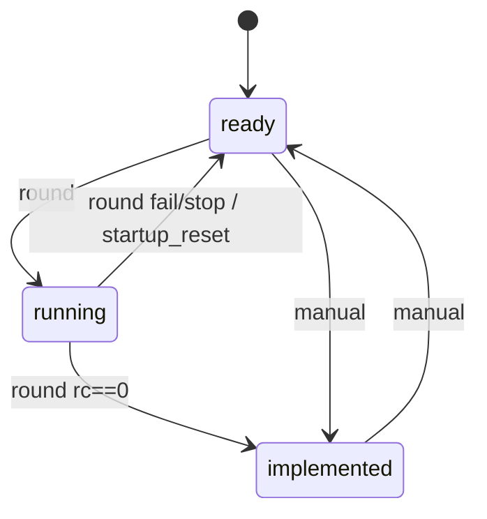
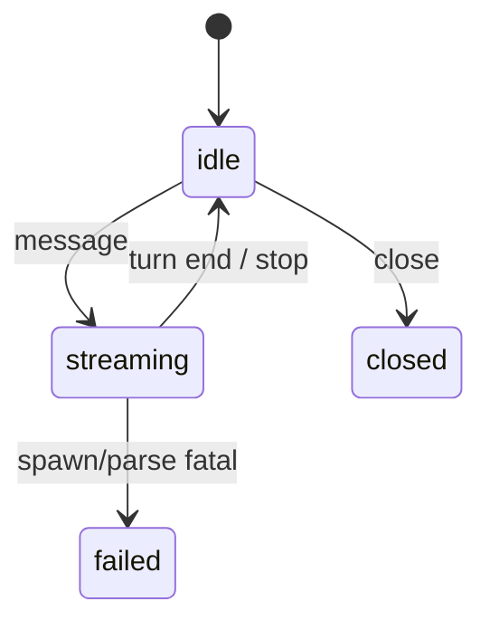
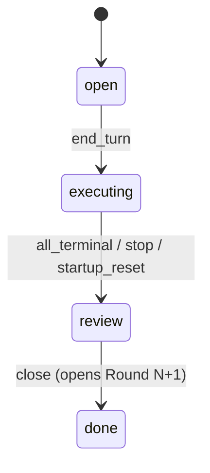
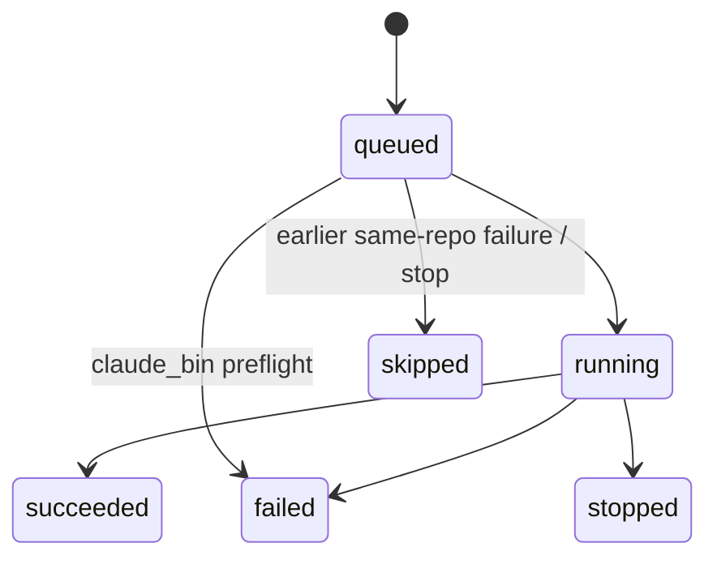

# roundtable (`apps/multi-repo-workspace`) — Architecture

A local, single-user, turn-based workspace over many Claude Code repos: a board of repos with live git/plan state, in-app `claude -p` planning sessions, rounds of orders executed headlessly (End Turn), and a review phase with diffs, commits, and follow-ups carried to the next round. Successor to docket (`apps/multi-repo-plan-runner`), which stays untouched and standalone.

## System context

External actors and systems around roundtable's boundary.

## Components

One stdlib HTTP server over core modules; `server.py` is transport only (validate + delegate).

## Key flow — planning turn

A multi-turn chat with Claude running inside the target repo; the plan file Claude writes is detected by snapshotting the planning dir around the turn.

## Key flow — End Turn

All queued orders execute: sequential within a repo (stop-on-failure), concurrent across repos, output persisted and streamed live.

## Data model

Persisted: Project (registry), Sidecar (in-repo), PlanningSession and Round/Order (under `~/.roundtable/`). Plan is a read-only view of a markdown file plus its sidecar status. Round cost is computed at read time, never stored.

## State machines

Closed sets with validated transition tables; any edge not drawn is rejected (409). Plan lifecycle (sidecar, `tracker.ALLOWED` — trigger on the edge):

Planning session (`sessions.ALLOWED`; `closed`/`failed` terminal):

Round (`rounds.ROUND_ALLOWED`) and order (`rounds.ORDER_ALLOWED`):

## Key Decisions

### 2026-07-10 — Successor app, not a docket rewrite; sidecar format is the shared contract

**Status:** Accepted
**Context:** docket runs externally-authored plans; the wanted workflow adds in-app planning, rounds, and review. Options: grow docket (bloats a shipped tool, TUI parity drag), extract a shared library (violates the repo's ≥2-consumer/cohesion bar for `libs/` — the overlap is a file format, not a domain), or a new member.
**Decision:** New member `apps/multi-repo-workspace` (roundtable); docket stays untouched and useful standalone. The only shared surface is the on-disk lifecycle sidecar format (same keys, location, statuses), kept in sync by hand — registered in `docs/shared-plugin-logic.md` with `Cross-reference:` comments in both trackers (the one sanctioned docket edit). Trigger vocabularies deliberately differ (`round` vs `headless`); both sides treat `trigger` as an opaque display string, so histories interleave.
**Consequences:** Both apps can point at the same repos without fighting. Plan discovery/frontmatter code is forked at birth (marked in module docstrings), accepted as intentional duplication; if a third consumer appears, revisit extraction.

### 2026-07-10 — Stdlib server + vanilla JS; the only non-stdlib pieces are claude-usage and two vendored JS assets

**Status:** Accepted
**Context:** Same scale as docket (local, single user, ~10 repos, tiny data). Full markdown rendering (headings/tables/code in plans, transcripts) is wanted; hand-rolling CommonMark would exceed the wrapper it replaces.
**Decision:** stdlib `ThreadingHTTPServer` + hand-written JSON API + SSE (native `EventSource`; GET endpoints), vanilla JS with hash routes, 5s board polling with SSE reserved for live streams. Python deps: exactly one, the in-repo stdlib-only `claude-usage` (cost estimation). Frontend: vendored, pinned single-file `marked` + `DOMPurify` under `static/vendor/` (upstream license headers retained) — no npm, no build step. All fetches through `js/api.js`; all markdown through `js/markdown.js`.
**Consequences:** Zero infra, trivial install; routing/SSE written by hand. Vendored assets are upgraded manually. Not intended for multiple users or large data.

### 2026-07-10 — Plans are app-read-only; exactly three sanctioned writes into a target repo

**Status:** Accepted
**Context:** roundtable both surfaces repos and lets Claude plan inside them; an app that edits plan files risks clobbering externally-authored artifacts (docket's founding invariant, now with more write-capable surfaces).
**Decision:** The app never creates, edits, or deletes a plan file. Writes into a target repo are limited to: (1) the spawned Claude planning session writing the plan itself, (2) the file editor's explicit Save (PUT with optimistic concurrency), (3) the explicit Commit (`gitwrite.py`: `add -A` + `commit`, argv no shell, no push/branch/amend — quarantined as the only git write). Everything else the app owns lives in sidecars and `~/.roundtable/`. Every externally-supplied slug passes `safe_slug`; every file path passes a realpath containment check.
**Consequences:** Deleting `~/.roundtable/` or `implementation/` loses only app state, never a plan. Commit stays locally reversible; review-to-PR automation is post-MVP.

### 2026-07-10 — Instruction-not-body for every spawn; the CLI owns conversation state

**Status:** Accepted
**Context:** Both planning turns and implement runs must hand context to `claude -p`. Piping plan bodies bloats stdin and breaks sibling-file references; managing message arrays in-app duplicates what the CLI already does.
**Decision:** Implement runs pipe a short instruction that names the plan file (`instruction_template`, `{path}` substituted). Planning turn 1 pipes `planning_template` (`{request}`, `{planning_dir}`); later turns pipe the user's message verbatim with `--resume <session_id>` carrying context. Produced plans are detected by snapshotting the planning dir before/after each turn — filesystem truth, not model claims.
**Consequences:** Tiny stdin, full repo access for Claude, no in-app context-window management. A session that outgrows the CLI's context is handled by starting a fresh session (documented limitation).

### 2026-07-10 — Pricing-table estimate is the canonical cost; CLI total_cost_usd is secondary

**Status:** Accepted
**Context:** Two cost sources per run: `claude-usage`'s pricing-table estimate over reported token counts, and the CLI's own `total_cost_usd`. They can disagree, and the CLI figure's basis is opaque.
**Decision:** Every displayed cost is the estimate (`claude_usage.estimated_cost`); `total_cost_usd` is stored and shown only as an informational secondary figure. A model missing from the pricing table renders "n/a" (`null`), never $0. Round cost is rolled up at read time from per-order figures, never stored.
**Consequences:** Costs are consistent with `usage-dashboard`/`usage-report` (same library and table). Estimates drift when the pricing table lags a new model — visible as "n/a" rather than a wrong number.

### 2026-07-10 — One per-project lock shared by every repo-touching surface; persisted state + startup recovery

**Status:** Accepted
**Context:** Planning turns, implement runs, file saves, and commits can all touch the same working tree; docket's crash-recovery lesson (never strand `running`) now applies to sessions and rounds too, and rounds/transcripts must survive restarts (unlike docket's in-memory runs).
**Decision:** A single `locks.py` dict of per-project `threading.Lock`s serializes all of the above per repo (intra-process only — documented MVP limitation, same as docket). Sessions, rounds, and run output are persisted under `~/.roundtable/` as JSON/NDJSON; all JSON writes are atomic (temp + `os.replace` + bounded Windows retry) and hot reads go through a bounded-retry reader. On startup: `running` sidecars reset to `ready`, `streaming` sessions to `idle` with a synthetic `interrupted` transcript event, and a round stuck `executing` to `review` (running orders → `stopped`, queued → `skipped`; trigger `startup_reset`).
**Consequences:** A crash can't strand any state machine; history and costs survive restarts. Two server processes against the same repo are not cross-process-locked.
