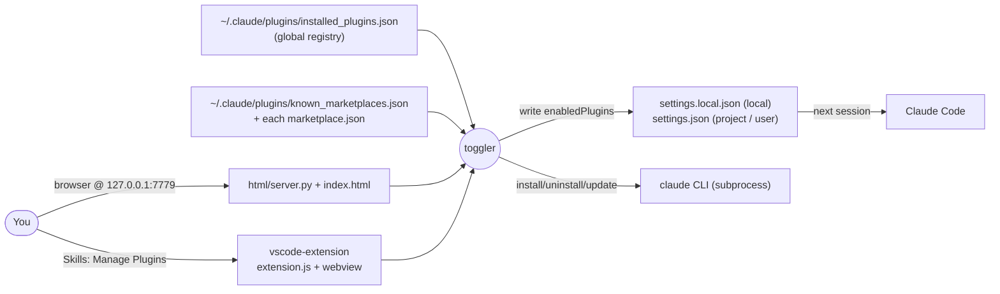
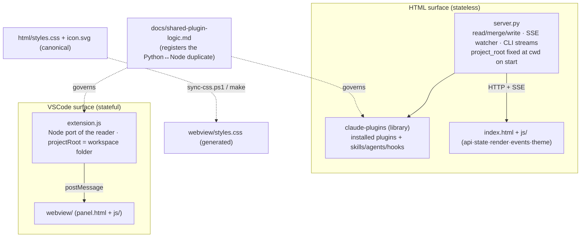
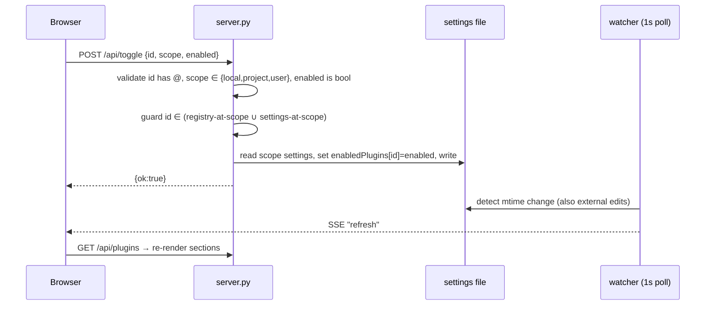
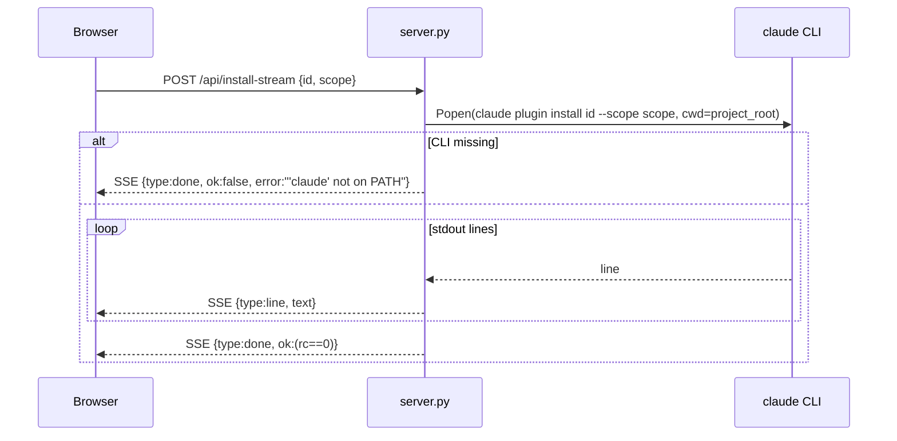
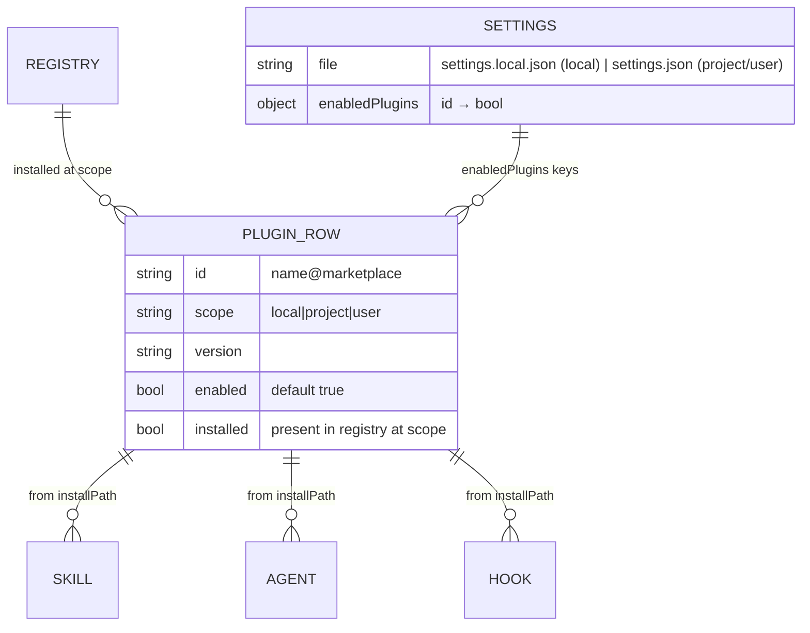

# per-project-plugin-toggler — Architecture

A developer tool for managing Claude Code plugins: toggle plugins on/off per-project (and per scope),
and browse/install plugins from known marketplaces — from a browser UI or inside VSCode. Two
independent surfaces share one file-based data contract, with the read/merge/write logic implemented
twice (stdlib Python for the HTML server, a Node port for the VSCode extension).

## System context

Both surfaces read the global installed-plugins registry and marketplaces, write per-scope
enablement to settings files Claude Code reads next session, and shell out to the `claude` CLI to
install/uninstall.

## Components

The two surfaces are parallel implementations over the same on-disk contract; the Python server uses
the `claude-plugins` library, the extension carries a registered Node port of that reader.

## Key flow — toggle a plugin (HTML surface)

Read the scope's settings, guard that the id belongs to that scope, write it back; a filesystem
watcher pushes an SSE refresh so external edits reflect live.

## Key flow — install from marketplace (streamed)

Install/uninstall/marketplace-update stream the `claude` CLI's output line-by-line over SSE.

## Data model

Enablement is per scope; a row is shown if installed at that scope OR keyed in that scope's
`enabledPlugins` (registry ∪ settings).

## Key Decisions

### (pppt) — Two surfaces, one file contract; reader logic duplicated Python↔Node

**Status:** Accepted
**Context:** Users want plugin management both in a browser and inside VSCode. The VSCode extension
runs in Node and cannot import the Python `claude-plugins` library, yet both must read the exact same
on-disk layout and write the same settings.
**Decision:** Keep two independent surfaces over one file-based contract
(`installed_plugins.json` in, `enabledPlugins` in settings out). The HTML server uses the shared
`claude-plugins` library; the extension carries a parallel Node port of that reader, registered as an
intentional duplicate in `docs/shared-plugin-logic.md` and kept in sync by hand. The HTML surface is
stateless (`project_root` fixed at process `cwd`); the extension is stateful (`projectRoot` from the
workspace folder).
**Consequences:** Both editors get native UX. The cost is a standing Python↔Node sync obligation for
any parsing change. `styles.css`/`icon.svg` are canonical in `html/` and generated into the webview
via `sync-css` (run automatically by `vsce package`'s prepackage hook) — never edited directly.

### (pppt) — Write per-scope enablement; guard that an id belongs to the scope it's written to

**Status:** Accepted
**Context:** Claude Code resolves plugins at three scopes (`local`/`project`/`user`) written to
different files (`settings.local.json` vs `settings.json` in project vs user `.claude`). Writing an
id to the wrong scope, or an id that doesn't exist at that scope, would corrupt resolution.
**Decision:** Each scope reads/writes its own settings file. `/api/toggle` validates the id format
and scope, then guards that the id is in that scope's section (registry-at-scope ∪ settings-at-scope)
before writing `enabledPlugins[id]`. A row appears in a section if installed at that scope or keyed in
that scope's settings (so a disabled-but-uninstalled entry still shows). Enablement defaults to true.
**Consequences:** Writes always land in the file Claude actually reads for that scope, and can't
invent cross-scope entries. Changes take effect on Claude Code's next session. The user-scope config
dir is currently hardcoded to `~/.claude` (honoring `CLAUDE_CONFIG_DIR` is the documented low-risk
future move; a free-form dir picker is deliberately deferred as a silent footgun).

### (pppt) — Live refresh via a filesystem-watching SSE channel

**Status:** Accepted
**Context:** Settings can change outside the tool — a hand edit, another surface, or the `claude` CLI
installing a plugin. A static page would show stale state.
**Decision:** The server polls the watched files (registry + the three settings files) every second
and broadcasts an SSE `refresh` to all connected clients on any mtime change; the UI re-fetches
`/api/plugins`. `/api/set-project` re-seeds the watcher for a new project root. SSE keepalive comments
prevent proxy/browser timeouts.
**Consequences:** The UI reflects external changes near-live without manual reload. Polling at 1s is
simple and dependency-free (no watchdog library) at the cost of up to ~1s latency. Benign
client-disconnect socket errors are suppressed at `handle_error`.

### (pppt) — Install/uninstall shell out to the `claude` CLI and stream output; stdlib-only server

**Status:** Accepted
**Context:** Actually installing/uninstalling a plugin or updating a marketplace is the `claude`
CLI's job; reimplementing it would duplicate and drift from Claude Code's own logic. Long operations
need visible progress.
**Decision:** `/api/install-stream`, `/api/uninstall-stream`, and `/api/marketplace-refresh` `Popen`
the `claude` CLI (cwd = project root) and stream stdout line-by-line over SSE, ending with a
`done` event carrying the exit code; a missing CLI is reported as a clean error. The server stays
stdlib-only (plus the in-repo `claude-plugins`); the extension has no npm runtime deps. CORS is
restricted to `http://localhost`; the server binds `127.0.0.1`. Missing `installed_plugins.json`
falls back to `MOCK_PLUGINS` with `"mock": true` for a zero-config dev experience.
**Consequences:** Install correctness is owned by the CLI, not this tool, and users see live progress.
The install feature requires `claude` on PATH. No third-party dependencies on either surface;
loopback + localhost-CORS is the auth story.
