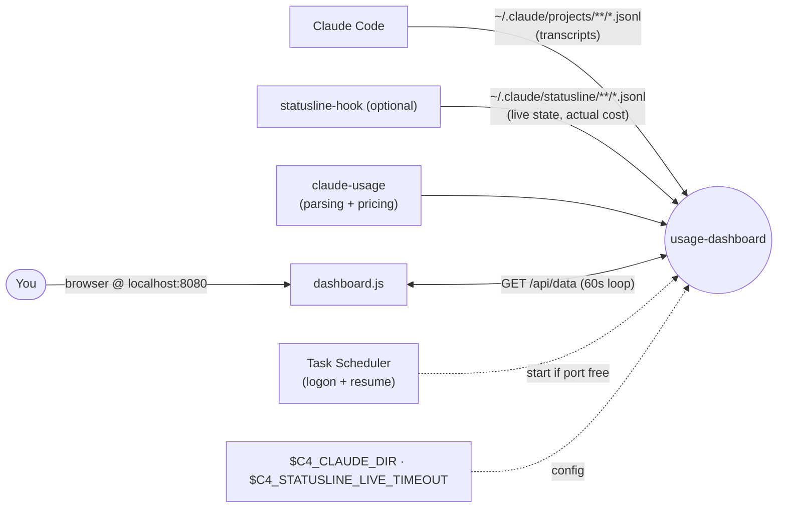
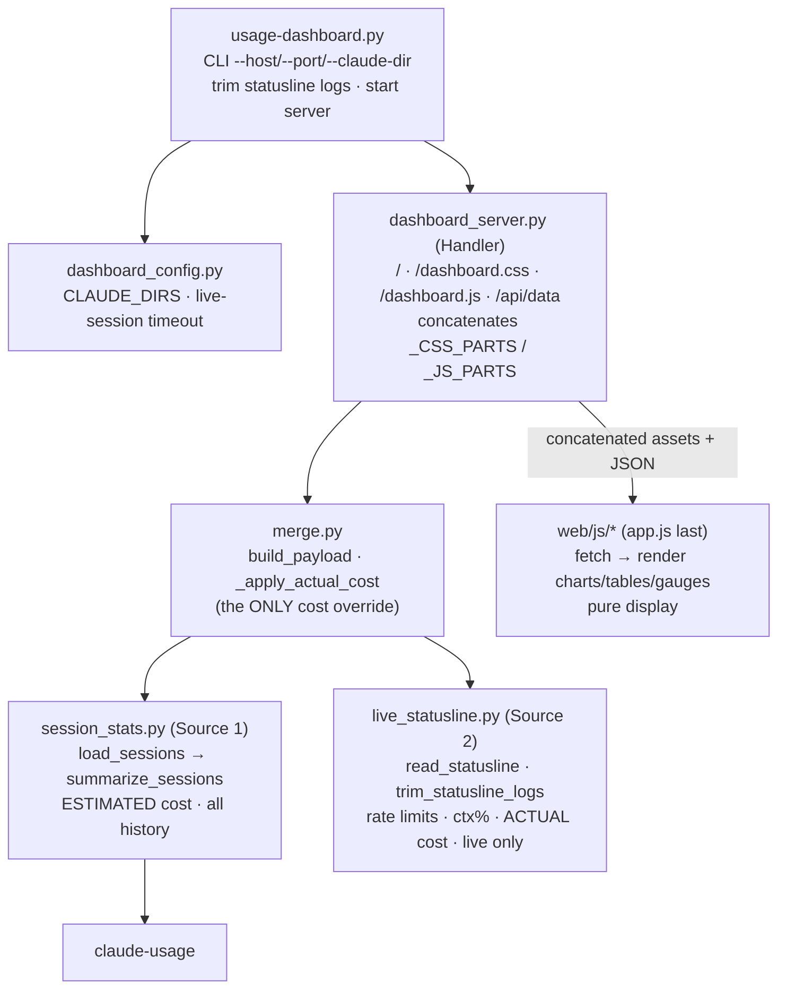
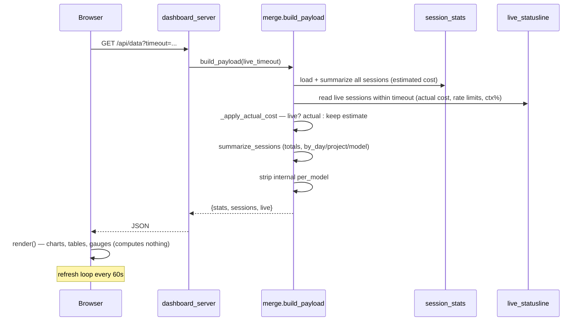
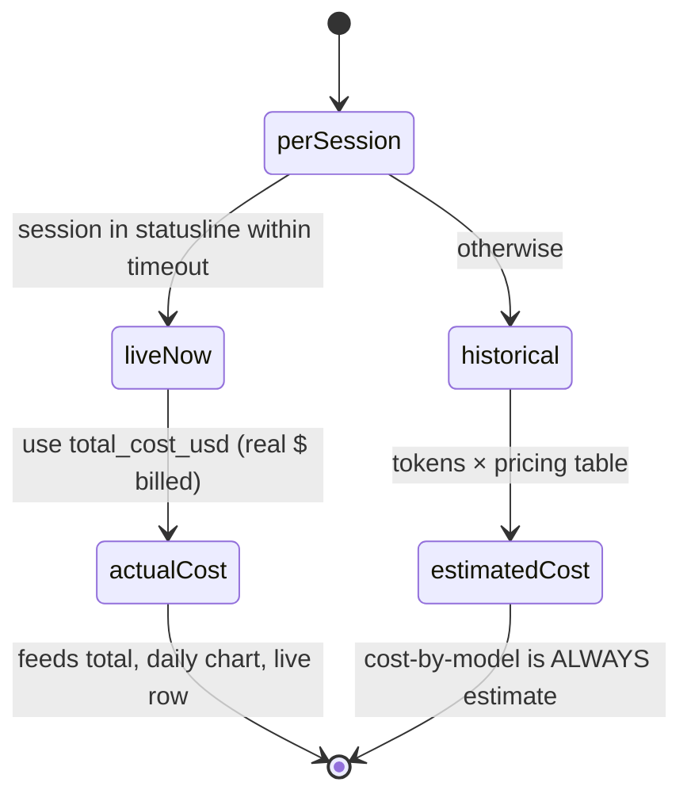
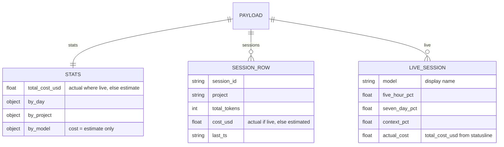

# usage-dashboard — Architecture

An HTTP server that reads Claude Code's local logs and serves a single-page dashboard of token
usage, cost, and live rate limits. Two independent data sources go in; `merge.py` overlays real cost
on live sessions and aggregates everything server-side; the browser JS just draws the payload. Its
only runtime dependency is the in-repo `claude-usage` library.

## System context

Two log sources feed the server; the browser polls one JSON endpoint. The live panel depends on the
optional `statusline-hook` export and degrades gracefully without it.

## Components

Backend is config + two sources + a reconciler + an HTTP transport; the UI computes nothing. The
entry point puts `backend/` on `sys.path` so backend modules keep flat imports.

## Key flow — /api/data request

The two sources are reconciled once, in `merge.build_payload`; actual cost overlays estimate only
for currently-live sessions.

## Cost resolution

The single overlap between the two sources — and the historical source of confusion — is cost.

## Data model

The `/api/data` payload is the contract coupling server and browser; `per_model` is internal and
stripped before sending.

## Key Decisions

### 2026-07-02 — Two independent data sources reconciled in one place

**Status:** Accepted
**Context:** Historical token/cost data lives in Claude Code's transcripts (all sessions, but cost
can only be *estimated* from token counts). Live rate limits, context %, and the *actual* billed
cost are only available from the optional statusline-hook export (recent sessions only). Mixing the
two ad hoc had historically confused the code.
**Decision:** Keep the sources in separate modules — `session_stats.py` (Source 1, estimated,
full history) and `live_statusline.py` (Source 2, live, actual) — and reconcile them in exactly one
place, `merge.build_payload`. The module layout exists to keep the two straight.
**Consequences:** Each source is independently testable and its meaning is unambiguous. The live
source is optional: absent, the dashboard shows "Hook not set up" and still renders history. All
"where did this number come from" questions resolve to one of two modules.

### 2026-07-02 — Actual cost wins only for live sessions; override lives in one function

**Status:** Accepted
**Context:** For a currently-live session both an estimate (tokens × price) and the real billed
figure exist; for historical sessions only the estimate does. Scattering "use actual here, estimate
there" logic would reintroduce the confusion the layout is meant to prevent.
**Decision:** `merge.py._apply_actual_cost` is the *only* place cost is overridden: a live session
(present in the statusline within timeout) uses the statusline's `total_cost_usd`; every other
session keeps its estimate. The cost-by-model breakdown is always the estimate — the statusline does
not attribute cost per model. Divergence between estimate and actual means the pricing table is
stale, not a parsing bug.
**Consequences:** One auditable override point. Totals, the daily-cost chart, and live rows reflect
real cost where available; by-model stays estimate. Pricing changes are a `claude_usage.MODEL_COSTS`
edit (with `web/js/models.js` kept in step), never a change here.

### 2026-07-02 — All computation server-side; a fixed `{stats, sessions, live}` payload contract

**Status:** Accepted
**Context:** Aggregation could happen in the browser, but that would duplicate pricing/summary logic
client-side and make the two-source reconciliation impossible to reason about.
**Decision:** The backend computes everything — new aggregate stats go in
`session_stats.summarize_sessions`, new live fields in `live_statusline`. The `web/js/` code is pure
display over a fixed `{stats, sessions, live}` payload. CSS/JS are split into single-concern files
concatenated by the server in a fixed order (`_CSS_PARTS`/`_JS_PARTS`), with `app.js` last since the
parts share one global scope (non-module scripts).
**Consequences:** One source of truth for every number; the browser can't drift from the server's
math. The payload keys couple server and render code — both ends change together. The concatenation
order is load-bearing.

### 2026-07-02 — Multi-dir aggregation, idle-timeout live view, and a self-guarding scheduled task

**Status:** Accepted
**Context:** Users may run multiple Claude config dirs (e.g. a devcontainer profile) and want them
viewed as one. The live view must drop stale sessions, and an auto-start task must not collide with
a manually running server.
**Decision:** `--claude-dir`/`$C4_CLAUDE_DIR` accept multiple `os.pathsep`-separated dirs, aggregated
as one. A session idle past `C4_STATUSLINE_LIVE_TIMEOUT` (default 1800s, also per-request adjustable)
drops out of the live view. The Windows Task Scheduler helper starts the server on logon/resume but
only if the port is free (`usage-dashboard-start-once.ps1`). Startup trims statusline logs to bound
disk growth.
**Consequences:** One dashboard spans several profiles; the live panel stays current. The scheduled
task is safe to leave installed alongside manual runs. Log growth is bounded without user action.
