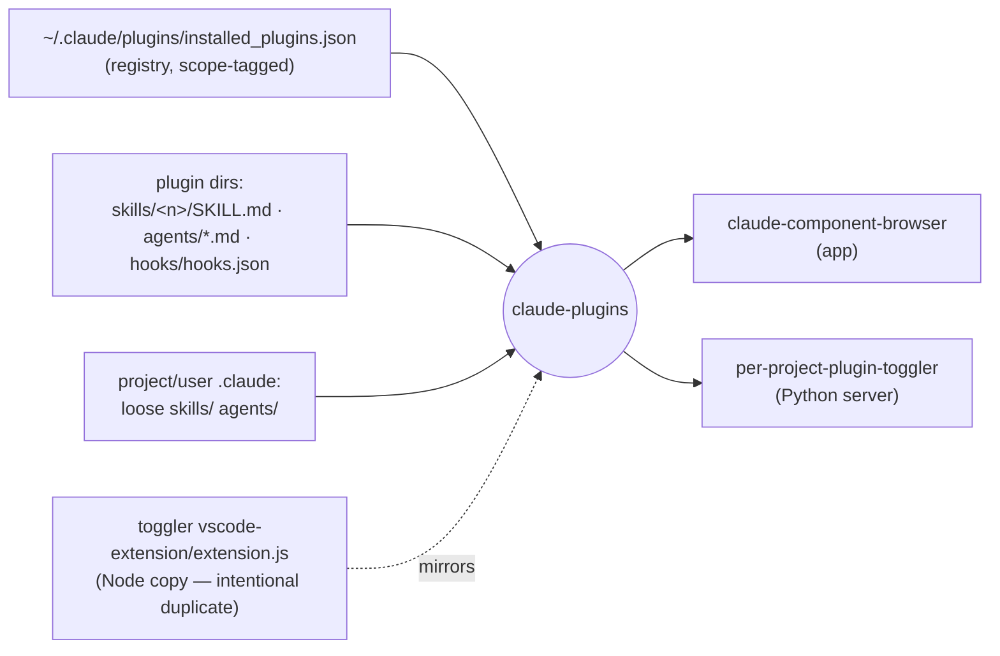
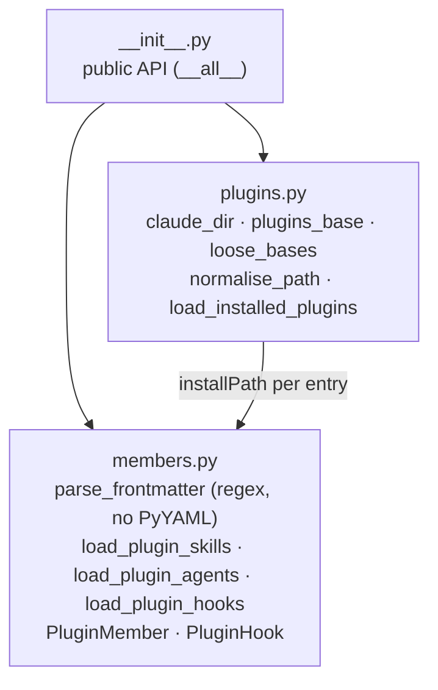
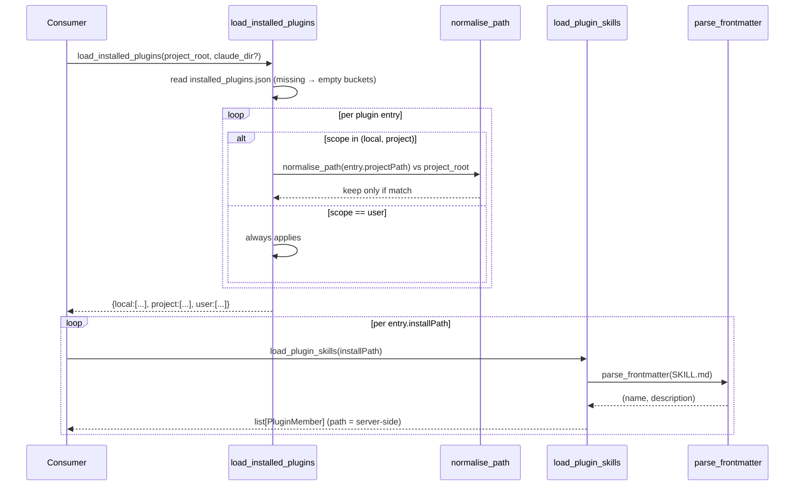
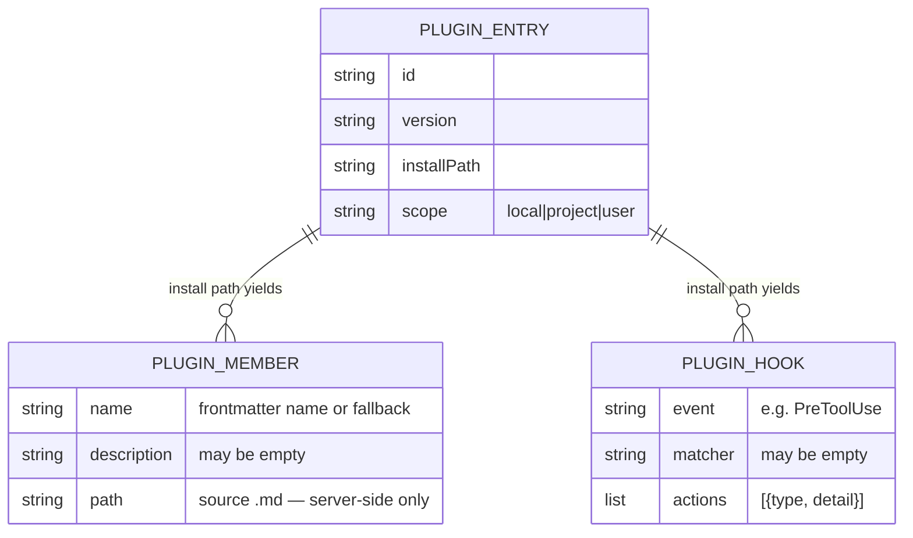

# claude-plugins — Architecture

A dependency-free library that reads Claude Code's installed plugins and their members — skills,
agents, hooks — from local config. One external contract (the `installed_plugins.json` registry plus
each plugin's on-disk member layout) modelled once, consumed by `claude-component-browser` and
`per-project-plugin-toggler`.

## System context

Reads Claude Code's on-disk plugin config; serves typed records to the two apps that browse/toggle
plugins. A parallel Node port of this logic lives in the toggler's VSCode extension (registered
intentional duplicate).

## Components

Public surface is `__init__.py`; `plugins.py` reads the registry and buckets by scope, `members.py`
parses each plugin's members.

## Key flow — browse a project's plugins and their skills

Bucket the registry by scope for a project root, then read each install path's members. Missing or
unreadable inputs degrade to empty, never raise.

## Data model

Three frozen record types; nothing is persisted. `PluginMember.path` is server-side detail.

## Key Decisions

### 2026-07-02 — Extract the plugin/member reader into a shared stdlib-only library

**Status:** Accepted
**Context:** Both `claude-component-browser` and the `per-project-plugin-toggler` Python server
needed to read the same `installed_plugins.json` registry and each plugin's
`skills/`/`agents/`/`hooks/` layout. Two real consumers of one cohesive domain cleared the `libs/`
extraction bar.
**Decision:** Model the contract once — `plugins.py` for the registry and scope bucketing,
`members.py` for member parsing — behind a single `__init__.py`. Keep `dependencies = []`; parse
frontmatter with a regex rather than pulling in PyYAML for a `name`/`description` extraction.
**Consequences:** One parser for two apps; a layout change is fixed in one place. The regex
frontmatter parser handles inline and `>-`/`>`/`|` block scalars but is not a full YAML parser (by
design). The public API is `__all__` and semver-relevant.

### 2026-07-02 — Bucket plugins by scope; match local/project entries against the project root

**Status:** Accepted
**Context:** Claude Code installs plugins at three scopes (`local`, `project`, `user`), and the
same plugin can appear at more than one. A consumer viewing a given project must see only the
`local`/`project` entries that belong to *that* project, plus all `user` entries.
**Decision:** `load_installed_plugins` returns `{local, project, user}` buckets. `user` always
applies; `local`/`project` are kept only when their `projectPath` matches the passed `project_root`,
compared via `normalise_path` (resolves symlinks, lower-cases the Windows drive letter) so path
casing/format differences don't cause false mismatches.
**Consequences:** Correct per-project views on Windows and POSIX. A plugin legitimately appears in
multiple buckets (one entry per scope). Loose (non-plugin) components reuse the same on-disk reader
via `loose_bases`, which has no `local` scope (local is a plugin/settings concept only).

### 2026-07-02 — Graceful degradation and server-side `path`; a deliberate Node duplicate

**Status:** Accepted
**Context:** The registry or a member file may be missing, partially written, or unreadable, and
member records carry a filesystem `path` that must not leak to browser clients. The VSCode
extension runs in Node and cannot import a Python library, yet needs identical parsing.
**Decision:** Every reader returns empty (buckets/lists) on a missing or unparseable input rather
than raising. `PluginMember.path` is documented server-side detail that consumers strip before
sending to clients. The Node reimplementation in the toggler's `extension.js` is registered as an
intentional duplicate in `docs/shared-plugin-logic.md` and kept in sync by hand.
**Consequences:** Consumers never wrap reads in try/except and a corrupt config yields an empty UI,
not a crash. The Node copy is a standing sync obligation — parsing changes must land in both.
