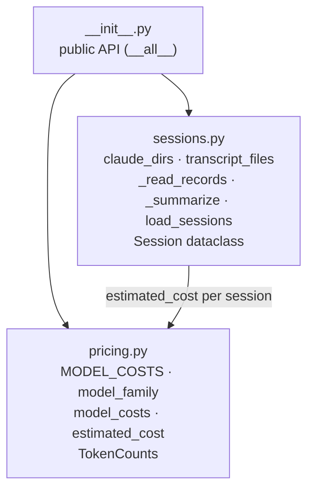
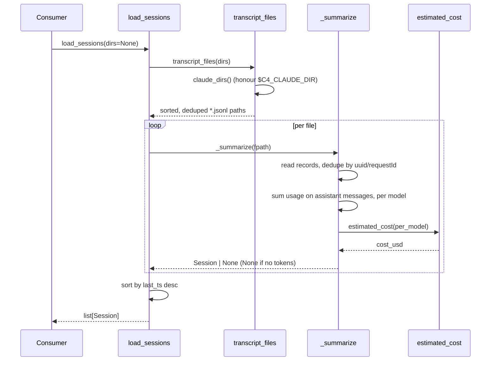
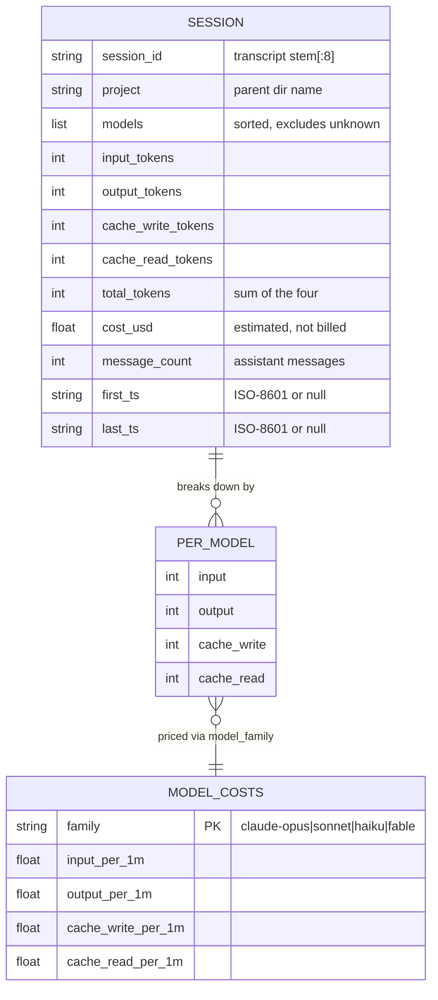

# claude-usage — Architecture

A dependency-free library that reads Claude Code's local session transcripts
(`~/.claude/projects/**/*.jsonl`) and rolls them up into per-session token/cost summaries. One
external contract (Claude Code's transcript layout) modelled once, consumed by `usage-dashboard`
and `usage-report`.

## System context

The library sits between Claude Code's on-disk transcripts and the two members that need usage data.

```mermaid
flowchart LR
    cc["Claude Code<br/>(writes transcripts)"] -->|"~/.claude/projects/**/*.jsonl"| lib((claude-usage))
    env["$C4_CLAUDE_DIR<br/>(pathsep-separated dir override)"] -. resolves .-> lib
    lib -->|load_sessions → list[Session]| dash["usage-dashboard<br/>(app)"]
    lib -->|load_sessions → list[Session]| report["usage-report<br/>(tool)"]
```

## Components

The public surface is `__init__.py`; two internal modules do discovery/parsing and pricing.



## Key flow — load_sessions

Discover every transcript, summarize each into a `Session` (dropping ones with no token usage),
sort newest first.



## Data model

`Session` is the only entity — an in-memory rollup, never persisted by this library.



## Key Decisions

### 2026-07-02 — Extract transcript parsing into a shared stdlib-only library

**Status:** Accepted
**Context:** Both `usage-dashboard` and `usage-report` needed to parse the exact same
`~/.claude/projects/**/*.jsonl` layout into token/cost summaries. The monorepo's `libs/` rule
requires a cohesive domain *and* ≥2 real consumers before extracting.
**Decision:** Model Claude Code's transcript contract once here, with two internal modules
(`sessions.py` for discovery/parse, `pricing.py` for cost math) behind a single `__init__.py`
public surface. Keep `dependencies = []` — a library imposes every dependency on every consumer,
and stdlib `glob`/`json`/`dataclasses` cover the whole job.
**Consequences:** Two consumers share one parser and one pricing table; a transcript-format or
pricing change is fixed in exactly one place. The public API is `__all__` and is treated as
semver-relevant.

### 2026-07-02 — Cost is estimated (token counts × list price), keyed by model family

**Status:** Accepted
**Context:** Consumers want a cost figure, but the library only sees token counts in transcripts —
not the amount Anthropic actually billed. Model ids also carry version suffixes
(`claude-opus-4-7`, `claude-opus-4-8`) that should not fragment the rollup.
**Decision:** Compute `cost_usd` as token counts × `MODEL_COSTS` list price. Collapse raw model ids
to a pricing family via `model_family` (substring match on the family word) so versions aggregate
into one row. Fold `<synthetic>` and unpriced ids into `unknown`, excluded from the model breakdown
and priced at zero.
**Consequences:** Costs are directional estimates, documented as such at every boundary. A pricing
change is a one-line `MODEL_COSTS` edit; a misfamilied id is a `model_family` fix. Unknown models
silently contribute zero cost rather than erroring.

### 2026-07-02 — Resolve config dirs via `$C4_CLAUDE_DIR`, defaulting to `~/.claude`

**Status:** Accepted
**Context:** Tests and multi-profile users need to point the parser at non-default or multiple
Claude config directories without code changes, and the monorepo namespaces its own env vars `C4_`.
**Decision:** `claude_dirs()` reads a pathsep-separated `$C4_CLAUDE_DIR` (multiple dirs supported),
falling back to `~/.claude`. All discovery flows through it, so every consumer honours the override
for free.
**Consequences:** Deterministic, fixture-driven tests and multi-profile support with no API
surface for the caller to manage. Paths are deduped and sorted so results are stable across globs.
