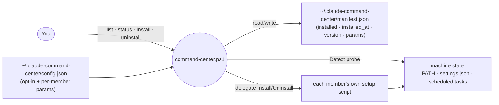
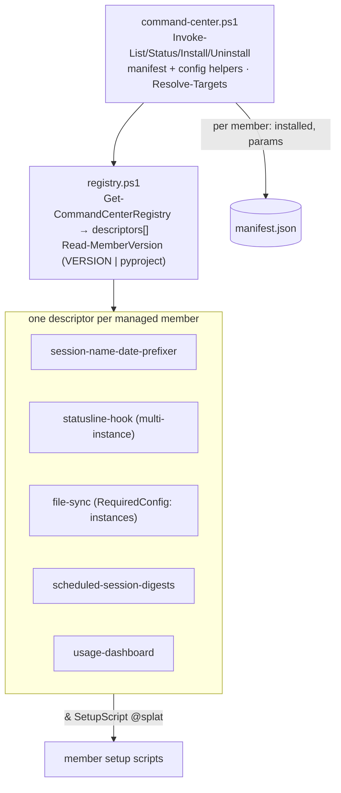
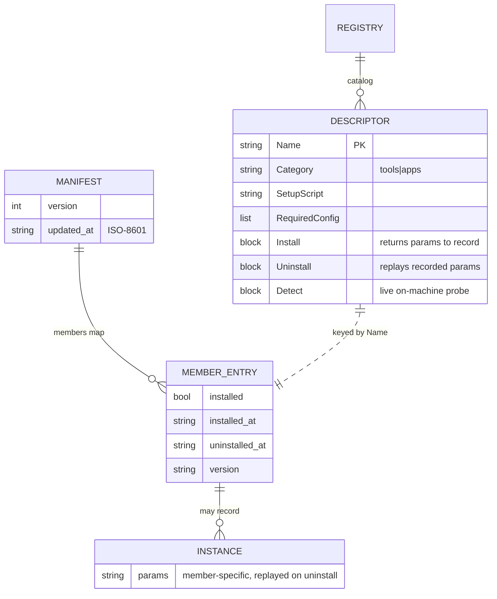

# setup (command-center) — Architecture

The umbrella installer for the repo's installable members. One `command-center.ps1` entry point
installs/uninstalls tools and tracks per-machine state in a manifest. It is a **thin delegator**: it
never reimplements a member's install logic — it calls each member's own setup script and records
the outcome. Only `setup/` knows all members (through delegation), so the no-cross-member-dependency
rule holds.

## System context

You drive one CLI; it delegates to member setup scripts and reconciles a manifest against what's
actually on the machine.



## Components

The CLI reads a registry of member descriptors; each descriptor's `Install`/`Uninstall`/`Detect`
blocks are the only thing that knows how to touch that member.



## Key flow — install

Resolve targets, enforce the opt-in/required-config gate, delegate, then record the params needed to
reverse it later.

```mermaid
sequenceDiagram
    participant U as You
    participant CLI as command-center
    participant D as descriptor.Install
    participant S as member setup script
    participant M as manifest

    U->>CLI: install (-Member X | -All)
    CLI->>CLI: Resolve-Targets
    loop per target
        alt -All and no config entry
            CLI-->>U: skip (opt-in only)
        else RequiredConfig incomplete
            CLI-->>U: -All → skip; -Member → throw
        else
            CLI->>D: Install(SetupScript, memberCfg)
            D->>S: delegate (& SetupScript -Action install ...)
            S-->>D: side effects on machine
            D-->>CLI: params hashtable to record
            CLI->>M: write {installed, installed_at, version, params}
        end
    end
```

## Data model

The manifest is the source of truth for uninstall; multi-instance members record an `instances`
array whose params are replayed on removal.



## Key Decisions

### 2026-07-02 — Thin delegator over per-member setup scripts, never a reimplementation

**Status:** Accepted
**Context:** The repo has several installable tools, each with its own setup script. A unified
installer could either reimplement each install inline (central knowledge, but couples `setup/` to
every member's internals and risks drift) or delegate. The monorepo's no-cross-member-dependency
rule means members must stay independent; only one place may know them all.
**Decision:** `command-center.ps1` is a thin orchestrator. Each member is a descriptor in
`registry.ps1` whose `Install`/`Uninstall` blocks shell out to that member's own setup script and
whose `Detect` block probes real machine state. Adding a member is appending one descriptor —
nothing else changes.
**Consequences:** Install logic lives once, in the member. `setup/` is the sole knower of all
members, and only through delegation, so members stay decoupled. The cost is that each descriptor
must faithfully mirror its member's script's parameters.

### 2026-07-02 — A per-machine manifest is the source of truth for uninstall (replayed params)

**Status:** Accepted
**Context:** Uninstalling `file-sync` or the digests requires the exact params used at install
(folder pairs, meta dir, picks) — they can't be re-derived. State also must survive across
invocations and distinguish "I installed this" from "this happens to be present".
**Decision:** Record each install in `~/.claude-command-center/manifest.json` with `installed`,
`installed_at`, `version`, and the params returned by the `Install` block. `Uninstall` replays those
params. `status` compares the manifest against live `Detect` probes: yellow = on machine but not in
manifest, red = in manifest but not detected.
**Consequences:** Uninstall is reliable for parameterised members, and drift between recorded and
actual state is visible. `Install` must return exactly the params needed to reverse it — an
incomplete record breaks uninstall.

### 2026-07-02 — `-All` is opt-in via config; missing/incomplete config skips, never fails

**Status:** Accepted
**Context:** A blanket `install -All` should not install every tool unconditionally (some need
config, e.g. `file-sync`'s folder pairs; some the user simply doesn't want), and one member's
missing config should not abort a batch run.
**Decision:** `-All` installs only members with a `config.json` entry (even an empty `{}`); members
absent from config, or present but missing `RequiredConfig` keys, are skipped with a note and the
run continues. `install -Member <name>` bypasses the opt-in check and installs one member with
defaults; for a single member, incomplete required config throws rather than skips.
**Consequences:** Batch installs are safe and predictable — you get exactly the members you opted
in. Only `file-sync` has `RequiredConfig` (no sensible default folder pair exists). Apps,
`usage-report`, and libs are deliberately excluded from management (run on demand); `usage-dashboard`
is the one app in the registry because it registers a scheduled task.
