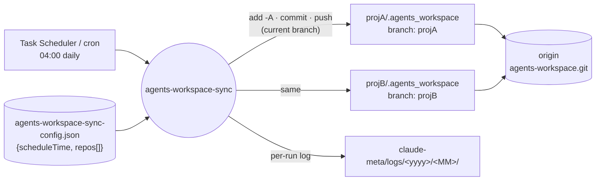
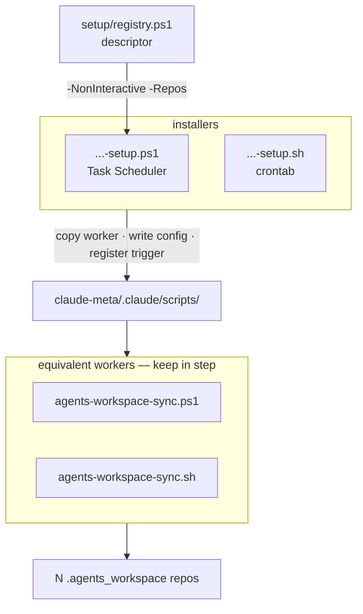
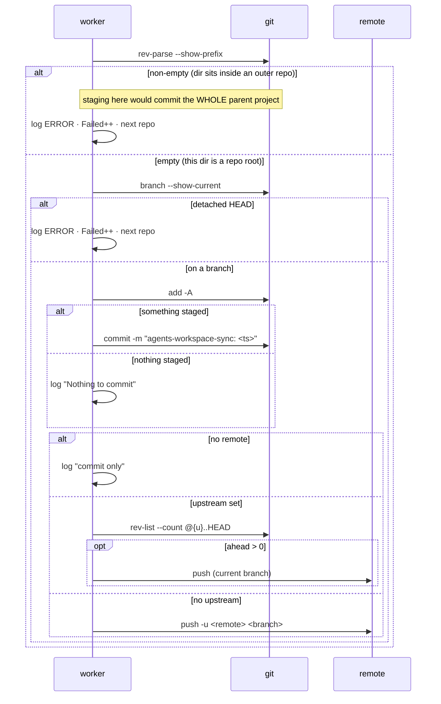

# agents-workspace-sync — Architecture

A daily unattended job that commits and pushes a configured list of `.agents_workspace` git
repos. Pure git plumbing: no `claude` CLI, no cursor, no staging. It shares the
`scheduled-session-digests` logging layout and install shape, and nothing else.

## System context

The worker lives in the meta repo's scripts dir alongside the digests, reads its own config,
and writes to N foreign repos that all push to one shared `agents-workspace` remote — one
branch per parent project.

## Components

Two behaviourally equivalent workers and their installers. The installer copies the worker into
the meta repo; the scheduled task runs that installed copy, not the one in this repo.

## Key flow — one repo, with the guard first

The guard is the load-bearing step. Everything else is ordinary git.

Exit: `0` all repos ok · `1` fatal setup (no meta dir / config / repos) · `2` ran with N failures.

## Key Decisions

- **Its own `tools/` member, not a fifth `scheduled-session-digests` scheduler.** It shares no
  pipeline with the digests — no transcript scan, no cursor, no `claude --print` — so the only
  reuse would have been the installer chrome. Sibling of `git-sync`, not a caller of it:
  `git-sync.ps1` is hardcoded to the single `$C4_CLAUDE_META_DIR` repo, while this loops N
  foreign repos.

- **Each configured path must be a standalone repo, enforced by `git rev-parse --show-prefix`
  being empty.** A `.agents_workspace` that is merely a tracked subdirectory of an outer project
  would cause `git -C <path> add -A` to walk up to the outer `.git` and stage the entire parent
  project — committing and pushing unrelated work-in-progress nightly, across every repo in the
  list. Rejected the textual comparison of `--show-toplevel` against the configured path:
  git reports `C:/x/y` where Git Bash's `pwd` reports `/c/x/y`, so it rejected every repo on
  Windows; case, symlinks, and 8.3 short names break it too.

- **Commit and push the current branch; never switch branches.** These repos are sibling
  branches of one shared `agents-workspace` remote (one branch per parent project), so
  `git-sync`'s merge-to-default behaviour would be wrong here. It also keeps the tool safe to
  run against a repo someone is actively working in, since HEAD never moves.

- **Never pull, merge, rebase, or force-push.** A push rejected because the remote moved ahead
  is logged as a failure for a human. Unattended conflict resolution on notes repos is not worth
  the risk of losing work.

- **A failing repo is logged and skipped, not fatal.** Exit `2` reports "ran with failures" so
  the scheduler surfaces it, while every healthy repo still syncs. Exit `1` is reserved for
  fatal setup problems where nothing could run at all.

- **`Sync-Repo` returns nothing and reports through `$script:Failed`.** `Log` writes to the
  PowerShell success stream, so a returned value would arrive mixed into the log lines and a
  caller testing it would test a non-empty array — which is always truthy, silently swallowing
  every failure.

- **Config is a JSON file in the meta repo, re-read every run.** Adding or dropping a repo is an
  edit, not a reinstall.
