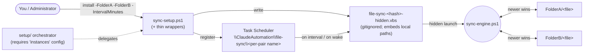
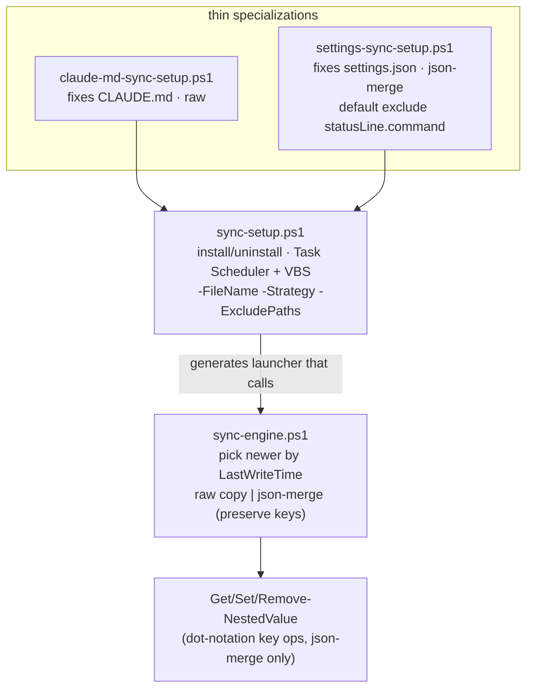
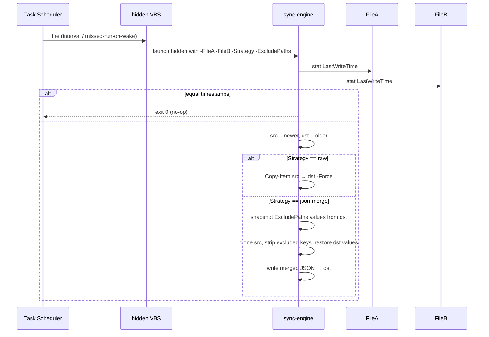

# file-sync — Architecture

Keeps a single named file in sync between two folders chosen at install time, always copying the
newer file over the older. One generic engine plus two thin specializations (CLAUDE.md raw copy;
settings.json copy-with-key-preservation). Each install registers a Windows Task Scheduler job that
runs on an interval via a hidden VBS launcher.

## System context

You install a folder-pair sync; Task Scheduler fires the engine on an interval to keep the two
copies converged.

## Components

A generic engine and generic installer, with two wrappers that only fix the file name and strategy.

## Key flow — one scheduled sync tick

Newer file wins; `raw` copies verbatim, `json-merge` re-applies the destination's excluded keys onto
the newer JSON.

## Key Decisions

### 2026-07-02 — Newer-file-wins as the entire conflict policy

**Status:** Accepted
**Context:** Syncing one file between two folders needs a conflict rule. Options: two-way merge,
three-way merge with a base, interactive prompt, or a simple last-writer-wins by mtime. The use case
(mirror CLAUDE.md / settings.json across config dirs) is low-conflict and unattended.
**Decision:** The engine compares `LastWriteTime` and copies newer over older; equal timestamps are
a no-op. No prompts, no three-way merge, no base version. This is the whole policy for `raw`.
**Consequences:** Trivial, predictable, unattended sync. A genuine concurrent divergence loses the
older edit silently — acceptable for the config-mirroring use case, not for source files. Correctness
depends on trustworthy mtimes.

### 2026-07-02 — Two strategies over one engine; json-merge preserves machine-specific keys

**Status:** Accepted
**Context:** `settings.json` must sync but keep per-machine keys (e.g. `statusLine.command`) intact
on each side, whereas `CLAUDE.md` is plain text needing a verbatim copy. Both share the same
newer-wins selection.
**Decision:** Keep one engine with two apply strategies. `raw` copies verbatim. `json-merge` snapshots
the destination's `-ExcludePaths` (dot-notation) values, clones the newer JSON, strips those keys,
then restores the destination's snapshots — so machine-specific keys survive. Two thin wrappers fix
`-FileName`/`-Strategy` and pass folder/interval args through; they add no engine logic.
**Consequences:** One selection rule, one place to change it; new file types are a `sync-setup.ps1`
call away. Excluded paths are preserved, not clobbered. Wrappers must stay thin — duplicating engine
logic into a wrapper is a defect.

### 2026-07-02 — Per-(file, folder-pair) Task Scheduler jobs via a gitignored hidden VBS launcher

**Status:** Accepted
**Context:** Sync must run unattended on an interval, invisibly (no popping console), survive missed
runs across sleep, and allow several independent syncs at once. The launcher embeds resolved local
paths that must not be committed.
**Decision:** Each install registers a task under `\ClaudeAutomation\file-sync\` with a
per-(file, folder-pair) name, launched by a generated `file-sync-<hash>-hidden.vbs` that runs the
engine hidden. Missed runs fire on next wake; the schedule never expires. The generated VBS embeds
local paths and is gitignored; `hidden.vbs` in the repo is a reference template only. Uninstall takes
the same two folders used to install (symmetric naming).
**Consequences:** Multiple folder pairs sync in parallel without collision; runs are invisible and
resilient to sleep. The generated launcher is machine-specific and never committed; uninstall requires
the original folder arguments. This is the one member the `setup/` orchestrator can't install without
config (folder pairs have no sensible default).
