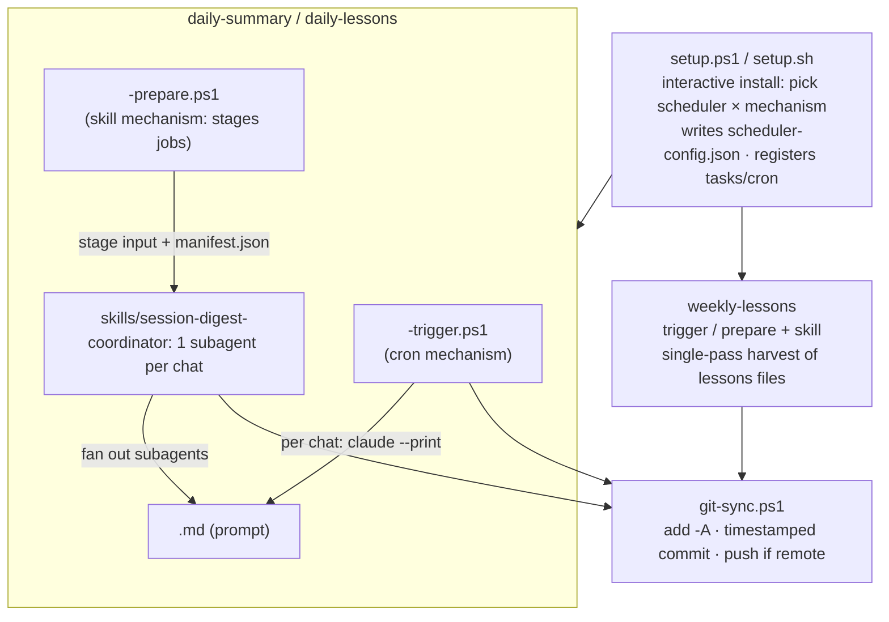
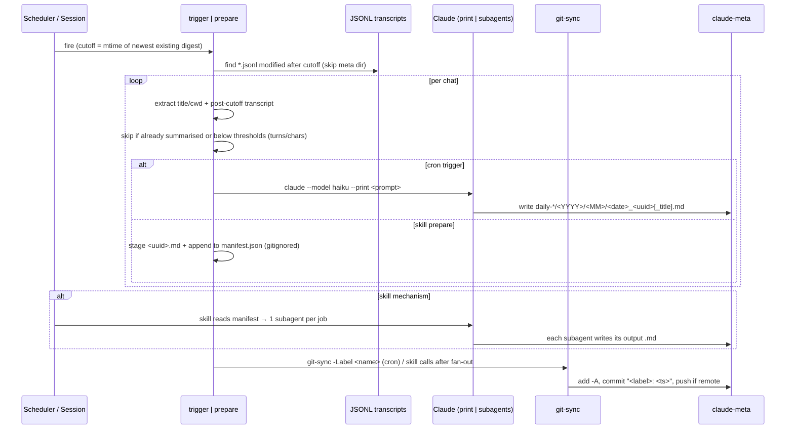
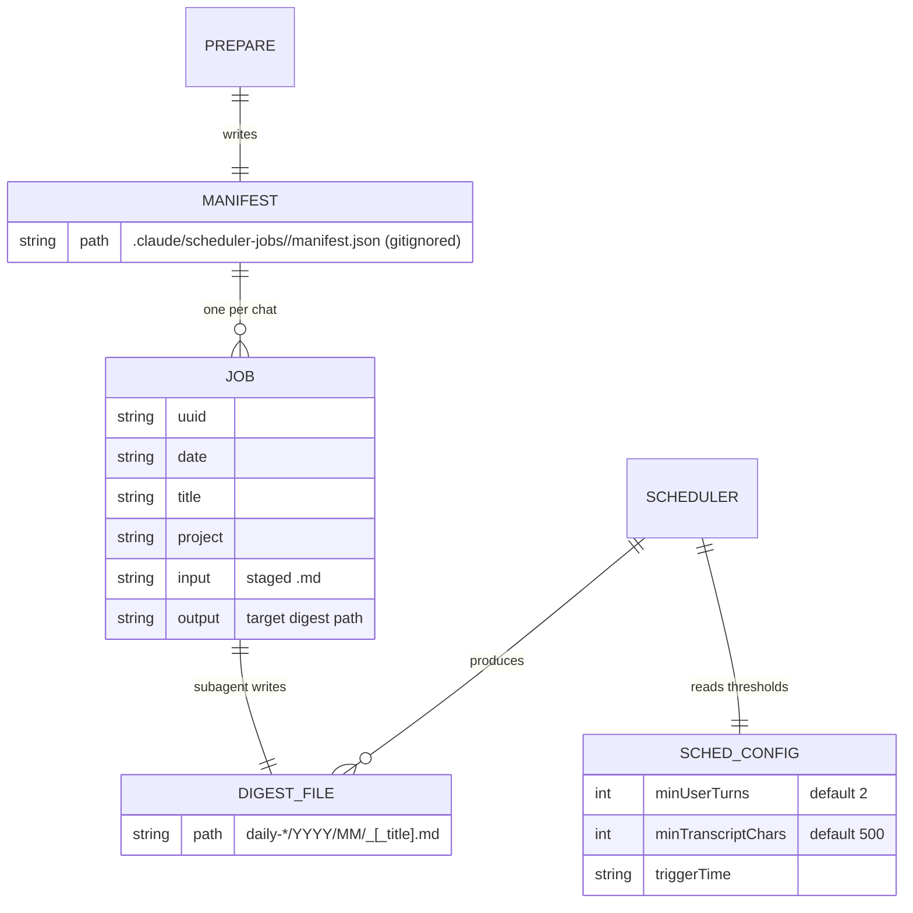

# scheduled-session-digests — Architecture

Unattended Claude Code automations that run on a schedule and write output into a shared local git
repo (`claude-meta`), optionally pushed to a remote. Four independently installable schedulers —
`daily-summary`, `daily-lessons`, `weekly-lessons`, and `git-sync` (called by the other three).
Each of the first three runs via **either or both** of two mechanisms: an unattended **cron**
trigger (`claude --print`) or an on-demand **skill** that fans work out to subagents in an
interactive session.

## System context

Schedulers read Claude Code's transcripts, produce markdown digests under `claude-meta`, and let
`git-sync` version them.

## Components

Each scheduler is a self-contained folder; the two daily ones ship both a cron trigger and a
skill+prepare pair. `git-sync` is the sole writer of git history.

## Key flow — daily digest, both mechanisms

Same discovery and cutoff logic; the mechanisms diverge only in who calls Claude — the cron trigger
loops `claude --print`, the skill stages a manifest and fans out to subagents.

## Data model

The staging area (skill mechanism) and the durable digest tree. Staging is gitignored so a partial
run is never committed.

## Key Decisions

### 2026-07-02 — Two run mechanisms per scheduler: unattended cron and interactive skill

**Status:** Accepted
**Context:** Fully unattended digests need programmatic `claude --print`, which consumes
programmatic credit that may be rate-limited. Users sometimes want the same digest run from an
interactive session instead, using that session's capacity.
**Decision:** Ship each daily scheduler as both a **cron** trigger (Task Scheduler / cron loops
`claude --print` per chat) and a **skill** (`/session-digest-<name>`) backed by a `*-prepare.ps1`
that stages per-chat inputs and a `manifest.json`; the skill fans out one subagent per chat, then
`git-sync`s. Install offers a split list so any combination is possible (e.g. skill for daily, cron
for weekly). The two paths share discovery, cutoff, and threshold logic — they differ only in who
invokes Claude.
**Consequences:** Users pick the credit source per scheduler. The prepare/trigger pair must be kept
in sync since they duplicate discovery logic. The daily skills are coordinators (fan-out per chat);
the weekly skill is a single-pass harvest — preserve that shape.

### 2026-07-02 — `git-sync` is the sole writer of `claude-meta` history

**Status:** Accepted
**Context:** Three schedulers all need to commit their output to `claude-meta`. Duplicating
add/commit/push into each would fragment the git logic and risk inconsistent commit messages or
partial commits.
**Decision:** Centralize all git writes in `git-sync.ps1`: it stages `-A`, makes one
timestamped `"<label>: <ts>"` commit, and pushes only if a remote is configured. Each scheduler
calls it once, after all its output is written (one commit per run, not per chat). It no-ops
cleanly when there's nothing staged or `claude-meta` isn't a git repo.
**Consequences:** One commit-per-run with consistent messages, and push is optional (commit-only
without a remote). Digest scripts never touch git directly. The skill mechanism's staging area is
gitignored so an interrupted fan-out never lands a half-finished commit.

### 2026-07-02 — Incremental cutoff = mtime of the newest existing digest; skip-short thresholds

**Status:** Accepted
**Context:** Rescanning the full transcript history every night would re-summarise everything and
burn credit. Trivial sessions (accidental opens, one-liners) aren't worth a digest.
**Decision:** Derive the cutoff from the `LastWriteTime` of the most recently written digest (or
beginning-of-time on first run / `-FullScan`); process only `*.jsonl` modified after it, and within
a long session only the post-cutoff turns. Skip a chat if already summarised, or if it fails
configurable thresholds (`minUserTurns` default 2, `minTranscriptChars` default 500) from
`scheduler-config.json`. Metadata (title/cwd) is read from the whole file even if before the cutoff.
**Consequences:** Each run does incremental work proportional to new activity. Thresholds are
tunable at install. The cutoff is derived from output-file mtimes rather than a stored watermark —
simple, but sensitive to digests being touched/moved after the fact.

### 2026-07-02 — Four independently installable schedulers, each with its own README

**Status:** Accepted
**Context:** The monorepo rule is one README per member, but these four schedulers install, run, and
release independently and each has non-trivial config/output worth documenting on its own.
**Decision:** Keep each scheduler in its own folder (`daily-summary/`, `daily-lessons/`,
`weekly-lessons/`, `git-sync/`) with its own README and scripts — a sanctioned exception to the
one-README rule. `skills/` holds the installable skills, copied to
`$C4_CLAUDE_META_DIR/.claude/skills/`. Windows (PowerShell/Task Scheduler) and Linux (Bash/cron)
paths are kept behaviourally equivalent.
**Consequences:** Each scheduler is documented and installable on its own. The cost is four READMEs
to maintain and a two-platform sync obligation for every behaviour change.
