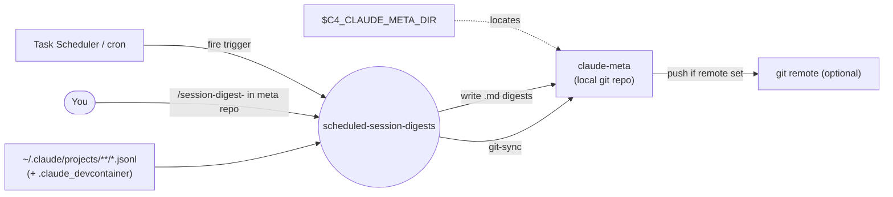
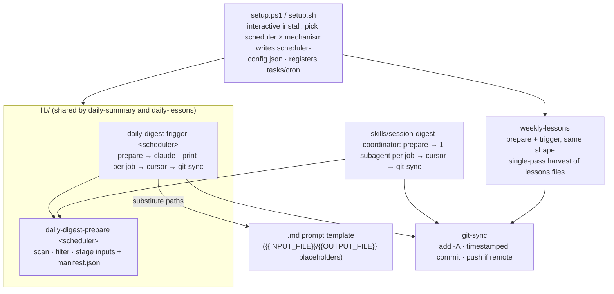
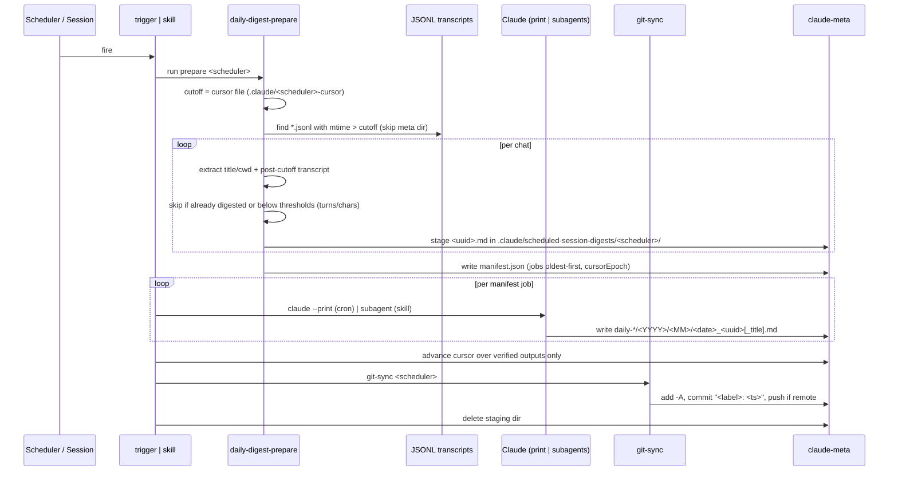
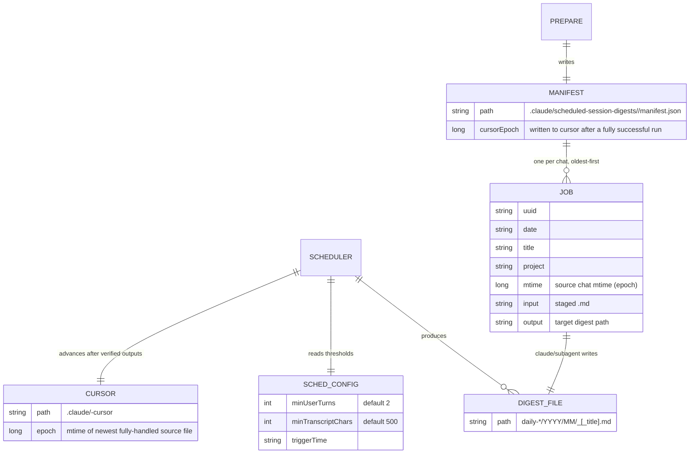

# scheduled-session-digests — Architecture

Unattended Claude Code automations that run on a schedule and write output into a shared local git
repo (`claude-meta`), optionally pushed to a remote. Four independently installable schedulers —
`daily-summary`, `daily-lessons`, `weekly-lessons`, and `git-sync` (called by the other three).
Each of the first three runs via **either or both** of two mechanisms: an unattended **cron**
trigger (`claude --print`) or an on-demand **skill** that runs in an interactive session. Both
mechanisms consume the same **prepare** script, which is the single owner of the scan/stage logic.

## System context

Schedulers read Claude Code's transcripts, produce markdown digests under `claude-meta`, and let
`git-sync` version them.

## Components

The two daily schedulers share one parameterized prepare/trigger pair (`lib/`); weekly-lessons has
its own pair with the same shape. Triggers are thin consumers of the prepare scripts, so the cron
and skill mechanisms cannot drift apart. `git-sync` is the sole writer of git history.

## Key flow — daily digest, both mechanisms

One scan/stage implementation; the mechanisms diverge only in who calls Claude — the cron trigger
loops `claude --print` over the manifest, the skill fans the same manifest out to subagents.

## Data model

The transient staging area (gitignored, reset per run, deleted by the consumer) and the durable
digest tree. The cursor files live outside the staging dir — they are state, not temp.

## Key Decisions

### 2026-07-02 — Two run mechanisms per scheduler: unattended cron and interactive skill

**Status:** Accepted (amended 2026-07-16: the mechanisms now share the prepare script instead of
duplicating discovery logic)
**Context:** Fully unattended digests need programmatic `claude --print`, which consumes
programmatic credit that may be rate-limited. Users sometimes want the same digest run from an
interactive session instead, using that session's capacity.
**Decision:** Ship each scheduler as both a **cron** trigger and a **skill**
(`/session-digest-<name>`). Install offers a split list so any combination is possible (e.g. skill
for daily, cron for weekly). The daily skills are coordinators (fan-out per chat); the weekly skill
is a single-pass harvest — preserve that shape.
**Consequences:** Users pick the credit source per scheduler.

### 2026-07-02 — `git-sync` is the sole writer of `claude-meta` history

**Status:** Accepted
**Context:** Three schedulers all need to commit their output to `claude-meta`. Duplicating
add/commit/push into each would fragment the git logic and risk inconsistent commit messages or
partial commits.
**Decision:** Centralize all git writes in `git-sync.ps1`: it stages `-A`, makes one
timestamped `"<label>: <ts>"` commit, and pushes only if a remote is configured. Each scheduler
calls it once, after all its output is written (one commit per run, not per chat). It no-ops
cleanly when there's nothing staged or `claude-meta` isn't a git repo.
**Consequences:** One commit-per-run with consistent messages, and push is optional (commit-only
without a remote). Digest scripts never touch git directly. The staging area is gitignored so an
interrupted run never lands a half-finished commit.

### 2026-07-02 — Four independently installable schedulers, each with its own README

**Status:** Accepted
**Context:** The monorepo rule is one README per member, but these four schedulers install, run, and
release independently and each has non-trivial config/output worth documenting on its own.
**Decision:** Keep each scheduler in its own folder (`daily-summary/`, `daily-lessons/`,
`weekly-lessons/`, `git-sync/`) with its own README and scripts — a sanctioned exception to the
one-README rule. Shared daily scripts live in `lib/`; `skills/` holds the installable skills,
copied to `$C4_CLAUDE_META_DIR/.claude/skills/`. Windows (PowerShell/Task Scheduler) and Linux
(Bash/cron) paths are kept behaviourally equivalent.
**Consequences:** Each scheduler is documented and installable on its own. The cost is four READMEs
to maintain and a two-platform sync obligation for every behaviour change.

### 2026-07-16 — Triggers consume the prepare scripts; one shared daily implementation

**Status:** Accepted (supersedes the prepare/trigger duplication noted in the 2026-07-02 decision)
**Context:** The cron triggers and skill prepare scripts each carried an independent copy of the
scan/extract logic per scheduler per language (~1200 duplicated lines), with divergent temp-file
locations (`.claude/scripts/` inputs, `/tmp` mktemps, `docs/claude_logs/` staging vs
`.claude/scheduler-jobs/`).
**Decision:** The prepare script is the single owner of scan/filter/stage; it writes per-job inputs
plus `manifest.json` to `$C4_CLAUDE_META_DIR/.claude/scheduled-session-digests/<scheduler>/`
(gitignored, reset per run, deleted by the consumer when done). The cron trigger runs prepare, then
loops the manifest through `claude --print`, substituting each job's paths into the prompt template
(`{{INPUT_FILE}}`/`{{OUTPUT_FILE}}`); the skill fans the same manifest out to subagents. The two
daily schedulers share one parameterized `lib/daily-digest-prepare.{ps1,sh}` and
`lib/daily-digest-trigger.{ps1,sh}`. The daily-lessons cron prompt embeds the lessons methodology
and writes directly to the output path — the `ceh-lessons-learned` marketplace-skill dependency was
dropped after its output contract changed upstream (see DECISION_LOG entry 55).
**Consequences:** Cron/skill and summary/lessons parity is structural. All transient files live in
one gitignored staging root and are cleaned up by the consumer even on crash (trap/finally).

### 2026-07-16 — Cursor files replace output-mtime cutoffs

**Status:** Accepted (supersedes the 2026-07-02 "cutoff = mtime of newest digest" decision)
**Context:** Deriving the cutoff from output-file mtimes is fragile: a crash mid-run advances the
cutoff past unprocessed chats, and touched/moved digests corrupt it.
**Decision:** Each scheduler keeps `.claude/<scheduler>-cursor` — the Unix-epoch mtime (whole
seconds, both platforms truncate identically) of the newest source file fully handled. Prepare
reads it as the scan cutoff; consumers advance it only over verified outputs (oldest-first,
stopping at the first failure), and to the newest scanned file after a fully successful run. The
UUID-already-digested check remains as a safety net. Skip-short thresholds
(`minUserTurns`/`minTranscriptChars` from `scheduler-config.json`) are unchanged.
**Consequences:** A crashed or failed job is retried exactly; completed work is never redone. First
run after upgrade rescans history once (the UUID check makes it a cheap re-filter).
