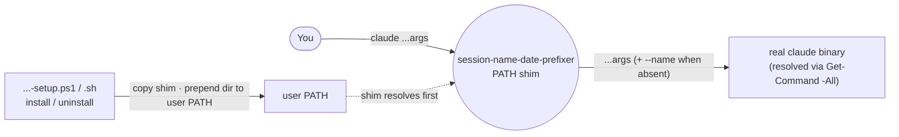
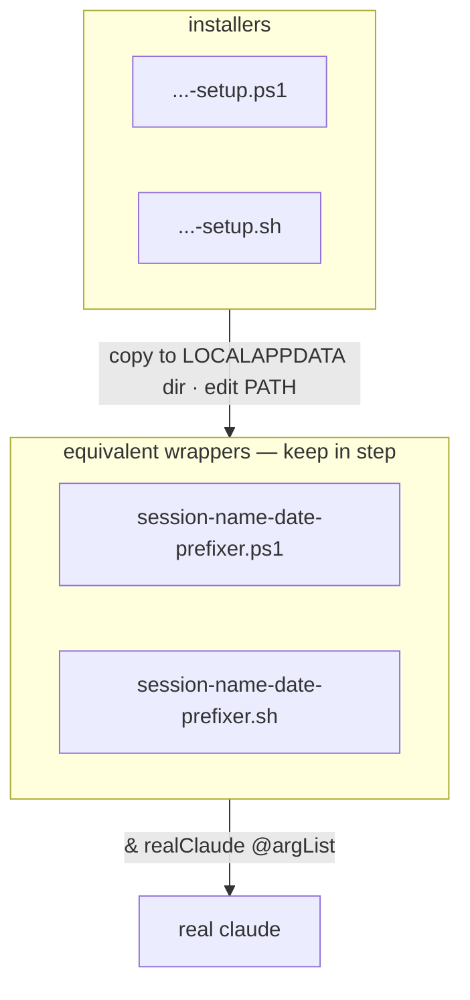

# session-name-date-prefixer — Architecture

A transparent `claude` CLI wrapper that auto-injects a dated `--name <cwd>-<yyMMddHHmm>` when the
user passes none, so session history is easy to browse. It sits on `PATH` ahead of the real binary
and forwards every argument unchanged except for that one addition.

## System context

A shim between your shell and the real `claude`: install puts it first on `PATH`; it resolves and
execs the real binary.



## Components

Two behaviourally identical wrappers (PowerShell / Bash) plus their installers.



## Key flow — inject name when absent

The one behaviour: prepend `--name` only when neither `--name` nor `-n` is present, then exec the
real binary (never itself).

```mermaid
sequenceDiagram
    participant U as Shell
    participant W as wrapper
    participant R as real claude

    U->>W: claude <args>
    W->>W: scan args for --name / -n
    alt name absent
        W->>W: dirName = leaf(cwd) sanitised; stamp = yyMMddHHmm
        W->>W: argList = [--name dirName-stamp] + args
    else name present
        W->>W: argList = args (unchanged)
    end
    W->>W: resolve real claude (skip *claude.ps1 / self)
    alt not found
        W-->>U: error, exit 1
    else
        W->>R: exec with argList
        R-->>U: normal claude session
    end
```

## Key Decisions

### 2026-07-02 — A PATH shim that wraps `claude`, not a hook or alias

**Status:** Accepted
**Context:** The goal is a default session name without asking the user to change how they invoke
`claude`. Options: a shell alias/function (per-shell, doesn't cover every launch context), a Claude
Code hook (no hook fires before session naming), or a wrapper binary on `PATH`.
**Decision:** Install a wrapper script named `claude` into a `LOCALAPPDATA`/local dir prepended to
the user `PATH`, so it intercepts every `claude` launch. It forwards all arguments verbatim and only
prepends `--name <cwd>-<yyMMddHHmm>` when both `--name` and `-n` are absent. It resolves the real
binary via `Get-Command claude -All`, skipping itself, to avoid infinite recursion.
**Consequences:** Works across all shells and launch contexts with no per-shell config. Pass-through
is sacred — every other argument is untouched. Correctness hinges on the shim being ahead of the real
binary and on the self-skip in resolution; uninstall must reverse the PATH edit. The `.ps1`/`.sh`
pair must stay behaviourally identical.
