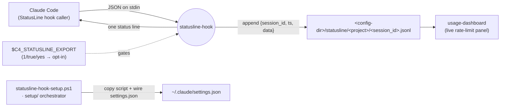
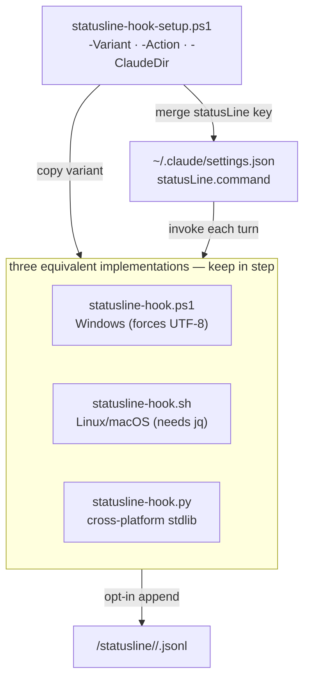
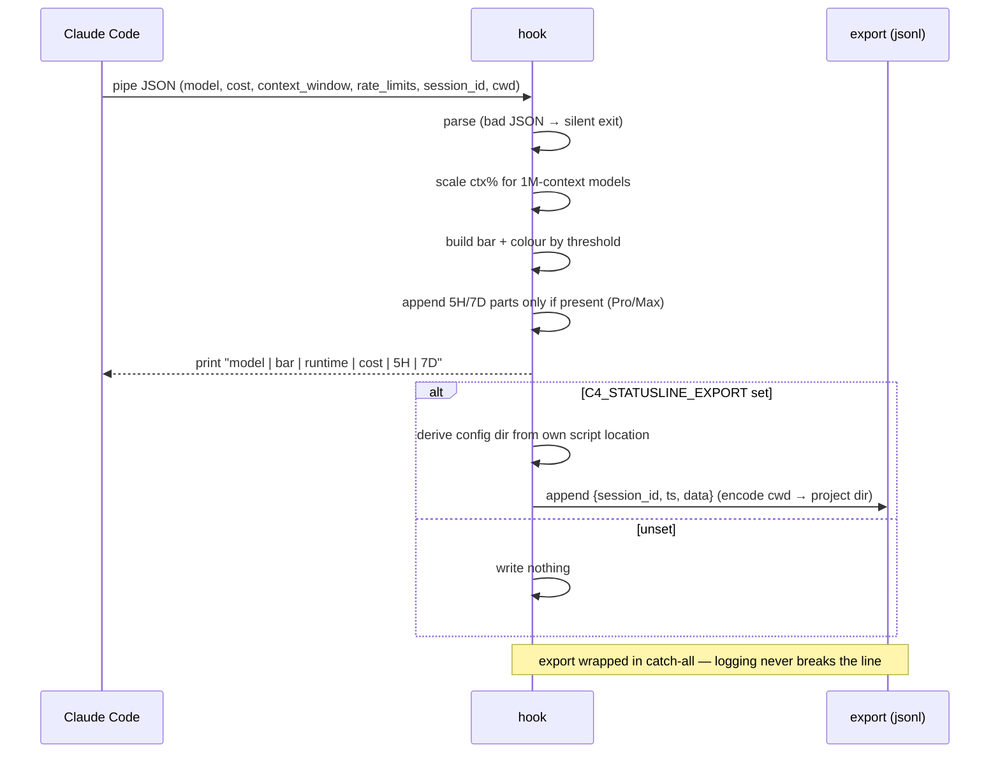

# statusline-hook — Architecture

A Claude Code `StatusLine` hook that prints a colour-coded one-liner each turn
(`model | context bar | runtime | cost | 5h rate | 7d rate`). It can also append the turn to a
per-project/per-session JSONL log that powers the `usage-dashboard` live rate-limit panel. Three
behaviourally identical implementations, one per shell.

## System context

Claude Code invokes the hook each turn, piping a JSON blob on stdin; the hook prints one line and
(opt-in) writes a JSONL export the dashboard reads.

## Components

One script per shell, all reading the same stdin contract and writing the same export shape. Setup
copies the chosen variant and wires the `statusLine` key.

## Key flow — one turn

Parse stdin, render the line, and (only when export is enabled) append the raw turn; logging never
breaks the status line.

## Key Decisions

### 2026-07-02 — Three shell-specific implementations kept behaviourally identical

**Status:** Accepted
**Context:** The hook must run wherever Claude Code runs (Windows PowerShell, Linux/macOS Bash) and
also be lintable/type-checkable. No single script covers all shells cleanly, and the primary dev
platform is Windows.
**Decision:** Ship three equivalent scripts — `.ps1`, `.sh` (needs `jq`), `.py` (stdlib only) — and
treat them as one behaviour with three ports: any change to one is mirrored in the others. Setup
picks a variant with `-Variant`. The Python variant carries a `pyproject.toml` solely to satisfy
the monorepo "every Python member is a `uv` project" rule and hold ruff/mypy config; it is
explicitly not an installable package (`package = false`, `dependencies = []`).
**Consequences:** Users pick the script for their shell with nothing to install to run it. The cost
is a standing three-way sync obligation — a behaviour change is not done until all three match.

### 2026-07-02 — JSONL export is opt-in, off by default, with a fixed record contract

**Status:** Accepted
**Context:** The `usage-dashboard` live panel wants each turn's raw data, but most users just want a
status line and should not silently accumulate logs of full turn payloads.
**Decision:** Gate the export behind `C4_STATUSLINE_EXPORT` (`1`/`true`/`yes`); unset means print
and write nothing. When enabled, append `{session_id, ts, data}` to
`<config-dir>/statusline/<project>/<session_id>.jsonl` — the exact shape the dashboard reads. The
dashboard treats the export as optional and skips it silently when absent. The export is wrapped in
a catch-all so a logging failure never breaks the status line.
**Consequences:** Zero footprint by default; the dashboard's live panel lights up only when the user
opts in. The record shape is a cross-member contract — both ends change together.

### 2026-07-02 — Hook self-locates its config dir from its own script path

**Status:** Accepted
**Context:** The export must land under the same Claude config dir the hook was installed into,
including non-default `-ClaudeDir` installs, without threading an env var through Claude Code's hook
invocation.
**Decision:** The hook derives its base dir from its own resolved script location
(`Path(__file__).parent`), not from `$C4_CLAUDE_DIR` or any env var. Setup's `-ClaudeDir` (default
`~/.claude`) chooses the install dir, and each installed copy exports beside itself.
**Consequences:** Multiple installs each export under their own dir with no extra config. The tradeoff
is that moving the script by hand also moves where it exports — the install location is the source of
truth.
