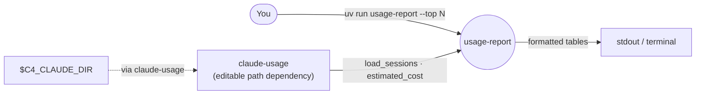
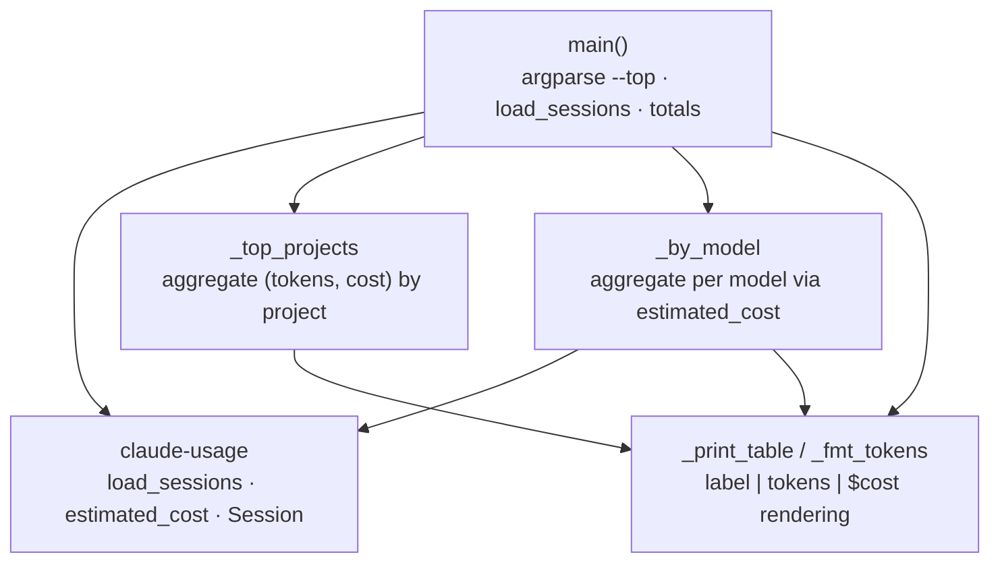
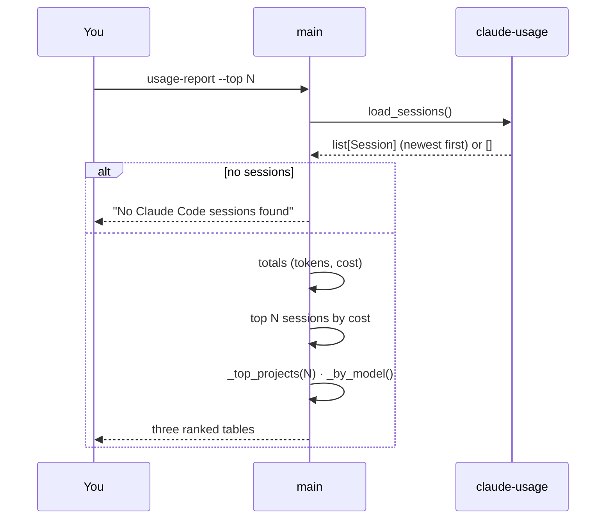

# usage-report — Architecture

A thin CLI that prints a cross-session summary of Claude Code token usage and estimated cost — the
terminal counterpart to the `usage-dashboard` app. All parsing and pricing live in the shared
`claude-usage` library; this member is presentation only.

## System context

A one-shot command: read sessions via the library, render three ranked tables to stdout.

## Components

One module: `cli.py`. Aggregation helpers rank sessions/projects/models; the pricing and parsing
are imported, never reimplemented.

## Key flow — render the report

## Key Decisions

### 2026-07-02 — Thin presenter over `claude-usage`; a real installable package

**Status:** Accepted
**Context:** The terminal summary needs the same transcript parsing and pricing as the
`usage-dashboard` app. Duplicating that logic would create two sources of truth for cost.
**Decision:** Keep this member presentation-only — `cli.py` calls `claude_usage.load_sessions` and
`estimated_cost` and does nothing but aggregate and format. Unlike the stdlib-only `tools/` scripts,
this is a packaged tool with a `usage-report` console entry point and a single runtime dependency:
`claude-usage`, wired as an editable path source (so `uv sync` is required before first run).
**Consequences:** Parsing/pricing changes land once, in the library, and both consumers pick them
up. The tradeoff versus the zero-setup scripts is a real `uv sync` step. Output keeps cost labelled
"estimated" to stay honest that it is token counts × list price, not billed.
