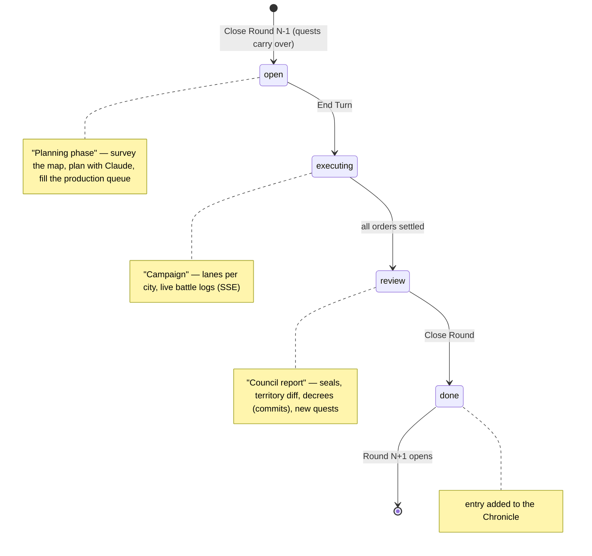
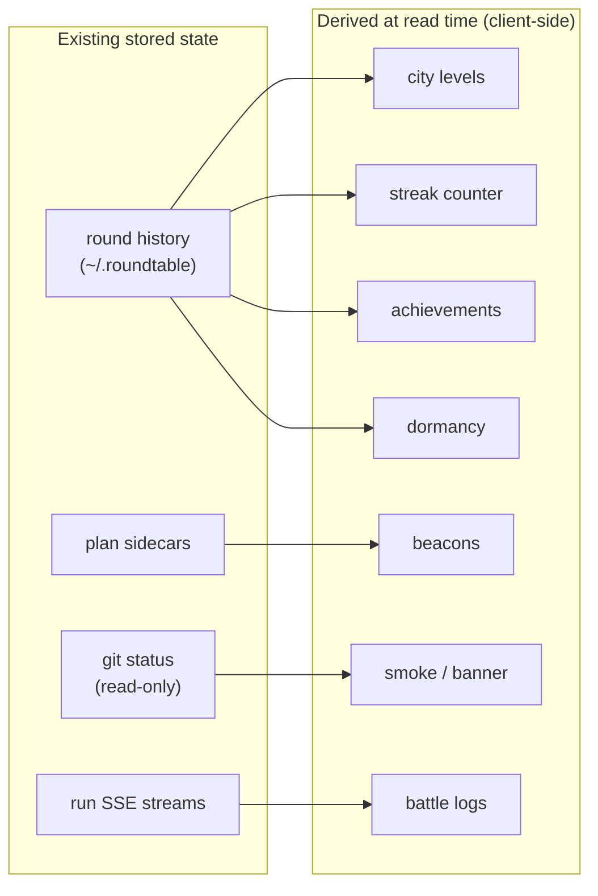

# Draft: Gamifying the roundtable UI

**Status:** idea draft, not a plan. Written 2026-07-13. No commitment to any of it; pick the cheap wins first.

## Premise

The README already sells roundtable as "a strategy game, not a shooter: each repo is a city on a board, and work advances in rounds." The UI currently *describes* that metaphor but doesn't *play* it — cards are cards, End Turn is a button, history is a table. Gamification here means finishing the metaphor the app already committed to, not bolting points onto a dashboard. Everything below is derived from data the app already stores (rounds, orders, runs, costs, sidecars); almost nothing needs new persistent state.

## Design direction

Civilization / Advance Wars energy, executed inside the existing Tidewater token system: calm base palette, with the "game layer" carried by shape, motion, and a handful of accent colors — not by cartoon chrome. No new dependencies, no build step, vanilla JS + CSS as today. A `Game mode` toggle in the header (persisted in `localStorage`) lets the whole layer be turned off, so the plain-professional UI stays available and the gamified layer can ship incrementally behind it.

**Framework decision (settled):** stays vanilla. The game layer is mostly CSS over server-owned state (5s poll + SSE); there is no client-side state graph for a framework to reconcile, and "no npm, no build step" is a stated project property the reskin must not break. The constraint to preserve is "no build step + server-owned state", not "no framework" per se — revisit only if roundtable ever grows real client-side interactivity (optimistic updates, undo, inline editing across views).

### Vocabulary map (presentation layer only — API/backend terms never change)

| Backend / API term | Game-mode label | Plain-mode label |
|---|---|---|
| repo / project | city | repo |
| round `open` | Planning phase | open |
| round `executing` | Campaign | executing |
| round `review` | Council report | review |
| order | order (in the production queue) | order |
| End Turn | End Turn (already game vocabulary) | End Turn |
| commit | Seal the decree | commit |
| follow-up note | quest | follow-up |
| estimated cost | treasury spend | est. cost |

### The round loop, reframed

The existing state machines are rendered, never extended — the game layer is a costume over `rounds.ROUND_ALLOWED`:



## The pieces

### 1. The board becomes a map

- Repo cards restyle as **city tiles**: a small "city crest" (deterministic generated glyph from the repo name — hash to a shape+color pair, pure CSS/SVG, no assets), the branch as the city's "banner", dirty count as smoke over the city.
- **City level** = plans implemented all-time for that repo (derived by scanning round history at read time, same policy as cost). Level shows as a small numeral on the crest; the tile's border ornament gets slightly richer at levels 5/10/20. Growth is the whole reward loop — no popups.
- Repos with a `ready` plan get a subtle **pulsing beacon** (the "your move" affordance every turn-based game has). Repos untouched for N rounds get a desaturated **"dormant"** treatment — fog of war, gently guilting you back.
- The 5s board poll already exists; no data change needed, only `board.js` + CSS.

Board sketch (game mode on):

```
+- ROUND 12 - PLANNING PHASE ----------------- streak: 4 -- [game: on] -+
|                                                                       |
|  +----------------+  +----------------+  +----------------+          |
|  | (D)7           |  | (T)12        ~ |  | (S)3     .fog. |          |
|  | usage-dashbrd  |  | multi-repo-ws  |  | file-sync      |          |
|  | |> main        |  | |> feat/gamify |  | |> main        |          |
|  | ~3 dirty ^2 v0 |  | clean    ^0 v0 |  | clean          |          |
|  | * ready:2  <-- |  | * ready:1  <-- |  | dormant (4 rd) |          |
|  +----------------+  +----------------+  +----------------+          |
|        ^ beacon pulses      ^ smoke = dirty       ^ desaturated      |
|                                                                       |
|  agenda: 3 quests carried from Round 11          [ END TURN (2) ]    |
+-----------------------------------------------------------------------+
```

Anatomy of one city tile:

```
+--------------------------+
| (D)7  usage-dashboard    |   (D)7  = crest glyph + city level
| |> feat/plan-value       |   |>    = banner (current branch)
| ~ 3 dirty    ^2 v0       |   ~     = smoke (dirty count), ^v = ahead/behind
| * ready: 2   o run: 0    |   *     = beacon, pulses while ready plans exist
+--------------------------+
```

**Crest generation (deterministic, zero assets):** hash the repo name (e.g. FNV-1a over the UTF-8 bytes), then index into 8 crest shapes (inline SVG paths: diamond, tower, sail, gear, leaf, star, key, wave) x 8 Tidewater-compatible hues = 64 distinct crests. Same repo always gets the same crest on every machine; no image files, no uploads, ~30 lines of JS + one `<defs>` block.

**Dormancy rule:** a repo is dormant when it appears in zero orders across the last 3 closed rounds (constant in `board.js`, not config — tune by editing). Dormant tiles get `filter: saturate(.4)` and the crest at half opacity; any activity clears it instantly on the next poll.

### 2. Turn structure made visible

- A persistent **turn banner**: `Round 12 — Planning phase` / `Executing` / `Review`, driven by the existing round state machine (`open|executing|review|done`). This is a straight rendering of state that today is only implicit in which page you're on.
- **End Turn** becomes the game's signature button: large, right-aligned, hourglass/next-turn iconography, disabled-state replaced by the existing "controls appear only when functional" rule (it simply isn't shown until there are orders).
- The order queue renders as a **production queue** (Civ-style vertical stack with per-order repo crest + plan name), reordering as drag or up/down buttons.

### 3. Execution as spectacle

- End Turn triggers a **campaign view**: one lane per repo, orders marching left-to-right, the live SSE stream as a scrolling "battle log" per lane. Succeeded orders plant a flag; failed ones show a broken banner. This is a reskin of the existing round view — the SSE plumbing is untouched.
- Per-order **cost ticks up like a resource counter** (gold coin glyph next to the existing estimate; the pricing-table-estimate-is-canonical policy is unchanged, it just gets a coin icon).

Campaign view sketch (during End Turn):

```
+- ROUND 12 - CAMPAIGN --------------------- treasury: $1.42 ----------+
|                                                                       |
|  (D) usage-dashboard   [ord_1 FLAG done $0.61] -> [ord_2 >> running] |
|      | battle log: Editing src/cards/plan_value.py ...             | |
|      | battle log: Running ruff check . ... ok                     | |
|                                                                       |
|  (T) multi-repo-ws     [ord_3 >> running]                            |
|      | battle log: Reading roundtable/static/js/board.js ...       | |
|                                                                       |
|  (S) file-sync         [ord_4 .. queued]                             |
|                                                        [ STOP ]      |
+-----------------------------------------------------------------------+
```

Order glyph per status (shape + word, never color alone): `.. queued`, `>> running`, `FLAG done`, `XX failed` (broken-banner icon), `-- stopped`, `>| skipped`. Within a lane, a failure marks the remaining orders `>| skipped` — exactly the existing stop-on-failure semantics, just drawn.

How the derived game data maps onto existing state (nothing new is stored):



### 4. Review as the council report

- Review phase framed as an **after-action report**: per-repo card with outcome seal (victory laurel / defeat mark / skipped shield), diff stats as "territory gained/lost" (+/- lines), the commit action as **"Seal the decree"** (still the app's only git write, unchanged semantics).
- Follow-up notes become **quests**: they already carry into the next round's agenda; rendering them as quest cards with the round they originated from gives free narrative continuity.

Council report sketch (review phase, one card per repo that had orders):

```
+- COUNCIL REPORT - usage-dashboard -----------------------------------+
|  LAUREL victory      plan: add-plan-value-card         spend: $0.61  |
|                                                                       |
|  territory:  +214 / -32 lines across 6 files          [ view diff ]  |
|  replay:     [ open battle log ]                                      |
|                                                                       |
|  [ Seal the decree (commit) ]      [x] Reviewed                       |
|                                                                       |
|  new quest: "PlanValue card needs an empty-state for month 1"        |
|             -> carries to Round 13                                    |
+-----------------------------------------------------------------------+
```

Outcome seals are shape + label, never color alone: laurel = all orders succeeded, broken banner = any failed, shield = skipped/stopped. The seal is per-repo (derived from that repo's order statuses in the round), the round's Chronicle entry aggregates them.

### 5. Meta-progression (all derived, no new state)

- **Chronicle** (History page reskin): each closed round is an entry in an illuminated ledger — round number, seals, total cost, quests spawned/resolved.
- **Streak counter** in the header: consecutive closed rounds with zero failed orders.
- A small set of **achievements**, computed at read time from history, shown on the Chronicle page only (never toasts/popups — this is a work tool):
  - *First Light* — first round closed. *Clean Sweep* — a round where every order succeeded. *Federation* — a round touching 5+ repos. *Frugal* — a round under $X total. *Long March* — 10-round streak.
- Explicitly **no XP bars, no daily-login mechanics, no notifications**. The reward is visual growth of the board, not interruption.

## Accessibility & motion (non-negotiable, not gold-plating)

- Every state is conveyed by **shape + text label**, color is reinforcement only (seals, order glyphs, beacons all carry words).
- All pulse/march animations sit behind `@media (prefers-reduced-motion: reduce)` — with it set, beacons render as a static badge and campaign lanes update without transitions.
- Game-mode labels are visual skin only: `aria-label`s keep the neutral terms ("commit", not "seal the decree"), so screen reader output is stable across modes.
- Contrast: crest hues are picked from the Tidewater ramp at >= 4.5:1 against the tile background; the dormancy desaturation applies to decoration only, never to the repo name or counts.
- Queue reordering is buttons (up/down), not drag-only — keyboard-reachable by construction.

## Changes required (by surface)

| Surface | Change | Size |
|---|---|---|
| `static/css/` | Game-layer stylesheet (crests, tiles, banner, seals), gated on a `body.game` class | M |
| `static/js/board.js` | Crest generation, level/beacon/dormant rendering | M |
| `static/js/app.js` / `index.html` | Header toggle + turn banner | S |
| `static/js/round.js` | Production-queue + campaign-lane reskin of existing round view | M |
| `static/js/review.js` | Seals, quest cards | S |
| `static/js/history.js` | Chronicle + achievements/streak (derived client-side from the existing history API) | M |
| Backend | Ideally **zero**. If history responses lack per-repo implemented counts, add read-only aggregate fields to the existing history endpoint — no new store, computed at read time like cost | S/none |

Invariants untouched: plans stay app-read-only, closed status sets stay closed (the game layer renders states, never adds them), sidecar contract with docket unchanged, no new deps, no build step.

## Suggested sequencing (if any of this proceeds)

1. Game-mode toggle + turn banner + End Turn restyle (cheapest, biggest feel-change).
2. Board tiles: crests, beacons, dormancy.
3. Campaign execution view.
4. Review seals + quests.
5. Chronicle, streaks, achievements.

Each step is independently shippable and independently deletable.

## Open questions

- Should game mode be default-on (it's the app's stated identity) or default-off (it's a work tool)? Draft leans **default-on with a one-click off**.
- Do achievements deserve any persistence (e.g. "earned in round 7") or is pure derivation enough? Draft says pure derivation — no new state until someone misses it.
- Naming: keep the neutral terms in the API/backend forever; the game vocabulary lives only in the presentation layer.
