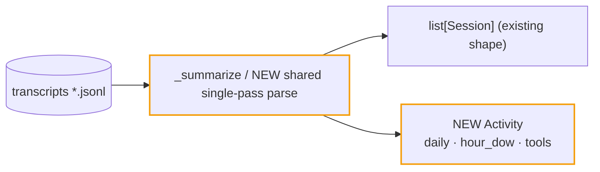

# ITER_01_v4 — claude-usage: per-message activity rollups

Foundational, backend-library-only iteration. No dashboard code changes; the app keeps
running unchanged against the existing `load_sessions`. This iteration exists first
because ITER_02's accurate daily buckets, model mix, and hour×dow profile all read from
`Activity`.

## §01 · Concept

> Unchanged — see SKELETON_v4 § 01.

## §02 · Architecture



New public API (additive; `usage-report` keeps working untouched):

```python
@dataclass
class DayBucket:
    date: str                      # local-time ISO day
    tokens: int
    cost: float                    # estimated, pricing table
    sessions: int                  # distinct sessions active that day
    per_family: dict[str, int]     # model_family -> tokens

@dataclass
class Activity:
    daily: list[DayBucket]         # last 364 local days, padded, oldest first
    hour_dow: list[list[int]]      # 7 rows (Mon..Sun) x 24 cols, tokens
    tools: dict[str, int]          # tool_use name -> call count

def load_usage(dirs: list[Path] | None = None) -> tuple[list[Session], Activity]: ...
```

Exported via `__init__.py` / `__all__`: `Activity`, `DayBucket`, `load_usage`. Semver:
minor bump.

## §03 · Tech Stack

> Unchanged — see SKELETON_v4 § 03. (Stdlib only; no new dependencies.)

## §04 · Backend

All in `libs/claude-usage/src/claude_usage/sessions.py` (plus `__init__.py` exports).

**Single pass, not a second parse.** Refactor `_summarize(fpath)` so one iteration over a
file's records feeds both the existing per-session totals and per-message activity
buckets passed in as accumulators. `load_usage` drives the pass; `load_sessions(dirs)`
becomes `return load_usage(dirs)[0]` (public behavior identical — same ordering, same
dedup). Do **not** read every file twice: transcripts are the dominant I/O cost and the
dashboard re-loads on every request.

**Bucketing rules:**
- Timestamps: `datetime.fromisoformat(...).astimezone()` → **local time** before
  extracting day / hour / weekday. (The current `last_ts[:10]` day-slicing in the
  dashboard is UTC; the v4 heatmap and charts intentionally switch to local days —
  a small, documented behavior change, since these views exist for a human's calendar.)
- Attribution: each assistant message's usage lands in its own message-day/hour bucket
  (same dedup by `uuid`/`requestId` as today). Long sessions no longer lump into one day.
- `daily` covers exactly the last 364 local days padded with zero-days (mirrors the
  existing `_by_day` padding), oldest first. Usage older than 364 days is dropped from
  `Activity` (sessions still carry it).
- `per_family` keys use the existing `model_family()`; `unknown` excluded.
- `DayBucket.cost` = per-message tokens × `model_costs(model)` (estimate).
- `sessions` per day = count of distinct session files with ≥1 counted message that day.
- `hour_dow[weekday][hour]` += message total tokens (all four classes), same local `dt`.
- Tools: on assistant messages, `message.content` may be a string or a list of blocks;
  when a list, count blocks with `block.get("type") == "tool_use"` by `block.get("name")`.
  Missing/empty names are skipped. (Subagent spawns appear naturally as their tool name,
  e.g. `Task`/`Agent` — no special-casing.)

**Gotchas addressed:** malformed lines/records already skipped by `_read_records` — keep
activity accumulation inside the same guarded loop; timezone conversion must handle
naive timestamps (treat as UTC, then `astimezone()`); do not let a huge `tools` dict grow
unbounded per call — it is naturally bounded by distinct tool names.

**Tests** (`libs/claude-usage/tests/test_sessions.py`, extend): synthetic transcript
fixtures asserting (a) `load_usage` sessions == `load_sessions` output; (b) a session
spanning two local days attributes tokens to both days; (c) hour/weekday bucketing for a
known timestamp; (d) tool_use counting for list-content and string-content messages;
(e) per_family aggregation; (f) 364-day padding and cutoff. Run
`uv run pytest` + `uv run ruff check .` + `uv run mypy src` in `libs/claude-usage/`.

Docs: update the library README public-API table (new symbols) in this iteration.

## §05 · Frontend

> Unchanged — see SKELETON_v4 § 05. (No UI change; nothing consumes Activity yet.)
