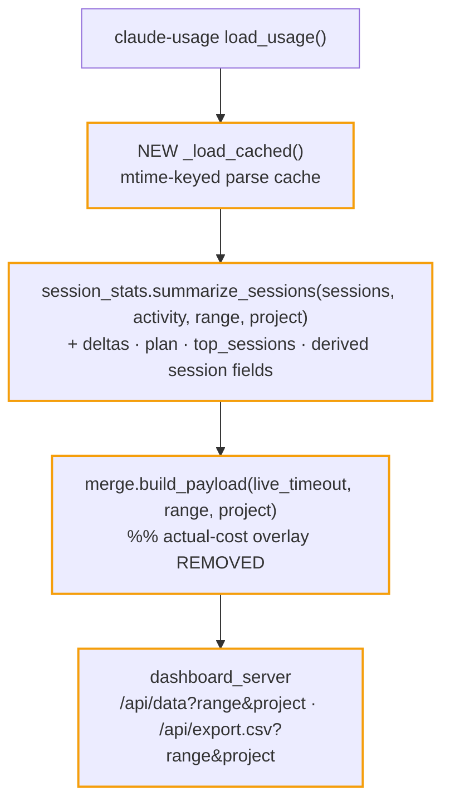

# ITER_02_v4 — server insight aggregates + scoping

Backend-only iteration: `/api/data` gains its full v4 `stats`/`sessions` shape. The
existing UI keeps rendering (it reads only keys that still exist with unchanged shapes);
new keys stay unrendered until ITER_03. The app is runnable and verifiable via
`curl /api/data`.

## §01 · Concept

> Unchanged — see SKELETON_v4 § 01.

## §02 · Architecture

Payload: implements every `stats` ⊕-key and the three ⊕ session fields from
SKELETON_v4 § 02 (all except `live.history`/`live.forecast`, which are ITER_05).
Range/project semantics exactly as specified there.

**Invariant change (deliberate, user-directed):** "actual cost wins for live sessions"
is retired. `merge._apply_actual_cost` is deleted; `sessions[].cost_usd` is always the
pricing-table estimate. The live card's per-session actual cost (`live.sessions[].session_cost`)
is untouched — it remains informational. Update `apps/usage-dashboard/CLAUDE.md` and
README (the "two sources" cost rule) in this iteration so docs never contradict code.

## §03 · Tech Stack

> Unchanged — see SKELETON_v4 § 03.

## §04 · Backend

**`dashboard_config.py`:** add
`PLAN_PRICE_USD: float | None` from `C4_PLAN_PRICE_USD` (invalid/unset → `None`).

**`session_stats.py`** — the bulk of the work:

- `_load_cached() -> tuple[list[dict], Activity]`: module-level memo of
  `claude_usage.load_usage(...)` keyed by `(file_count, max_mtime)` over
  `claude_usage.transcript_files(...)`. Interactive range/project switching re-fetches
  `/api/data` per click; without this, every click re-parses every transcript. The key
  scan is a cheap `os.stat` sweep. (`// less-code:` ceiling — single-process in-memory
  memo; upgrade path is per-file incremental parsing if scan cost ever matters.)
- `summarize_sessions(sessions, activity, range_key, project)`:
  - Filter sessions: `project` exact match first, then `last_ts ≥ cutoff(range_key)`
    (`RANGE_DAYS = {"7d": 7, "30d": 30, "90d": 90, "12m": 365, "all": None}` — closed
    set; unknown value → `all`).
  - Totals / token classes / cache economics: existing logic over the filtered rows.
  - `delta`: recompute the same totals over the *preceding* equal-length window
    (`cutoff−N .. cutoff`); emit pct changes
    (`(cur − prev) / prev * 100`, `None` per metric when `prev == 0`); whole key `null`
    for `all`.
  - `month_cost_usd` / `month_projected_usd`: unchanged (calendar month, ignores range,
    ignores project — document with a one-line comment; it is a billing-cycle figure).
  - `plan`: `None` if no `PLAN_PRICE_USD`, else
    `{"price_usd": p, "month_value_usd": month_cost, "ratio": month_cost / p}`.
  - `by_project`: existing top-10 (cost already computed today — UI renders it in
    ITER_03). `by_model`: existing, over filtered rows.
  - `top_sessions`: top 5 filtered rows by `cost_usd` (session-row dicts, `per_model`
    stripped later as usual).
  - Time-series from `activity` (already project-agnostic — see limitation below):
    `by_day` = last `min(range_days or 90, 90)` entries of `activity.daily` (existing
    `{date, tokens, cost, sessions}` shape); `heatmap` = full 364; `model_mix` = same
    span as `by_day`, `{date, per_family}`; `hour_dow` = `activity.hour_dow`;
    `tools` = top 15 of `activity.tools` as `[{name, count}…]`.
  - **Limitation, accepted + documented in code:** `Activity` is not project-bucketed,
    so when `project` is set the time-series keys still show all-projects activity;
    cards/tables are project-scoped. (Upgrade path: add a per-project dimension to
    `DayBucket` if this ever matters; skipped as YAGNI now.)
- Per-session derived fields (added to each session dict before summarize):
  `duration_secs` (from `first_ts`/`last_ts`, `0` when either missing),
  `cost_per_hour` (`None` when `duration_secs < 300` — sub-5-min sessions produce
  absurd rates), `cache_hit_pct` (`cache_read / (input + cache_read) * 100`, `None`
  when denominator is 0).

**`merge.py`:** delete `_apply_actual_cost` and its call;
`build_payload(live_timeout, range_key="all", project=None)` threads the new params into
`summarize_sessions` and passes filtered-by-project **sessions list** (range-filtered
rows) as the payload's `sessions` (the table should show what the cards count).

**`dashboard_server.py`:** parse `range` and `project` from the query string for
`/api/data` and `/api/export.csv` (values passed through; `project` URL-decoded by
`parse_qs`). CSV export gains the three derived columns.

**Gotchas addressed:** module-level cache must be guarded for the threaded server
(`threading.Lock` around rebuild — ThreadingHTTPServer handles requests concurrently);
`cutoff` computed from `datetime.now().astimezone()` so range boundaries match the
lib's local-day bucketing; division-by-zero on all delta/ratio denominators.

**Validation:** `uv run python -m py_compile` on changed files; `tests/smoke.sh` still
passes; manual `curl "localhost:8080/api/data?range=7d&project=X"` spot-check.

## §05 · Frontend

> Unchanged — see SKELETON_v4 § 05. (UI renders the new keys in ITER_03; until then the
> dashboard displays exactly what it does today, minus the live-cost overlay effect on
> the totals.)
