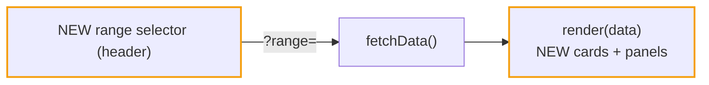

# ITER_03_v4 — render the insight layer

Frontend-only iteration: every `stats` key ITER_02 ships gets its pixels. No server
changes.

## §01 · Concept

> Unchanged — see SKELETON_v4 § 01.

## §02 · Architecture

Payload contract and endpoints unchanged from ITER_02_v4 § 02; this iteration only adds
consumers. Client state gains one server-scoped control:

## §03 · Tech Stack

> Unchanged — see SKELETON_v4 § 03.

## §04 · Backend

> Unchanged — see ITER_02_v4 § 04.

## §05 · Frontend

**`settings.js`:** `getRange()` / `onRangeChange()` persisting `cc_range` in
localStorage (default `all`); `fetchData()` in `app.js` appends
`&range=` (and later `&project=` — ITER_04). Range change → `fetchData()`.

**Header (render.js, above the stats grid):** segmented range selector
`7d · 30d · 90d · 12m · all` styled like the existing theme toggle (real `<button>`s,
`aria-pressed`, focus visible).

**Stat cards row (5 cards now):**
- Total Tokens / Est. Cost / Cache Savings: existing values (now range-scoped) plus a
  delta line from `stats.delta` — `▲ 12% vs prev 30d` / `▼ 8%` with green/red via
  existing `--green`/`--red` tokens, plus an explicit `vs prev <N>` label so meaning
  never rides on color alone. Hidden when `delta` is null.
- This Month: unchanged card, sub-line keeps projection (calendar-month, unaffected by
  range — title-attr note).
- **Plan Value** (new): when `stats.plan` — `${month_value_usd}` big, sub
  `{ratio.toFixed(1)}× your ${price_usd} plan`; when null — muted hint
  `set C4_PLAN_PRICE_USD to see plan ROI`.

**Charts row:** Daily Token / Daily Cost charts unchanged code-wise (`by_day` shape is
identical; titles become `last N days` from the range, capped at 90).

**New panels (cards, after the existing chart rows):**
- **Model mix over time**: stacked daily bars from `stats.model_mix`; new
  `makeStackedBarChart(canvas, days, familyColors)` in `charts.js` reusing the existing
  axis/tooltip machinery (tooltip lists per-family tokens). Colors: family base shade
  `MODEL_SHADES[fam][0]`; legend row above the canvas.
- **Activity profile (hour × weekday)**: 7×24 grid from `stats.hour_dow`; new
  `hourDowHTML(matrix)` in `heatmap.js` reusing `.hm-cell` intensity levels (quartiles of
  non-zero cells), row labels Mon–Sun, col labels 0/6/12/18; cell `title` tooltip with
  exact tokens.
- **Top tools**: bar-row list (existing `.bar-row` pattern) from `stats.tools`.
- **Expensive sessions**: `stats.top_sessions` as a compact 5-row table (session id,
  project, model tag, cost) — precursor to drill-down in ITER_04.

**Session table:** add sortable columns `Duration` (humanized `2h 14m`, new `fmt.dur`),
`$/hr` (`cost_per_hour`, `–` when null), `Cache %` (`cache_hit_pct`, `–` when null),
using the existing `sortTh` mechanism (`DESC_FIRST_KEYS` += the three keys; null-safe
sort comparator). Table already lives in a horizontal-scroll wrapper — verify at
1280px.

**Top Projects card:** each bar row gains the cost figure (`fmt.usd(p.cost)`) alongside
tokens; label unchanged.

**Accessibility:** all new interactive elements are native `<button>`/`<a>`; delta
arrows include text (`vs prev …`), never color-only; grid cells carry `title` text;
contrast uses the existing token palette in both themes.

**Validation:** visual pass in light + dark; `curl`-free — data comes from the running
server; console clean of render errors on empty-data edge (fresh machine: `stats.tools`
empty, `plan` null, `delta` null).
