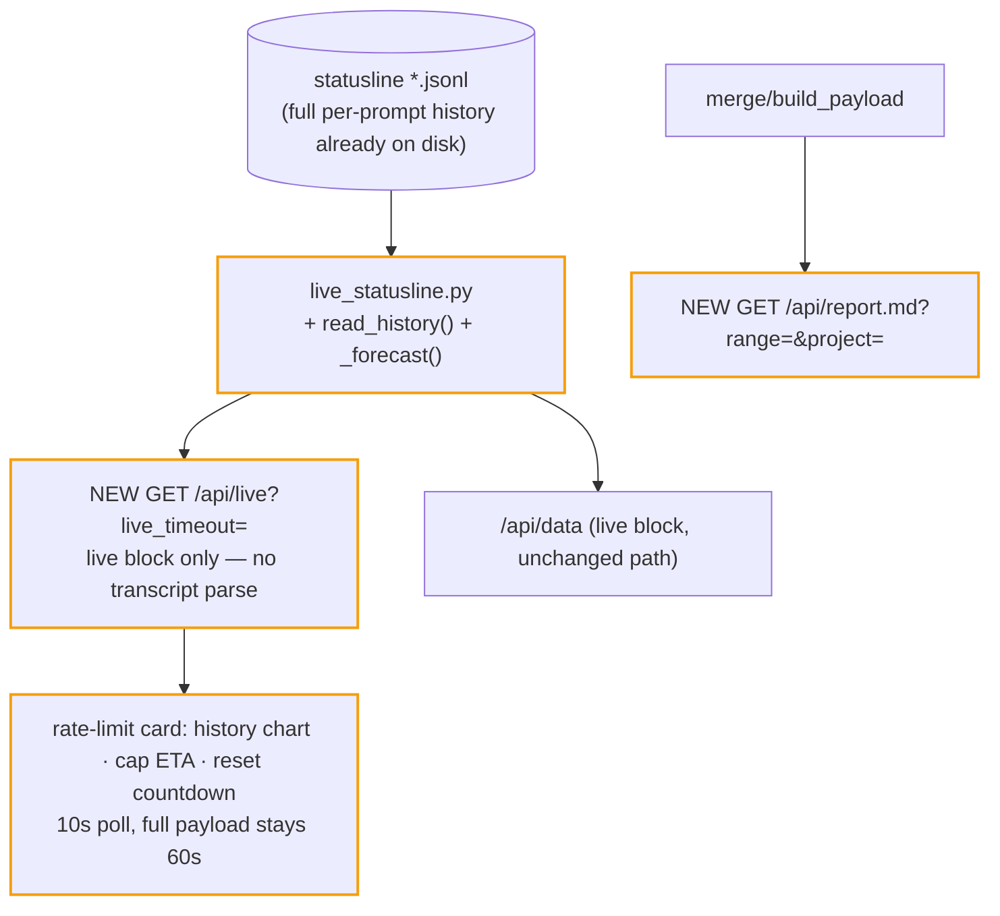

# ITER_05_v4 — live trajectory + reporting (MVP terminator)

Closes the family: the live card learns history, forecasting, and reset countdowns on a
fast 10s poll, and the dashboard gains a Markdown report export. Ends with the v4 docs
pass.

## §01 · Concept

> Unchanged — see SKELETON_v4 § 01.

## §02 · Architecture

- **No new persistence.** The statusline hook already appends one record per prompt, and
  `trim_statusline_logs` keeps 10k lines per session file — weeks of samples. History is
  *read*, not stored. (Limitation: history only spans what the hook logged; gaps when no
  sessions ran are gaps in the line — rendered as such.)
- **Fast-poll instead of SSE** (decision, logged): the live card's freshness goal is met
  by `GET /api/live` every 10s — the endpoint reads only statusline files (cheap) and
  skips the transcript parse entirely. Native `EventSource`/SSE on a stdlib threading
  server adds connection-lifecycle code for no additional product value at one local
  client. Upgrade path stays open: the payload shape is transport-agnostic.

`live` block gains (shape from SKELETON_v4 § 02): `history` (≤200 downsampled
`[ts, pct]` points per window) and `forecast` (`five_hour_eta_ts` /
`seven_day_eta_ts`, epoch seconds or null). `resets_at` already flows per window.

## §03 · Tech Stack

> Unchanged — see SKELETON_v4 § 03.

## §04 · Backend

**`live_statusline.py`:**
- `read_history(hours: float, bucket_secs: int) -> dict`: walk all statusline files
  (reuse `_statusline_files`), collect `(ts, five_hour_pct, seven_day_pct)` from every
  parseable line within `now − hours`, keep the **max pct per time bucket** (rate-limit
  % is monotone within a window; max is the honest sample), return
  `{"five_hour": [[ts, pct]…], "seven_day": [[ts, pct]…]}` sorted by ts. Defaults:
  5h window → `hours=5, bucket=90s`; 7d → `hours=168, bucket=3600s`; both capped at
  ~200 points.
- `_forecast(samples, now) -> float | None`: slope from the first/last of the trailing
  hour's samples (`≥2` points, `Δpct > 0` required); ETA = `now + (100 − latest_pct) /
  slope`. Two-point slope over an hour is deliberately dumb — a rate-limit % is already
  a smoothed counter; regression is YAGNI. Return null when flat/declining or
  insufficient data.
- `read_statusline` gains `history`/`forecast` keys (computed only when any live session
  reports limits — skip the file walk otherwise).

**`dashboard_server.py`:**
- `GET /api/live?live_timeout=` → `json(read_statusline(timeout))` — no
  `build_payload`, no transcripts. Same error envelope as `/api/data`.
- `GET /api/report.md?range=&project=` → `Content-Disposition: attachment;
  filename="claude-code-usage-report.md"`. Body built by a new
  `backend/report.py: render_report(payload, range_key, project) -> str` (f-strings,
  stdlib only): title + generated-at + scope line; totals table (tokens by class, est.
  cost, cache savings, deltas when present); plan value; top projects (tokens + cost);
  model breakdown; top 5 sessions; top 10 tools. Reuses `build_payload` — no new
  aggregation logic in the report.

**Gotchas addressed:** the 10s live poll and 60s data poll run concurrently against the
threaded server — both handlers are read-only, no shared mutable state beyond ITER_02's
locked parse cache (which `/api/live` never touches); `resets_at` passed through
untouched (UI parses defensively); history walk tolerates unreadable files exactly like
`_latest_record_per_session`.

**Validation:** extend `tests/smoke.sh` to hit `/api/live` and `/api/report.md` and
assert 200 + non-empty body. `py_compile` changed files.

## §05 · Frontend

**Rate-limit card (`rate-limit.js`):**
- Sparkline history per window: new `makeLineChart(canvas, points, opts)` in `charts.js`
  (single polyline + fill, reusing the bar chart's axis/dpr/tooltip patterns; ~60 lines).
  Rendered under each of the 5-HOUR / 7-DAY percent figures.
- Cap ETA line per window when `forecast` non-null: `at current pace: cap ~16:40`
  (local `fmt.ts`-style time); reset countdown from `resets_at`: `resets in 2h 12m`
  (new `fmt.until(ts)`; accepts epoch seconds or ISO). Both plain text, no color-only
  signaling.
- Report link: `export report` anchor next to the existing `export csv`, href
  `/api/report.md` + current `range`/`project` params.

**`app.js`:** second loop — `setInterval(fetchLive, 10_000)` calling `/api/live` and
re-rendering only the rate-limit card (`document.querySelector('.rl-card')`
`outerHTML` swap + chart redraw), leaving the 60s full refresh untouched. Pause the
live loop when `document.hidden` (Page Visibility API) to stop background churn.

**Docs pass (closes v4):** update `apps/usage-dashboard/README.md` (new endpoints,
params, env var, cost-policy rewrite of the "two sources" section) and `CLAUDE.md`
invariants (estimate-canonical; payload keys); root README catalog line if its
one-liner mentions features. Repo conventions: no new CHANGELOG (member has not cut an
independent release).

## Out of MVP scope

- Budget setting + progress bar / projected-overrun warning (point 13)
- Threshold alerts, banners, browser notifications (point 14)
- Pricing-staleness divergence flag (point 18 — live cost judged unreliable; estimate is canonical instead)
- True SSE/WebSocket push (fast-poll delivers the freshness goal; transport upgrade path noted)
- Server-side persisted rate-limit sample store (statusline logs are the store)
- Project-scoped Activity time-series (accepted limitation in ITER_02; per-project day buckets deferred)
- Weekly-bucketed long-range charts (charts cap at 90 daily bars; heatmap covers the year)
- Auth, multi-user, remote access, database — out of this app's character (local, single-user, stdlib)
