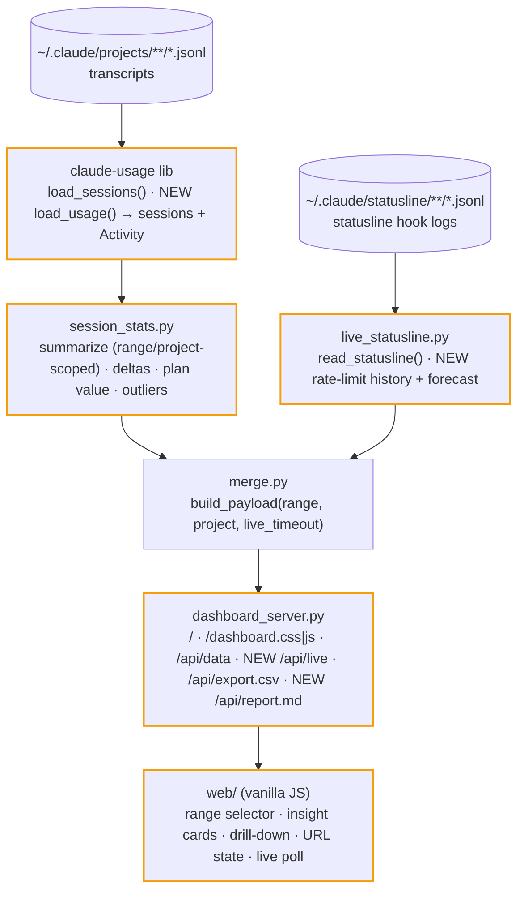

# SKELETON_v4 — usage-dashboard insight layer

This family plans **v4 of an existing, working app** (`apps/usage-dashboard/`). The
skeleton is self-contained: it re-states the current architecture as the baseline and
declares the **full v4 target surface** (payload contract, endpoints, library API).
Implementations behind the new surface land across ITER_01_v4 … ITER_05_v4. Nothing in
the prior `planning/v1–v3` folders is a dependency; those families are unrelated
repo-level plans and stay untouched.

**UI convention for not-yet-built features:** a control or panel appears in the UI only
in the iteration that implements it end-to-end. No disabled placeholders.

## §01 · Concept

The dashboard today is a passive poster: all-time totals, fixed 30-day charts, a session
table. v4 turns it into an **interactive insight tool** that answers the questions a
Claude Code power user actually has: *What is my subscription worth in API terms? How is
this week trending vs last? Where (project / model / hour of day) do my tokens go? Which
sessions were outliers? When will I hit my rate-limit cap?* Plus drill-down navigation,
shareable URL state, and a Markdown report export.

Core flow: open dashboard → pick a time range → read the headline cards (plan value,
totals with deltas) → click a project / model / day to drill into the sessions behind it
→ export a report.

**Cost policy (v4 change):** the pricing-table **estimate is canonical** for every
aggregate and every session row. The statusline's `total_cost_usd` was judged unreliable;
the `merge.py` actual-cost overlay is removed (ITER_02). Actual cost remains visible only
as an informational column in the live rate-limit card.

## §02 · Architecture



Amber-bordered nodes change in v4. The two-source design and the "all computation
server-side, `js/` renders only" invariant are unchanged.

### Data model — full v4 target

**Library (`claude-usage`), additive only** (consumer `usage-report` must not break):

- `Session` (existing dataclass) — unchanged fields.
- `Activity` (new dataclass): per-message rollups bucketed in **local time** —
  - `daily: list[DayBucket]` — `{date, tokens, cost, sessions, per_family: {family: tokens}}`,
    364 days; tokens attributed to each assistant message's own day (fixes the current
    last_ts-day lumping; also feeds model-mix).
  - `hour_dow: list[list[int]]` — 7×24 token matrix (rows Mon..Sun, cols 0..23).
  - `tools: dict[str, int]` — tool_use block counts by tool name.
- `load_usage(dirs) -> tuple[list[Session], Activity]` — single parse pass producing
  both; `load_sessions` stays as-is (wrapper or unchanged implementation).

**Payload contract v4** (`/api/data` → `{stats, sessions, live}`; new keys marked ⊕,
filled by the iteration in brackets — until then the key is absent):

- `stats` (all scoped to the request's `range` + `project` unless noted):
  totals + token classes (existing) · `cache_savings_usd` / `cost_without_cache_usd`
  (existing) · `month_cost_usd` / `month_projected_usd` (existing, always calendar-month)
  · `by_day` (existing shape; from `Activity.daily`, span = min(range, 90) days) [02]
  · `heatmap` (existing shape; from `Activity.daily`, always 364d, project-scoped) [02]
  · `by_project` ⊕cost rendered [02/03] · `by_model` (existing)
  · ⊕ `delta: {tokens_pct, cost_pct, sessions_pct} | null` vs the preceding
    equal-length period; null for `range=all` [02]
  · ⊕ `plan: {price_usd, month_value_usd, ratio} | null` (null when
    `C4_PLAN_PRICE_USD` unset; always calendar-month, all projects) [02]
  · ⊕ `top_sessions: [session row…]` top 5 by cost in range [02]
  · ⊕ `model_mix: [{date, per_family: {family: tokens}}…]` span = min(range, 90) [02]
  · ⊕ `hour_dow: 7×24 matrix` [02] · ⊕ `tools: [{name, count}…]` top 15 [02]
- `sessions[]`: existing fields (estimate-canonical `cost_usd`)
  ⊕ `duration_secs`, `cost_per_hour | null`, `cache_hit_pct | null` [02]
- `live`: existing fields (`available`, `five_hour`, `seven_day`, `sessions[]`, `ts`,
  `timeout`) ⊕ `history: {five_hour: [[ts,pct]…], seven_day: [[ts,pct]…]}` (≤200 points
  each) ⊕ `forecast: {five_hour_eta_ts | null, seven_day_eta_ts | null}` [05]

### API surface — full v4 target

| Method/Path | Description |
|---|---|
| GET `/`, `/dashboard.css`, `/dashboard.js` | static shell + concatenated bundles (existing) |
| GET `/api/data?live_timeout=&range=&project=` | full payload; `range` ∈ `7d,30d,90d,12m,all` (default `all`), `project` = exact project name filter [02] |
| GET `/api/live?live_timeout=` | `live` block only, cheap fast-poll endpoint (no transcript parse) [05] |
| GET `/api/export.csv?range=&project=` | session CSV, range/project-scoped [02: params] |
| GET `/api/report.md?range=&project=` | Markdown usage report download [05] |

**Range semantics:** a session is in range iff `last_ts ≥ now − range`. Cards, tables,
project/model breakdowns, and deltas are session-scoped (consistent with each other);
time-series (`by_day`, `heatmap`, `model_mix`, `hour_dow`) come from `Activity` per-message
buckets and may differ marginally from card totals for sessions spanning midnight — a
documented, accepted mismatch.

## §03 · Tech Stack

Unchanged, deliberately: Python 3.12 managed by `uv`; server is stdlib
`http.server.ThreadingHTTPServer`; the only runtime dependency is the in-repo
`claude-usage` library (which stays `dependencies = []`, stdlib only). Frontend is
framework-free vanilla JS with canvas charts, concatenated by the server. **v4 adds zero
new dependencies.** Lint/type: ruff (88) + mypy strict. Tests: pytest unit tests in the
library; the app keeps its smoke test (`tests/smoke.sh`).

## §04 · Backend

Structure (unchanged tree; changed files marked):

```
usage-dashboard.py            entry point (CLI) — unchanged
backend/
  dashboard_config.py         + C4_PLAN_PRICE_USD                     [02]
  session_stats.py            range/project scoping, deltas, plan,
                              outliers, per-session derived fields,
                              activity wiring, parse cache            [02]
  live_statusline.py          + history + forecast                    [05]
  merge.py                    overlay removed; params threaded        [02]
  dashboard_server.py         + params, /api/live, /api/report.md     [02][05]
libs/claude-usage/            + Activity, load_usage + unit tests     [01]
```

Run locally: `uv run python usage-dashboard.py` (unchanged). Env vars: `C4_CLAUDE_DIR`,
`C4_STATUSLINE_LIVE_TIMEOUT` (existing), `C4_PLAN_PRICE_USD` (new, monthly subscription
price; unset → plan card shows a setup hint).

Stub state at skeleton level: the app runs today as-is; every new payload key is simply
absent until its iteration ships, and the UI never references a key before the iteration
that renders it.

## §05 · Frontend

Single page (no routes). File tree (all under `web/`, concatenated by the server —
`js/app.js` stays last in `_JS_PARTS`):

```
dashboard.html                header, theme toggle, refresh bar, #main
css/  tokens|base|components|controls.css
js/
  format.js  models.js  charts.js   (+ line chart, stacked bars [03][05])
  heatmap.js                        (+ hour×dow grid variant [03])
  rate-limit.js                     (+ history chart, forecast, countdown [05])
  render.js                         (insight cards, panels, drill-down [03][04])
  settings.js                       (range/project/search/URL state [03][04])
  app.js                            (+ live fast-poll loop [05])
```

New UI surface by iteration: range selector + plan-value card + deltas + project cost
[03]; model-mix stacked chart, hour×dow panel, tools panel, outliers card, new session
columns [03]; drill-down clicks, search box, project filter chip, URL state [04];
live history chart + cap ETA + reset countdown, report download link [05].

Placeholder strategy: none — per the convention above, controls appear only when
functional.
