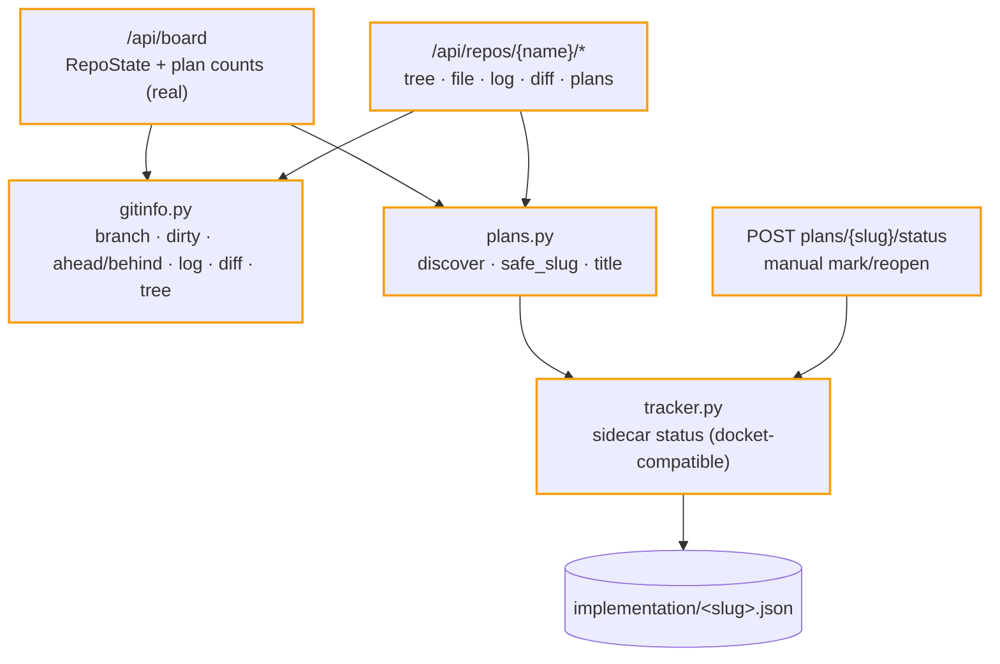

# ITER_01_v5 — repo truth on the board

The board stops being a stub: every card shows live git + plan state, and each repo opens into a browsable detail view. Plan lifecycle arrives via a tracker whose on-disk sidecar format is byte-compatible with docket's, so both apps can point at the same repos without fighting.

## §01 · Concept

> Unchanged — see SKELETON_v5 § 01.

## §02 · Architecture

Entities realized this iteration (shapes from SKELETON_v5 § 02): **RepoState**, **Plan**, **Sidecar**. Routes going live: `/api/board` (real), `tree`, `file` (GET **and PUT** — the file save is this iteration's one repo write, per the SKELETON repo-write policy), `log`, `diff`, `plans`, `plans/{slug}`, `plans/{slug}/status`.

**Sidecar interop (decision):** identical JSON keys and location as docket (`<implementation_dir>/<slug>.json`; `status`, `history[] {ts, from, to, trigger, run_id, rc}`); allowed statuses `ready|running|implemented`; roundtable's trigger vocabulary is `round|manual|startup_reset` (docket writes `headless|manual|startup_reset` — readers on both sides treat `trigger` as an opaque display string, so histories interleave cleanly). Registered in `docs/shared-plugin-logic.md` with `Cross-reference:` comments in both trackers — the one sanctioned docket edit.

## §03 · Tech Stack

> Unchanged — see SKELETON_v5 § 03. No new Python dependencies (git is BYO, subprocess only); the skeleton-declared vendored assets (`marked.min.js`, `dompurify.min.js`) physically land in `static/vendor/` this iteration.

## §04 · Backend

**`gitinfo.py`** — every call is `subprocess.run([git, ...], cwd=repo, timeout=10, no shell)`; any failure (missing git, not a repo, timeout) degrades to `null` fields plus a `git_error` string on the payload — the board must render for a mis-registered repo, never 500:
- `branch(repo)` → `git rev-parse --abbrev-ref HEAD` (detached ⇒ short hash + `detached: true`).
- `dirty(repo)` → `git status --porcelain` line count (untracked included).
- `ahead_behind(repo)` → `git rev-list --left-right --count @{upstream}...HEAD`; no upstream ⇒ `null` (not an error).
- `last_commit(repo)` / `log(repo, n=30)` → `git log --format=%H%x1f%ct%x1f%s` (unit-separator split; no fragile `|` parsing).
- `diff(repo)` → `{stat: git diff --stat, patch: git diff, untracked: [paths]}`; patch capped at 1 MB with a `truncated: true` flag.
- `tree(repo, rel)` → one `os.scandir` level (dirs first, `.git` skipped), each entry `{name, is_dir, size}` — lazy per-request listing, no recursion.
- Path guard: `_resolve_inside(repo, rel)` — `os.path.realpath` prefix check against the repo root; failures ⇒ 400. Applied to `tree` and both `file` verbs. GET `file` caps at 512 KB, returns `{content, mtime}`, and returns 415 when a NUL byte appears in the first 8 KB (binary heuristic).

**File save (`PUT /api/repos/{name}/file?path=`)** — body `{content, expect_mtime}`, both required:
- Same traversal guard; content cap 1 MB (413 above); target must not exist as a directory; an existing target that fails the binary heuristic ⇒ 415 (no binary editing); a *new* file is allowed (create).
- Optimistic concurrency: current `st_mtime_ns` ≠ `expect_mtime` ⇒ 409 `stale_file` with the on-disk mtime — the client re-fetches and re-applies; the server never merges (data-loss guard, not simplified away). New-file create passes `expect_mtime: null`.
- 409 `repo_busy` when the project lock is held (never edit under a live run/turn — same guard Commit uses in ITER_04).
- Write through the shared `_atomic_write`; response `{mtime}` (the new one). Text is written as UTF-8 exactly as received; no newline normalization.

**`plans.py` / `frontmatter.py` / `tracker.py`** — ported and adapted from docket (fork-at-birth, not a kept-in-sync copy; only the sidecar *format* is the shared contract): `rglob("*.md")` under `planning_dir`, `safe_slug` on every externally-supplied slug (the path-traversal guard), lenient flat-key frontmatter `title` extraction; tracker owns `ALLOWED: dict[(from, to), set[trigger]]` — edges this iteration: `ready→implemented {manual}`, `implemented→ready {manual}` (running edges arrive with the executor in ITER_03, `startup_reset` with recovery there too); `set_status` rejects anything else; `_atomic_write` (temp + `os.replace` + bounded Windows retry) preserved verbatim.

**`server.py`** — the seven repo routes go live; handlers validate (`name` must exist in Config, slugs through `safe_slug`, `to` must be a member of the status StrEnum — free-form strings rejected with 400) and delegate. `POST .../status` body: `{"to": "implemented"|"ready"}`; illegal edge ⇒ 409 with the tracker's message.

**`/api/board` response shape** (per project): `{name, path, state: {branch, detached, dirty_count, ahead, behind, last_commit} | null, git_error: str | null, plans: {ready: n, running: n, implemented: n}, round: null}` (`round` stays null until ITER_03).

**Validation (per contract):** `ruff` + `mypy --strict` clean; pytest units for `gitinfo` parsing (subprocess faked via a stub `git` script on PATH, docket-style), `plans`/`safe_slug` traversal cases, `frontmatter`, `tracker` edges + atomic write, and the file save (traversal reject, stale-mtime 409, binary 415, cap 413, busy 409, new-file create); coverage gate holds at 100% for the modules this iteration owns. `tests/smoke.sh` extended: boot, `GET /api/board` returns 200 with real state for a fixture repo.

## §05 · Frontend

- **`board.js`** — cards drop the `stub` badge: branch + dirty badge (`✚ n`), ahead/behind arrows, relative last-commit time, plan counts as three status chips; `git_error` renders an inline warning strip on the card. Card click → `#/repo/{name}`. 5s poll continues (skeleton loop, now with real data).
- **`repo.js`** — `#/repo/{name}`, four tabs:
  - **Plans**: table (title, slug, status chip, updated); row → plan view. Empty state per SKELETON.
  - **Files**: lazy directory tree (click to expand, one fetch per level) + file pane — `.md` files render through `markdown.js`, everything else preformatted; 415/cap responses render as "binary / too large" notes. An **Edit** button (text files under the cap only) swaps the pane to a plain `<textarea>` with Save / Cancel, a dirty indicator in the tab title, and Ctrl+S; `stale_file` conflicts surface as "changed on disk — reload?" with a reload action (local edit kept in the textarea until the user decides); `repo_busy` renders in the shared error banner. Markdown files get a rendered/source toggle in both view and edit modes. A **New file** input in the tab header (relative path) opens an empty editor whose first Save creates the file (`expect_mtime: null`).
  - **History**: `log` table (hash, when, subject).
  - **Diff**: stat block + patch in `<pre>` with minimal +/- line coloring; untracked list below; `truncated` flag renders a notice.
- **`plan.js`** — `#/repo/{name}/plan/{slug}`: rendered body, sidecar history table (ts, from→to, trigger), actions: **Mark implemented** / **Reopen** (only the legal edge for the current status is shown — no disabled buttons, per the family convention) and **Copy manual command** (the `claude` invocation string from the API, docket's `manual_command` port).
- **`markdown.js` + `static/vendor/`** — the single rendering entry point per SKELETON_v5 § 05: vendored `marked.min.js` (GFM on) piped through `dompurify.min.js` (default allowlist). Pinned versions recorded in each file's `VENDORED` header comment; upgrading = replacing the file and updating the header.
- Accessibility: tabs are `<button>`s with `aria-selected`; tree nodes are buttons, keyboard-expandable; status chips carry text, never color alone.

## §06 · LLM / Prompts

> Unchanged — see SKELETON_v5 § 06 (no claude invocation exists yet; `manual_command` is a display string only).
