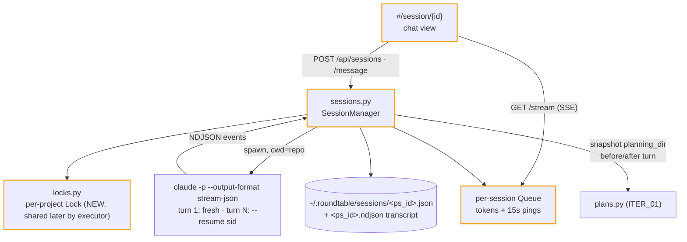

# ITER_02_v5 — plan with Claude inside the app

The differentiator lands: from any repo you open a **planning session** — a chat with Claude Code running in that repo — and the plan artifact Claude writes shows up as a first-class plan (ITER_01 machinery) the moment the turn ends.

## §01 · Concept

> Unchanged — see SKELETON_v5 § 01.

## §02 · Architecture

Entity realized: **PlanningSession** (shape from SKELETON_v5 § 02). Routes live: the six `/api/sessions*` routes. Session status machine (closed set, validated in `sessions.py`): `streaming → idle` (turn end), `idle → streaming` (message), `streaming → idle` (stop), `streaming → failed` (spawn/parse fatal), `idle → closed` (close). `closed`/`failed` are terminal; POST message against them ⇒ 409.

## §03 · Tech Stack

> Unchanged — see SKELETON_v5 § 03. No new dependencies; the skeleton-declared `claude-usage` path dependency is consumed for the first time here (`estimated_cost`).

## §04 · Backend

**`locks.py`** — `acquire(project_path) → threading.Lock` from a setdefault-guarded module dict. Planning turns hold the repo's lock for the duration of the subprocess; ITER_03's executor uses the same dict, so a turn and an implement run on one repo can never interleave (a busy repo surfaces as 409 `repo_busy` rather than queueing a chat turn invisibly — the UI tells the user who holds it).

**`sessions.py` — `SessionManager`:**
- `create(project, prompt)`: validate project; `ps_` id; write meta (`status: streaming`, `turns: 0`); start turn thread; return id immediately (the UI navigates to the session view and attaches SSE). Session creation is the explicit resource-creation act — the first message never implicitly creates anything (gotcha: implicit-creation race, addressed).
- Turn thread: `lock.acquire(blocking=False)` — on failure flip to `idle` and emit an SSE `error: repo_busy` event; else snapshot `planning_dir` (`{slug: (mtime, size)}`), build the prompt (turn 1: `planning_template` with `{request}`/`{planning_dir}` substituted; turn N: the raw user message), spawn `claude -p --output-format stream-json --verbose --permission-mode <planning_permission_mode> [--model M] [--max-turns N] [claude_extra_args…]` (+ `--resume <claude_session_id>` on turn N), prompt on stdin, cwd = repo path.
- Event pump: parse NDJSON lines; capture `session_id` from the `init` event into meta (first turn); `format_event` each into a display line; append raw event to `<ps_id>.ndjson` and push the display line to the session queue. On the `result` event, hand it to **`costs.py`**: `extract(result_event, fallback_model) → {usage, cost_est_usd, cost_reported_usd}` — prefers per-model `modelUsage`, falls back to `{fallback_model: usage}` (fallback model = the resolved `--model` knob, else the `init` event's model), maps the CLI's `cache_creation_input_tokens`/`cache_read_input_tokens` onto claude-usage's `cache_write`/`cache_read` keys, and calls `claude_usage.estimated_cost`; unknown model ⇒ `cost_est_usd: null` (SKELETON § 06 cost policy). On process exit: re-snapshot `planning_dir`, diff → new/changed `.md` slugs appended to `produced_plans` (with the turn number), append the turn record `{n, usage, cost_est_usd, cost_reported_usd}` and re-sum the session `cost_est_usd`, status → `idle` (or `failed` on rc≠0 *with no result event* — a model refusal is still a valid turn), release lock, push `end` event.
- `stop(id)`: `terminate()` then `kill()` after 5s grace; turn records `stopped: true` in the transcript; status → `idle`.
- One in-flight turn per session **and** per repo; `message` while `streaming` ⇒ 409 (the UI disables nothing — it simply doesn't render the input while streaming; family convention).
- Meta writes go through the shared `_atomic_write`.
- Startup recovery: any meta stuck `streaming` at boot → `idle` with a synthetic `interrupted` transcript event (no orphan claude process can be ours — we died).

**SSE plumbing (`server.py`):** `GET /api/sessions/{id}/stream` — `Content-Type: text/event-stream`, reads the session queue with a 15s timeout and emits `: ping` on timeout (heartbeat composed on one consumer loop — gotcha addressed); replays the current turn's buffered lines on connect so a mid-turn refresh loses nothing; closes on the `end` event. GET-only with the id in the path, so native `EventSource` suffices.

**Validation:** units for the manager against a **fake `claude` script** (docket's test approach: a stub executable emitting canned stream-json, exercising init-capture, resume args, plan detection, busy lock, stop, failure) and for `costs.py` (modelUsage path, single-model fallback, cache-key mapping, unknown-model null); `ruff`/`mypy` clean; coverage gate held; smoke extended to POST a session against the fake claude and see it reach `idle` with a detected plan.

## §05 · Frontend

- **`sse.js`** — thin `EventSource` wrapper: auto-reconnect off (a turn is finite), `onLine`/`onEnd`/`onError` callbacks.
- **`session.js`** — `#/session/{id}`: transcript pane (turn-grouped; user prompts right-aligned, Claude lines left; raw tool-use lines rendered dimmed and collapsed behind a per-turn "show activity" toggle), streaming pane appending live lines, input box + Send (rendered only when `idle`), Stop (only while `streaming`), Close (only when `idle`). A `produced_plans` banner appears when the turn ends: "New plan: `<slug>` → View" (Add-to-round joins the banner in ITER_03). Each finished turn's footer shows its cost (`$0.0842 est · $0.0817 reported`, "n/a" when null), and the session header carries the running total chip. `repo_busy` errors render in the shared error banner with the holder hint.
- **`repo.js`** — Plans tab gains a **Plan with Claude** button → prompt textarea (inline panel) → POST `/api/sessions` → navigate to the session view; plus a **Sessions** list under the tab (status, turns, produced plans, when) → session view. Sessions list has an empty state.
- Board cards show a small "planning" pulse dot while any session for that repo is `streaming` (data already in the 5s board poll — `/api/board` gains `sessions: {streaming: n}`; additive key, server-side).

## §06 · LLM / Prompts

- **Planning permission mode:** default `acceptEdits` — the session must be able to write the plan file; everything else Claude does in planning is reading. Registry knob `planning_permission_mode` per project for stricter/looser setups. `allowed_tools` passes through as `--allowedTools` exactly as in implement runs.
- **Turn-1 prompt** = `planning_template` (registry cascade, default `DEFAULT_PLANNING_TEMPLATE` from SKELETON_v5 § 06) with `{request}` = the user's textarea content, `{planning_dir}` = the project's resolved planning dir. Turn-N prompt = the user's message verbatim — no re-wrapping; the CLI's `--resume` carries all context.
- **Context strategy:** owned by the CLI (SKELETON decision). The session view shows the turn count; the README documents "long sessions: start a fresh session per plan" as the operating pattern.
- **Output handling:** display lines only; the app never parses plan content out of the stream — plan existence comes from the filesystem snapshot diff, which is deterministic regardless of how Claude phrases its answer (LLM-output-validation stance: trust files, not prose).
