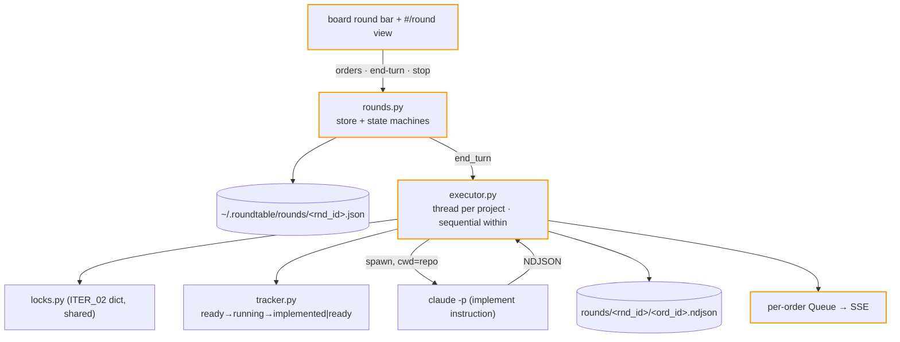

# ITER_03_v5 — the turn-based core

The civ loop arrives: orders accumulate in the open round, **End Turn** executes them all — sequentially within a repo, concurrently across repos — with live streams, and the round advances to review when the last run lands. (The review *UI* and round closing are ITER_04; after this iteration a round parks at `review` visibly but read-only.)

## §01 · Concept

> Unchanged — see SKELETON_v5 § 01.

## §02 · Architecture

Entities realized: **Round**, **Order** (shapes from SKELETON_v5 § 02; `reviewed`/`followup` stay at their defaults until ITER_04). Routes live: `/api/rounds`, `/api/rounds/current`, `/api/rounds/{id}`, `orders` add/remove, `end-turn`, `stop`, `/api/orders/{id}/stream`, `/api/orders/{id}/output`; `/api/board` fills its `round` field.

**State machines (validated tables in `rounds.py`, mirroring tracker's style):**
- Round `ALLOWED`: `open→executing {end_turn}` (requires ≥1 order), `executing→review {all_terminal, stop, startup_reset}`, `review→done {close}` (edge exists now; the `close` trigger is only exercised by ITER_04's route).
- Order: `queued→running`, `running→succeeded|failed|stopped`, `queued→skipped` (stop-on-failure within a project, or round-level stop). Terminal states are terminal.
- Tracker gains its running edges + startup reset: `ready→running {round}`, `running→implemented {round}`, `running→ready {round, startup_reset}`.

**First-boot behavior:** `rounds.current()` finds no non-done round ⇒ creates Round #1 (`open`, empty orders) lazily. `number` assignment and every round-file read-modify-write happen under a process-wide `rounds_lock` (single process; `max(number)+1` is safe under it — the sequential-ID race gotcha is bounded to this process by design and documented).

## §03 · Tech Stack

> Unchanged — see SKELETON_v5 § 03. Zero new dependencies.

## §04 · Backend

**`rounds.py`:**
- Store: one JSON per round in `~/.roundtable/rounds/`, `_atomic_write` everywhere; `current()` scans the dir (tiny scale) and enforces the at-most-one-non-done invariant, creating the next round only via `close` (ITER_04) or first boot. Round reads (`current`, `{id}`, list) compute `cost_est_usd` = Σ non-null order costs at read time — never stored, so it can't drift from its parts.
- `add_order(project, slug, instruction)`: round must be `open`; project in Config; slug through `safe_slug` and must exist; sidecar status must be `ready` (docket's only-ready-is-runnable decision inherited); no duplicate `(project, slug)` in the round ⇒ 409. Returns the order with its `ord_` id.
- `remove_order(id)`: round `open` only.
- `end_turn()`: ≥1 order else 400; re-validate every order's plan is still `ready` (a plan may have been manually marked since queueing — stale orders flip to `skipped` with a note rather than failing the whole turn); round → `executing`, `executed_at` set; hand the order list to the executor.
- `stop()`: round `executing` only; signals the executor (terminate in-flight processes, drain queued → `skipped`); round → `review`.

**`executor.py`:** one thread per distinct project (`ThreadPoolExecutor` is unnecessary; plain threads, docket-style), orders of a project run in queue order:
- Preflight `claude_bin` before touching status (docket decision) — failure ⇒ order `failed` with a synthetic output line, later orders in that project `skipped`.
- Per order: acquire the project lock (blocking — a streaming planning turn finishes first; the order shows `queued` with a "waiting for repo" line pushed to its queue), tracker `set_status(running, trigger=round, run_id=ord_id)`, spawn `claude -p` with the resolved implement instruction on stdin (instruction = order override → project `instruction_template` → `DEFAULT_INSTRUCTION_TEMPLATE`, `{path}` = `<planning_dir>/<slug>.md`; body never piped), stream NDJSON → `format_event` lines → append to `rounds/<rnd_id>/<ord_id>.ndjson` **and** push to the order's queue (subscribers get history-replay-on-connect like session SSE). The `result` event goes through ITER_02's `costs.extract`, and `{usage, cost_est_usd, cost_reported_usd}` is written onto the order with its terminal state.
- Exit: rc==0 ⇒ order `succeeded`, tracker → `implemented`; else `failed`, tracker → `ready`; stop ⇒ `stopped`, tracker → `ready`. Stop-on-failure: remaining queued orders of the *same project* → `skipped` (cross-project unaffected — docket semantics).
- Last terminal order flips the round `executing → review` (trigger `all_terminal`) under `rounds_lock`.
- Output files are the durable record — SSE queues are in-memory only and vanish on restart; `GET /api/orders/{id}/output` streams the NDJSON file back as JSON lines (works live and after restart; the live view prefers SSE).

**Startup recovery (extends ITER_02's):** a round stuck `executing` at boot → every `running` order `stopped` (rc null), `queued` → `skipped`, round → `review` (trigger `startup_reset`); tracker's `reset_stale_runs` flips stranded `running` sidecars → `ready` (both docket- and roundtable-written ones — same format).

**Validation:** units for round/order/tracker edge tables (every illegal edge asserted rejected), `end_turn` stale-order handling, executor against the fake `claude` (success, failure, stop, skip cascade, lock contention with a fake planning turn, cost written onto the order), read-time cost rollup, recovery paths. Coverage gate held; smoke extended: queue one order in a fixture repo, end turn against fake claude, poll until round hits `review`, assert output file exists.

## §05 · Frontend

- **Round bar** (in `index.html` header, rendered by `board.js` from the board poll): "Round 4 · open · 3 orders" + **End Turn** button (shown only when `open` with ≥1 order) / "executing 2/5…" progress while running. Click → `#/round`.
- **`round.js`** — `#/round`:
  - `open`: orders table (project, plan title, instruction-override affordance as an inline editable text row, remove button); empty state invites queueing from repo pages; **End Turn** with a plain confirm step (button arms → "Confirm End Turn").
  - `executing`: per-order cards with state chips and a live output pane per running order (`sse.js` on `/api/orders/{id}/stream`); finished orders collapse to their tail lines + a cost figure; a round-total cost ticker sits in the page header (from the 3s state poll — SKELETON freshness model); **Stop round** button.
  - `review`: read-only outcome list this iteration ("review tools arrive next" is *not* rendered — the page simply shows outcomes; review controls appear in ITER_04 per the family convention).
- **Add to round** appears at its call sites now: plan view action (plan `ready` + round `open`), the session view's produced-plan banner, and the repo Plans tab rows. Optional per-order instruction override is set in the round view, not at add time (one mutation path).
- Board cards: `round` field renders "2 orders this round" chip; during `executing` the chip pulses with per-repo run state.

## §06 · LLM / Prompts

> Unchanged — see ITER_02_v5 § 06 and SKELETON_v5 § 06 (the implement instruction and its template cascade were specified there; this iteration only wires them into the executor).
