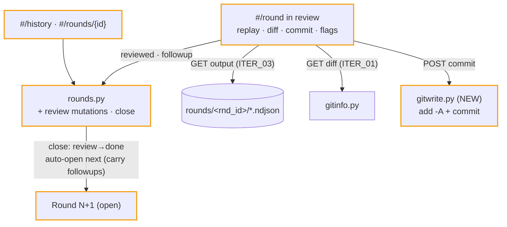

# ITER_04_v5 — review, history, ship (MVP terminator)

The loop closes: a round in `review` becomes an actual review surface — replay each run, read each repo's diff, commit what you accept, flag follow-ups — and **Close Round** opens the next one with the follow-ups surfaced. Plus round history, and the ship pass (docs, CI gate, catalog).

## §01 · Concept

> Unchanged — see SKELETON_v5 § 01.

## §02 · Architecture

Data model completion: Order's `reviewed` and `followup` become mutable (review phase only); Round gains `carried_followups[] {from_round, project, slug, note}` — written into the *next* round at close time so the new round starts with its inherited agenda. No other entity changes.

Routes live (the last 501s disappear): `POST /api/orders/{id}/reviewed`, `POST /api/orders/{id}/followup`, `POST /api/rounds/current/close`, `POST /api/repos/{name}/commit`.

## §03 · Tech Stack

> Unchanged — see SKELETON_v5 § 03. Zero new dependencies, start to finish.

## §04 · Backend

**`rounds.py` additions:**
- `set_reviewed(order_id, flag)` / `set_followup(order_id, note)` — round must be `review`; 409 otherwise. Notes are free text, trimmed, 2 KB cap.
- `close()` — round `review` only; exercises the `review→done {close}` edge (table already present since ITER_03); sets `closed_at`; creates Round N+1 (`open`, `number = N+1` under `rounds_lock`) with `carried_followups` = every non-empty `followup` from the closing round (plus any of the closing round's own `carried_followups` whose `(project, slug)` never got a new order — unaddressed agenda rolls forward rather than silently dropping).

**`gitwrite.py`** — the app's only git write, deliberately quarantined in its own module: `commit(repo, message)` → reject empty/whitespace message (400); `git add -A` then `git commit -m <message>` (argv, no shell); nothing-to-commit ⇒ 409 `nothing_to_commit`; success returns `{head, subject}`. No push, no branch operations, no `--amend` — commit is safe and locally reversible, which is why it's the one write inside the MVP line.
- Guard: 409 `repo_busy` if the project lock is currently held (don't commit under a live run/turn).

**`server.py`** — startup recovery, board poll, and all prior routes unchanged; the four new handlers validate and delegate as ever.

**Ship pass (repo conventions, this member):**
- `tests/smoke.sh` final form: boot server → board 200 → create session (fake claude) → plan detected → order → end turn → round reaches `review` → commit fixture change → close → Round N+1 open with carried follow-up. One happy path, end to end.
- CI: extend the repo's path-filtered workflow with a `multi-repo-workspace` job (`ruff` + `mypy --strict` + `pytest` with the 100% line+branch gate + smoke) and mark it a **required check** (un-required tests manufacture false confidence — repo convention).
- Docs: member `README.md` (concept, quick start with a runnable `examples/` registry mirroring docket's, the round loop, limitations) and `CLAUDE.md` (invariants: plans app-read-only; closed status sets + tables; instruction-not-body; safe_slug on every external slug; per-project lock intra-process only; atomic writes); root `README.md` catalog row; root `CLAUDE.md` env-var roster gains `C4_ROUNDTABLE_REGISTRY`, `C4_ROUNDTABLE_HOME`; `docs/shared-plugin-logic.md` sidecar-format entry (written in ITER_01, verified here); vendored `static/vendor/` files keep their upstream MIT license headers, noted in the member README (root LICENSE stays Apache-2.0, repo convention); living architecture doc at `.agents_workspace/architecture/apps/multi-repo-workspace/ARCHITECTURE.md` (document-architecture skill) with the decisions this family logged. No member `CHANGELOG.md` until a first tagged release (repo convention).

**Validation:** units for review mutations (phase guards), close/carry-over logic (incl. unaddressed-agenda roll-forward), `gitwrite` (fixture repo: empty message, nothing-to-commit, success, busy). Coverage gate 100% held over `roundtable/`.

## §05 · Frontend

- **`review.js`** (rendered inside `#/round` when status is `review`): per-order review cards — outcome chip **+ cost figure** (est canonical, reported secondary, per SKELETON_v5 § 06), output replay (collapsed, loads `/api/orders/{id}/output` on expand), the repo's live diff (ITER_01 endpoint, fetched per repo once, shared across that repo's cards), **Reviewed** checkbox, **Follow-up** note field (saved on blur), and a per-repo **Commit** box (message input + button; success shows the new head, `nothing_to_commit`/`repo_busy` render inline). The review header shows the round's total cost. **Close Round** enables the family's one deliberate gate: it renders only when every order is `reviewed` — the checkbox *is* the confirmation mechanism, so no extra confirm dialog.
- **`#/round` in a fresh `open` round:** a "Carried from Round N" panel lists `carried_followups` (project, plan, note) with two actions each: **Plan from this** (opens the repo's session panel with the note pre-filled into the prompt textarea) and **Dismiss** (removes it from the round — mutation allowed while `open`).
- **`history.js`** — `#/history`: rounds table (number, status, orders n, succeeded/failed/skipped counts, **cost**, executed/closed timestamps) → `#/rounds/{id}`: read-only round detail reusing the review card layout (replay + recorded flags/notes/costs; no mutations — the round is `done`). Empty states throughout.
- Board: a done-round summary chip on the round bar ("last round: 4 ✓ 1 ✗ · $0.61") sourced from the board poll.
- Accessibility pass to close the family: full keyboard walk of the loop (board → repo → session → round → review → close), visible focus everywhere, all a11y warnings resolved before the PR (frontend invariant).

## §06 · LLM / Prompts

> Unchanged — see ITER_02_v5 § 06 (the "Plan from this" pre-fill feeds the existing `planning_template` `{request}` slot; no new prompt surface).

## Out of MVP scope

- TUI frontend (browser only; docket keeps the TUI niche)
- Cross-process locking — TUI/server or two-server collisions on one repo (same documented limitation as docket)
- git push, branch creation, PR automation (commit is the only write; review-to-PR is post-MVP)
- Auth, multi-user, remote access, HTTPS (127.0.0.1 bind is the auth story — out of this app's character)
- Scheduled or autonomous rounds (end-turn is always a human act in MVP)
- Cross-round usage analytics — trends, aggregates, budgets (per-run and per-round cost is in; the analytics layer stays usage-dashboard's domain)
- Structured/syntax-highlighted file editor (the plain `<textarea>` is the MVP ceiling; editing itself is in)
- File create-from-tree, rename, delete (the editor saves existing files and can create via an explicit path; tree-level file management is out)
- Plan file deletion/archival from the UI
- Multiple concurrently-open rounds / per-repo independent turn cadence
- docket retirement or lib extraction of the shared machinery (fork-at-birth stands; revisit only if a third consumer appears)
