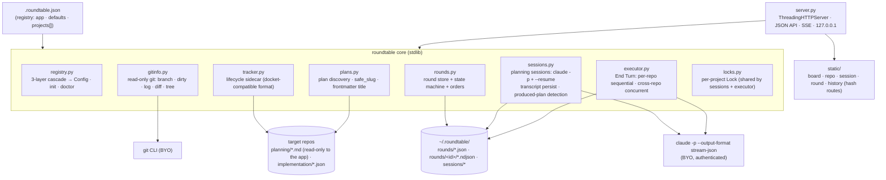

# SKELETON_v5 — roundtable (multi-repo-workspace)

This family plans a **new app member**: `apps/multi-repo-workspace/`, internal name **roundtable**. It is the successor to `apps/multi-repo-plan-runner/` (docket): where docket only *runs* externally-authored plans, roundtable is a full workspace — browse repos, **plan with Claude Code inside the app**, and execute plans, all from a turn-based board. docket stays untouched and useful standalone; the single sanctioned cross-member edit is one `Cross-reference:` comment in its `tracker.py` (ITER_01_v5, per the repo's intentional-duplication convention).

The skeleton is self-contained; nothing in `planning/v1–v4` is a dependency.

**UI convention for not-yet-built features:** a view or control appears in the UI only in the iteration that implements it end-to-end — no disabled placeholders. The skeleton's board renders real registry projects with state fields explicitly marked `stub`; unknown hash routes fall back to the board. Unimplemented API routes exist from the skeleton on and return `501 {"error": "not_implemented", "iter": "NN"}` so the full surface is visible and testable from day one.

## §01 · Concept

roundtable is a local, single-user, turn-based command center over the ~10 Claude Code repos you work across. The mental model is a strategy game, not a shooter: each repo is a city on a board, and work advances in **rounds**. In a round you survey the board (git state, plans, last round's outcomes), open repos to **plan with Claude Code in a chat panel** (Claude writes the plan artifact into that repo's `.agents_workspace/planning/`), queue **orders** (repo + plan pairs), then hit **End Turn**: all orders execute headlessly (`claude -p`), sequentially per repo and concurrently across repos, with live streams. The round then enters **review** — per-repo output replay, working-tree diffs, optional commit, follow-up notes — and closing it opens the next round. Interactive Claude Code is hands-on-every-move; roundtable is the high-level overview where you command many repos per turn.

Core flow: board → open repo → plan with Claude → add order → End Turn → watch streams → review diffs → commit → close round → next round.

## §02 · Architecture



**Repo-write policy:** roundtable never *autonomously* mutates a target repo. The only writes into a repo are (a) the spawned Claude Code planning session writing the plan file, and (b) two explicit user actions — the file editor's Save (ITER_01) and Commit (ITER_04). All app-owned mutable state lives in the sidecars (in-repo, docket-compatible) and the app state dir `~/.roundtable/`.

### Data model — full v5 target

Persisted unless noted. IDs are app-generated, prefixed, URL-safe: `{prefix}_{secrets.token_urlsafe(12)}` (`rnd_`, `ord_`, `ps_`). IDs and `created_at` are set once, never changed; every status is a closed `StrEnum` with a validated transition table.

- **Project** (registry, resolved per-knob `CODE_DEFAULTS → defaults.<k> → projects[].<k>`): `name` PK · `path` · `planning_dir` (`.agents_workspace/planning`) · `implementation_dir` (`.agents_workspace/implementation`) · `allowed_tools` · `model` · `max_turns` · `permission_mode` (implement runs) · `planning_permission_mode` · `instruction_template` (implement) · `planning_template` · `claude_bin` · `claude_extra_args`. App level: `port`.
- **RepoState** (derived, never persisted): `branch` · `dirty_count` · `ahead/behind | null` · `last_commit {hash, ts, subject}`. [01]
- **Plan** (read-only view): `slug` (rel path sans `.md`, via `safe_slug`) · `title` (frontmatter, else slug) · `body`. [01]
- **Sidecar** (docket format, `implementation/<slug>.json`): `slug` · `status ∈ ready|running|implemented` · `history[] {ts, from, to, trigger ∈ round|manual|startup_reset, run_id?, rc?}`. Missing sidecar ⇒ `ready`. [01]
- **PlanningSession**: `id ps_*` · `project` · `claude_session_id | null` (from stream-json init event) · `status ∈ idle|streaming|closed|failed` · `created_at` · `turns[] {n, usage | null, cost_est_usd | null, cost_reported_usd | null}` · `cost_est_usd` (session total) · `produced_plans[] {slug, turn}` · transcript as sibling NDJSON. `usage` is per-model token counts `{model: {input, output, cache_write, cache_read}}` captured from the turn's `result` event. [02]
- **Round**: `id rnd_*` · `number` (1-based, assigned under a process-wide lock) · `status ∈ open|executing|review|done` · `created_at` · `executed_at | null` · `closed_at | null` · `orders[]` · `cost_est_usd` (computed at read time = Σ order costs, never stored). Invariant: **at most one round with status ≠ done**; closing a round auto-opens the next. [03]
- **Order** (embedded in Round): `id ord_*` · `project` · `slug` · `instruction | null` (override) · `state ∈ queued|running|succeeded|failed|stopped|skipped` · `rc | null` · `usage | null` (per-model counts, as on PlanningSession turns) · `cost_est_usd | null` · `cost_reported_usd | null` · `reviewed: bool` · `followup | null` (free-text note, set in review) · output as `rounds/<rnd_id>/<ord_id>.ndjson`. [03, review fields 04]

### API surface — full v5 target

All JSON; errors are `{"error": <code>, "detail": <str>}`. `[NN]` = iteration that implements it; until then the route returns 501 as above. No pagination anywhere — lists are bounded by registry size (~10 repos), plan counts, and round history at one-local-user scale; accepted for MVP.

| Method/Path | Description |
|---|---|
| GET `/`, `/static/*` | shell + JS/CSS files [SKELETON] |
| GET `/api/config` | resolved registry, sanitized (no absolute claude paths hidden — local trust) [SKELETON] |
| GET `/api/board` | per-project card data: RepoState + plan counts by status + active-round summary [01; round fields 03] |
| GET `/api/repos/{name}/tree?path=` | one directory level (lazy), `.git` excluded [01] |
| GET `/api/repos/{name}/file?path=` | file content + `mtime`, 512 KB cap, binary ⇒ 415 [01] |
| PUT `/api/repos/{name}/file?path=` | `{content, expect_mtime}` text-file save: traversal guard, 1 MB cap, existing-binary ⇒ 415, changed-on-disk ⇒ 409 `stale_file`, repo lock held ⇒ 409 `repo_busy` [01] |
| GET `/api/repos/{name}/log?n=` | recent commits (default 30) [01] |
| GET `/api/repos/{name}/diff` | working-tree unified diff + stat (tracked files; untracked listed by name) [01] |
| GET `/api/repos/{name}/plans` | plans + sidecar status [01] |
| GET `/api/repos/{name}/plans/{slug}` | plan body + sidecar history + manual-run command string [01] |
| POST `/api/repos/{name}/plans/{slug}/status` | `{to}` manual mark/reopen via tracker edges [01] |
| POST `/api/repos/{name}/commit` | `{message}` → `git add -A` + `git commit`; returns new head [04] |
| POST `/api/sessions` | `{project, prompt}` → create session, run first turn [02] |
| GET `/api/sessions?project=` | session list (meta only) [02] |
| GET `/api/sessions/{id}` | meta + full transcript [02] |
| POST `/api/sessions/{id}/message` | `{prompt}` follow-up turn (`--resume`); 409 while `streaming` [02] |
| GET `/api/sessions/{id}/stream` | SSE of the in-flight turn [02] |
| POST `/api/sessions/{id}/stop` | kill in-flight turn → `idle` [02] |
| POST `/api/sessions/{id}/close` | `idle → closed` [02] |
| GET `/api/rounds` | round history, newest first [03] |
| GET `/api/rounds/current` | the one non-done round + orders [03] |
| GET `/api/rounds/{id}` | full round detail incl. order outcomes [03] |
| POST `/api/rounds/current/orders` | `{project, slug, instruction?}`; only while `open`; plan must be `ready` [03] |
| DELETE `/api/rounds/current/orders/{id}` | remove; only while `open` [03] |
| POST `/api/rounds/current/end-turn` | `open → executing`; requires ≥1 order [03] |
| POST `/api/rounds/current/stop` | stop in-flight runs, skip queued → `review` [03] |
| GET `/api/orders/{id}/stream` | SSE live run output [03] |
| GET `/api/orders/{id}/output` | persisted NDJSON output replay [03] |
| POST `/api/orders/{id}/reviewed` | `{reviewed: bool}`; only while round `review` [04] |
| POST `/api/orders/{id}/followup` | `{note}`; only while round `review` [04] |
| POST `/api/rounds/current/close` | `review → done`, auto-open next round [04] |

**Freshness model (decision):** the board and round pages **poll** (`/api/board` 5s; round detail 3s while `executing`); SSE is used only for live token streams (session turns, order runs) — same rationale as usage-dashboard's fast-poll decision: SSE everywhere adds connection-lifecycle code for no product value at one local client.

**Auth/CORS:** server binds `127.0.0.1` only — that is the entire auth story (docket precedent). Same-origin only; no CORS headers, no cookies.

## §03 · Tech Stack

- Python **3.12**, managed by `uv` (`pyproject.toml` + `uv.lock`), packaged with a `roundtable` console entry point.
- **One runtime dependency, in-repo:** `claude-usage` (uv path dependency, exactly as usage-dashboard consumes it) for `estimated_cost` + the pricing table — roundtable is its third consumer, no lib changes needed. The lib is itself stdlib-only, so the pip footprint beyond the repo stays zero. Everything else is stdlib: `http.server.ThreadingHTTPServer`, `subprocess`, `json`, `secrets`, `threading`. No TUI (browser-only; that is the deliberate cut vs docket's `textual` dep).
- Frontend: framework-free vanilla JS + CSS, separate files via `<script>` tags, no build step — plus two **vendored, pinned, single-file assets** under `static/vendor/` (versions recorded in a `VENDORED` comment header): `marked.min.js` (CommonMark + GFM rendering) and `dompurify.min.js` (sanitizes rendered HTML). Vendoring beats hand-rolling here: full markdown is far more code than the wrapper around it, and no npm/build step enters the repo.
- BYO CLIs: `claude` (authenticated; app never touches API keys) and `git`, both invoked via `subprocess` without a shell.
- Dev: `ruff` (line 88) + `mypy --strict`; `pytest` (dev-dependency) with a 100% line+branch coverage gate over `roundtable/` (docket precedent) built up iteration by iteration; `tests/smoke.sh` boots the real server.

## §04 · Backend

```
apps/multi-repo-workspace/
  pyproject.toml            uv project, [project.scripts] roundtable
  roundtable/
    __init__.py  __main__.py  cli.py     argparse: serve · init · doctor
    registry.py             3-layer load → Config/Project · cmd_init(--scan/--merge/--dry-run) · cmd_doctor
    schema/roundtable.schema.json        editor-side only, $schema pointer   [SKELETON]
    gitinfo.py              read-only git subprocess wrappers                [01]
    plans.py                discovery · safe_slug · frontmatter title        [01]
    frontmatter.py          lenient read-only flat-key reader                [01]
    tracker.py              sidecar lifecycle (docket-compatible)            [01]
    locks.py                per-project Lock dict + rounds lock              [02]
    costs.py                result-event usage → per-model counts → claude_usage.estimated_cost  [02]
    sessions.py             planning session manager                        [02]
    rounds.py               round store + state machines                    [03]
    executor.py             End-Turn batch runner                           [03]
    gitwrite.py             commit action (the only git write)              [04]
    server.py               routes → core; SSE plumbing; startup recovery   [SKELETON→04]
    static/                 (see §05)
  tests/                    pytest unit/ + api/ ; smoke.sh
  README.md  CLAUDE.md
```

Skeleton-level behavior: `roundtable serve` boots, serves the shell and `/api/config`, `/api/board` returns registry projects with `"state": null, "stub": true`, every other route returns its 501 stub. `roundtable init [--scan ROOT] [--force|--merge] [--dry-run]` scaffolds `.roundtable.json` (docket's init semantics, `$schema` pointer included); `roundtable doctor` sanity-checks paths, dupes, permission modes, and `claude_bin`/`git` on PATH, exit 1 on any error-level finding.

Route handlers contain no business logic: they validate (path params through `safe_slug`, bodies against expected keys, unknown keys rejected) and call core modules; status mutations go only through `tracker`/`rounds`.

- Registry resolution (first match wins): `--registry PATH` → `$C4_ROUNDTABLE_REGISTRY` → `./.roundtable.json` → `~/.config/roundtable/.roundtable.json`.
- App state dir: `~/.roundtable/`, override `$C4_ROUNDTABLE_HOME`. Layout: `rounds/<rnd_id>.json`, `rounds/<rnd_id>/<ord_id>.ndjson`, `sessions/<ps_id>.json` + `<ps_id>.ndjson`. All JSON writes are atomic (temp file + `os.replace`, bounded Windows `PermissionError` retry — docket's `_atomic_write` pattern).
- Env vars (new, added to the repo's `C4_` roster in ITER_04 docs pass): `C4_ROUNDTABLE_REGISTRY`, `C4_ROUNDTABLE_HOME`.
- Run locally: `uv run roundtable serve` (default port 8640, `--port` overrides registry `port`).

## §05 · Frontend

Single page, hash routing (`router.js`); unknown hash → `#/board`. Views ship in the iteration that makes them real:

| Hash route | View | Iter |
|---|---|---|
| `#/board` | repo cards grid + round bar | SKELETON (stub state) → 01 (real) → 03 (round bar) |
| `#/repo/{name}` | repo detail: tabs Plans · Files · History · Diff | 01 |
| `#/repo/{name}/plan/{slug}` | plan body (rendered md) + lifecycle history + actions | 01 |
| `#/session/{id}` | planning chat: transcript + streaming pane + input | 02 |
| `#/round` | current round: orders, End Turn, live execution | 03 |
| `#/rounds/{id}` | past round detail / review replay | 04 |
| `#/history` | rounds table | 04 |

```
static/
  index.html                shell: header (app name · round badge [03]) · #main
  css/ tokens.css base.css components.css
  js/
    api.js                  centralized fetch wrapper (JSON + error envelope)
    router.js  app.js       hash routing · board poll loop
    board.js                repo cards                                  [SKELETON→01→03]
    repo.js  plan.js        repo tabs (incl. file editor) · plan view   [01]
    markdown.js             marked + DOMPurify wrapper                  [01]
  vendor/ marked.min.js dompurify.min.js   pinned single-file assets    [01]
    sse.js  session.js      fetch-free EventSource wrapper · chat view  [02]
    round.js                current round + live streams                [03]
    history.js  review.js   history table · review panel                [04]
```

- **Placeholder strategy:** none beyond the skeleton board's explicit `stub` badge per card; controls appear only when functional (family convention above).
- All views render explicit **empty states** ("no plans found", "no sessions yet", "round has no orders") and a single shared error banner fed by `api.js`; in-flight fetches show a lightweight busy indicator per panel.
- `markdown.js` is the single markdown entry point: `render(mdText) → sanitized HTML` (marked with GFM on, output through DOMPurify's default allowlist). Every markdown surface (plan bodies, `.md` files in the browser, transcripts if ever needed) goes through it — no second renderer, ever.
- File editing lives in the repo Files tab: plain `<textarea>` (native element over an editor library — deliberate ceiling; a structured/syntax-highlighted editor is post-MVP), Save via the PUT route with `expect_mtime` optimistic concurrency, dirty-state indicator, Ctrl+S binding.
- SSE consumption uses native `EventSource` — all SSE endpoints are GET with query/path params only, so its GET-only/no-headers limitation never bites (gotcha addressed by design).

## §06 · LLM / Prompts

- **What for:** two `claude -p` integrations — multi-turn **planning conversations** (ITER_02) and one-shot **implement runs** (ITER_03). Provider/model: the user's authenticated Claude Code CLI; per-project `model` knob passes `--model`, otherwise CLI default.
- **Conversation state:** the CLI owns it. First planning turn captures `session_id` from the stream-json `init` event; later turns pass `--resume <session_id>`. The app never builds a message array and never manages a context window (docket's inherited decision) — a session that outgrows its context is handled by starting a fresh session; transcripts are persisted app-side regardless.
- **I/O shape:** spawn `claude -p --output-format stream-json --verbose` with the prompt on stdin, cwd = repo; parse NDJSON events (`init`, assistant deltas, `result`); format to display lines (docket's `format_event` approach).
- **Prompt templates** (registry-overridable per project, `{placeholders}` substituted):
  - `DEFAULT_PLANNING_TEMPLATE` — "You are in planning mode for this repository. Work with me to produce an implementation plan. When the plan is agreed, write it as a markdown file under `{planning_dir}/` and tell me its path. Do not implement anything in this session.\n\nRequest: {request}"
  - `DEFAULT_INSTRUCTION_TEMPLATE` (implement) — docket's: a short instruction naming `{path}` (the plan file); the plan body is never piped.
- **Cost policy (inherited from the usage-dashboard v4 decision):** the pricing-table **estimate is canonical** — every displayed cost is `claude_usage.estimated_cost` over the token counts the `result` event reports (per-model `modelUsage` when present, else the run's single model + `usage`). The CLI's `total_cost_usd` is stored as `cost_reported_usd` and shown only as an informational secondary figure. A model missing from the pricing table yields `cost_est_usd: null`, rendered as "n/a", never 0.
- Full prompt/permission details land in ITER_02 §06.
